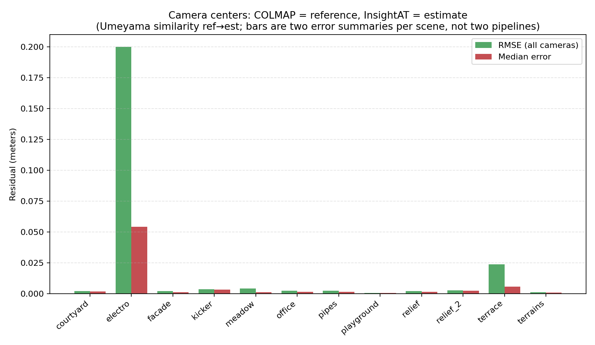

# InsightAT


**Open-source GPU-accelerated incremental SfM system for large-scale 3D reconstruction.**

InsightAT is a Structure-from-Motion system designed for **robustness, scalability, and automation**.  
It focuses on turning image collections into high-quality sparse 3D reconstructions through a fully CLI-driven, cloud-friendly pipeline.

> ⚠️ v0.1 — Early Release  
> The system is functional and usable, but APIs and internal designs may evolve.


---

## 🚀 Quick Start


### 1. Build

```bash

git clone https://github.com/huluoboge/InsightAT.git
cd InsightAT

cmake -S . -B build -DCMAKE_BUILD_TYPE=Release
cmake --build build -j


```
### 2. Run

```bash
./build/isat_sfm -i images/ -w work/
```

### 3. View result
```
./build/at_bundler_viewer work/incremental_sfm
```

---

## 🎯 Design Philosophy

InsightAT is built around a different philosophy compared to traditional SfM toolkits:

- Not a toolbox of algorithms, but a **fully engineered reconstruction pipeline**
- Not user-driven configuration, but **system-driven best-practice execution**
- Not single-shot SfM, but a **multi-stage optimization system**

It is designed for:
- Large-scale aerial and drone imagery
- Cloud-based distributed computation
- High-throughput GPU pipelines

---

## ✨ Key Features

### 🚀 End-to-end automated SfM pipeline
From images to sparse reconstruction in one command:
```bash
isat_sfm -i images/ -w work/
```

---

### ⚡ GPU-accelerated front-end

*   Feature extraction (SIFT)
*   Feature matching
*   Retrieval components

Default SIFT extraction and matching use **PopSift** (CUDA). Optional **SiftGPU** backend (CUDA or GLSL; EGL headless where applicable). See [THIRD_PARTY_LICENSES.md](THIRD_PARTY_LICENSES.md).

---

### 🔄 Asynchronous IO + GPU throughput design

*   Fully asynchronous feature and matching pipeline
*   Designed to maximize GPU utilization in cloud environments
*   Reduces IO bottlenecks in large-scale processing

---

### 🧠 Structured incremental SfM

*   Continuous track representation using compact memory layout
*   Incremental reconstruction with full global state preservation

#### Optimization strategy:

*   BA operates on subsets for efficiency
*   Resection uses full global structure for stability
*   Full 3D point cloud is always preserved

---

### 🌍 Coarse-to-fine global optimization system

SfM is treated as the **first stage of a larger reconstruction system**.

After initial reconstruction, the system supports:

*   Feature refinement
*   Distortion correction
*   GPS / external constraint integration
*   Drift correction
*   Global optimization refinement

---

### 🧩 Cloud-native CLI architecture

*   Every algorithm is an independent CLI tool
*   Task-based execution model (`isat_sfm` orchestrates pipelines)
*   Designed for distributed / parallel execution in cloud environments
*   Intermediate results stored as standardized binary containers:
    *   JSON header + binary SoA layout

---

### 📈 High-density reconstruction output

*   Produces dense sparse point clouds
*   Well-suited for:
    *   MVS pipelines
    *   3D Gaussian Splatting (3DGS)
    *   downstream reconstruction systems

---

## 🧭 System Architecture

```
Images
  ↓
Feature Extraction (GPU)
  ↓
Matching (GPU + async IO)
  ↓
Track Construction
  ↓
Incremental SfM
  ↓
Global Optimization (BA / Resection)
  ↓
Sparse 3D Model
```

---

🏗️ Scalability Direction
-------------------------

InsightAT is designed for future expansion into:

*   Cluster SfM
*   Hierarchical SfM
*   Large-scale aerial reconstruction systems

Target scenario:

> Multi-thousand to million image reconstruction at cloud scale

---

🆚 Comparison with COLMAP
-------------------------

InsightAT differs from traditional SfM systems:

|  | InsightAT | COLMAP |
| --- | --- | --- |
| System design | Full pipeline system | Algorithm toolbox |
| Execution model | CLI + task graph | Monolithic tools |
| Optimization | Coarse-to-fine system | Local pipeline tuning |
| Scale focus | Large-scale + cloud | General-purpose SfM |
| Automation | Fully automated pipeline | User-configured workflow |

---

## Benchmarks (ETH3D-style)

We batch-run **COLMAP** (sparse SfM only: feature extraction + exhaustive matching + mapper) and **InsightAT** (`isat_sfm`) on the same prepared image sets, then compare timing, sparse point counts, and—after a similarity alignment of camera centers—pose consistency between the two sparse models.

This is **not** the official ETH3D leaderboard metric; it is an internal A/B for reproducibility. See [benchmarks/README.md](benchmarks/README.md) for full procedure, environment variables, and caveats.

### Results (example batch)




**How to read the third figure:** it is **not** “green = COLMAP, red = InsightAT”. Both bars describe **one** comparison per scene: **COLMAP sparse model = reference**, **InsightAT = estimate**. A similarity transform aligns COLMAP camera centers to InsightAT’s; **green = RMSE** and **red = median** of the remaining center residuals (meters)—two statistics of the same geometric agreement.

### How to reproduce

1. Prepare dataset layout: `python3 benchmarks/eth3d/prepare_datasets.py -d /path/to/eth3d_root` (see [benchmarks/README.md](benchmarks/README.md)).
2. Run COLMAP batch → InsightAT batch → optional `compare_dataset_batch.py`.
3. Generate figures: `python3 benchmarks/sfm_compare/plot_eth3d_benchmark.py -d /path/to/eth3d_root`

---

🚧 Current Status (v0.1)
------------------------

Implemented:

*   Incremental SfM pipeline
*   GPU feature extraction and matching
*   Async IO architecture
*   CLI-based modular system
*   Track-based reconstruction system
*   Subset BA + global resection design

Planned:

*   Cluster / hierarchical SfM
*   Guided matching optimization
*   Feature refinement pipeline
*   Large-scale optimization system

---

📄 License
----------

MIT License

Copyright (c) 2026 Yang Hu

* * *

🤝 Contributing
---------------

Contributions are welcome.  
See [doc/README.md](doc/README.md) and [doc/dev-notes/design/index.md](doc/dev-notes/design/index.md) before submitting PRs.


