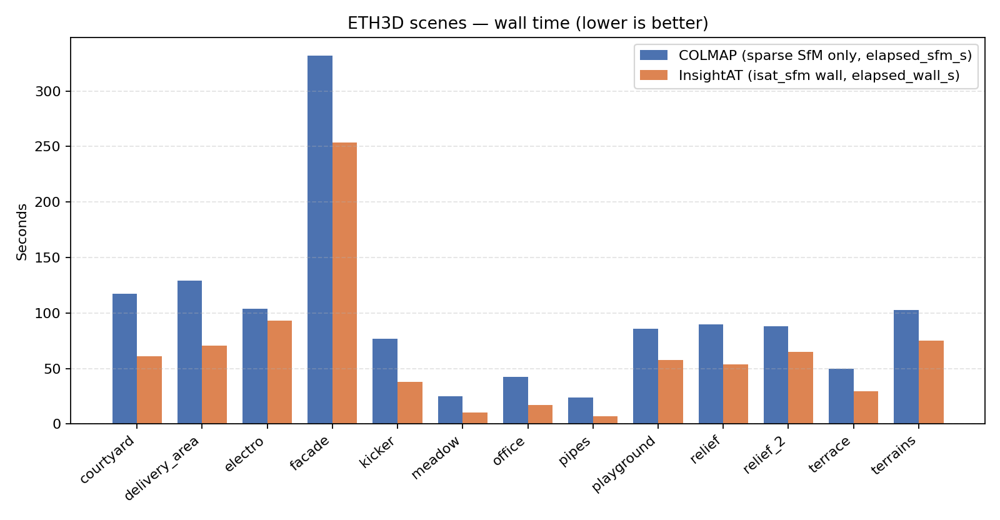
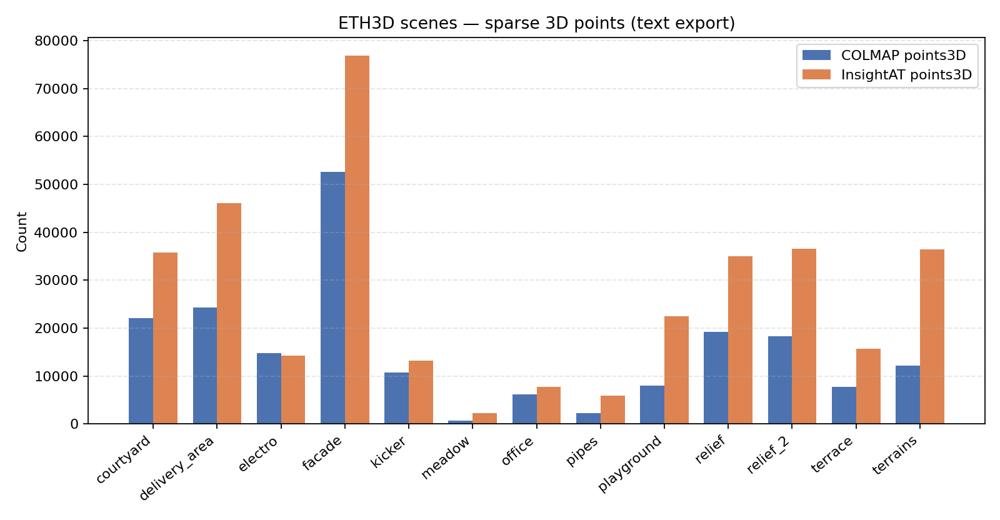
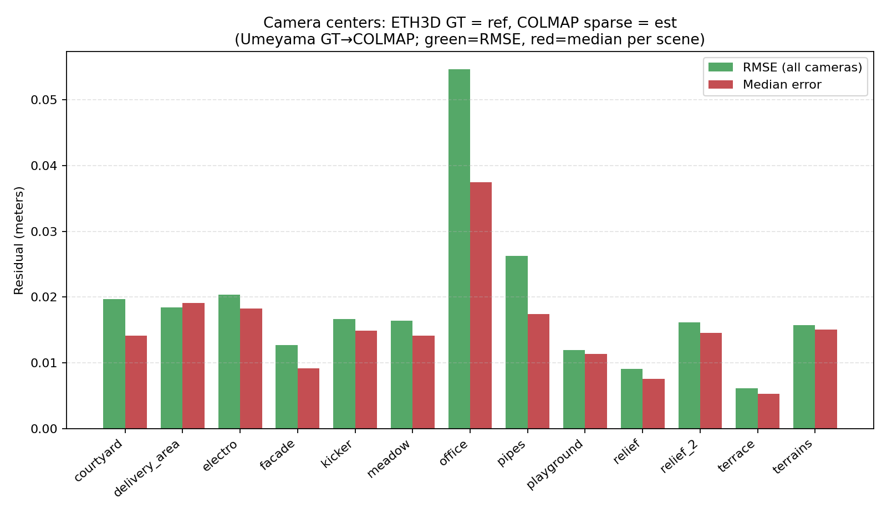
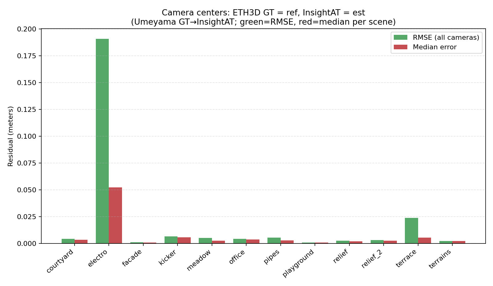

# InsightAT

**InsightAT is an open-source one-stop Structure-from-Motion system designed for easy-to-use and automated 3D reconstruction.**

InsightAT is a Structure-from-Motion system designed for **robustness, scalability, and automation**.  
It focuses on turning image collections into high-quality sparse 3D reconstructions through a fully CLI-driven, cloud-friendly pipeline.

> ⚠️ v0.1 — Early Release  
> The system is functional and usable, but APIs and internal designs may evolve.


---

## 🚀 Quick Start

**Build (recommended: Docker).** A native `cmake` build pulls in many system packages (Eigen, Ceres, OpenCV, GDAL, Qt, SuiteSparse, …). The supported path is to **build the image** and run tools inside the container.

```bash
git clone https://github.com/huluoboge/InsightAT.git
cd InsightAT
docker build -t insightat:cuda11.8 -f Dockerfile .
```

Run the pipeline (mount your photos and a writable work directory; requires [NVIDIA Container Toolkit](https://docs.nvidia.com/datacenter/cloud-native/container-toolkit/latest/install-guide.html) for `--gpus all`):

```bash
docker run --rm --gpus all -v /path/to/photos:/data/images -v /path/to/work:/data/work \
  insightat:cuda11.8 isat_sfm -i /data/images -w /data/work
```

See **[DOCKER_BUILD.md](DOCKER_BUILD.md)** for `docker-test.sh` (extracting `build/`), X11, and details.

**Optional native build** (for contributors comfortable installing dependencies on Linux): [doc/develop/build.md](doc/develop/build.md).

**Run (after a local `cmake` build)**:

```bash
./build/isat_sfm -i images/ -w work/
```

**View result (local build)**:

```bash
./build/at_bundler_viewer work/incremental_sfm
```

---

## 🎯 Design Philosophy

InsightAT is built around a different philosophy compared to traditional SfM toolkits:

- Not a toolbox of algorithms, but a **fully engineered reconstruction pipeline**
- Not user-driven configuration, but **system-driven best-practice execution**
- Not single-shot SfM, but a **multi-stage optimization system**

It is designed for:
- Large-scale aerial and drone imagery
- Cloud-based distributed computation
- High-throughput GPU pipelines

---

## ✨ Key Features

### 🚀 End-to-end automated SfM pipeline
From images to sparse reconstruction in one command:
```bash
isat_sfm -i images/ -w work/
```

---

### ⚡ GPU-accelerated front-end

*   Feature extraction (SIFT)
*   Feature matching
*   Retrieval components

Default SIFT extraction and matching use **PopSift** (CUDA). Optional **SiftGPU** backend (CUDA or GLSL; EGL headless where applicable). See [THIRD_PARTY_LICENSES.md](THIRD_PARTY_LICENSES.md).

---

### 🔄 Asynchronous IO + GPU throughput design

*   Fully asynchronous feature and matching pipeline
*   Designed to maximize GPU utilization in cloud environments
*   Reduces IO bottlenecks in large-scale processing

---

### 🧠 Structured incremental SfM

*   Continuous track representation using compact memory layout
*   Incremental reconstruction with full global state preservation

#### Optimization strategy:

*   BA operates on **retained state subsets** for efficiency
*   Resection / registration uses the **full track structure** for robustness
*   Full 3D point cloud is always preserved

---

### 🌍 Coarse-to-fine global optimization system

SfM is treated as the **first stage of a larger reconstruction system**.

After initial reconstruction, the system supports:

*   Feature refinement
*   Distortion correction
*   GPS / external constraint integration
*   Drift correction
*   Global optimization refinement

---

### 🧩 Cloud-native CLI architecture

*   Every algorithm is an independent CLI tool
*   Task-based execution model (`isat_sfm` orchestrates pipelines)
*   Designed for distributed / parallel execution in cloud environments
*   Intermediate results stored as standardized binary containers:
    *   JSON header + binary SoA layout

---

### 📈 High-density reconstruction output

*   Produces dense sparse point clouds
*   Well-suited for:
    *   MVS pipelines
    *   3D Gaussian Splatting (3DGS)
    *   downstream reconstruction systems

---

## 🧭 System Architecture

```
Images
  ↓
Feature Extraction (GPU)
  ↓
Matching (GPU + async IO)
  ↓
Track Construction
  ↓
Incremental SfM
  ↓
Global Optimization (BA / Resection)
  ↓
Sparse 3D Model
```

---

🏗️ Scalability Direction
-------------------------

InsightAT is designed for future expansion into:

*   Cluster SfM
*   Hierarchical SfM
*   Large-scale aerial reconstruction systems

Target scenario:

> Multi-thousand to million image reconstruction at cloud scale

---

🆚 Comparison with COLMAP
-------------------------

InsightAT differs from traditional SfM systems:

|  | InsightAT | COLMAP |
| --- | --- | --- |
| System design | Full pipeline system | Algorithm toolbox |
| Execution model | CLI + task graph | Monolithic tools |
| Optimization | Coarse-to-fine system | Local pipeline tuning |
| Scale focus | Large-scale + cloud | General-purpose SfM |
| Automation | Fully automated pipeline | User-configured workflow |

---

## Benchmarks (ETH3D-style)

We batch-run **COLMAP** (sparse SfM only: feature extraction + exhaustive matching + mapper) and **InsightAT** (`isat_sfm`) on the same prepared image sets, then compare **wall time** and **sparse point counts**. For camera geometry we use the scene’s **ETH3D GT** (`scenes/<scene>/gt/images.txt`) as reference and report RMSE / median of camera-center residuals (meters) **separately for COLMAP sparse and for InsightAT** (Umeyama alignment GT→estimate). This is **not** the official ETH3D leaderboard script, but uses the same released calibration models.

See [benchmarks/README.md](benchmarks/README.md) for full procedure, environment variables, and caveats.

**Example hardware / flags:** the reference figures in this repo were produced on an older **NVIDIA GTX 1060 (6 GB)**. InsightAT was run with **`--use-sift-gpu`** (forwarded by `run_insightat_batch.py`) where a SiftGPU-enabled build is available; COLMAP still uses its own SIFT stack—document your GPU, driver, and both toolchains when publishing timings.

### Results (example batch)









**How to read the alignment figures:** in each image, the two bar colors are **not** two different software packages—they are **RMSE** and **median** of the same per-camera residuals. **First image:** GT → **COLMAP** sparse. **Second image:** GT → **InsightAT** (Umeyama alignment ref→est).

### How to reproduce

1. Prepare dataset layout: `python3 benchmarks/eth3d/prepare_datasets.py -d /path/to/eth3d_root` (see [benchmarks/README.md](benchmarks/README.md)).
2. Run COLMAP batch → InsightAT batch → `python3 benchmarks/sfm_compare/compare_dataset_batch.py -d ...` (writes **`compare_gt_colmap.json`** and **`compare_gt_insightat.json`** by default).
3. Generate figures: `python3 benchmarks/sfm_compare/plot_eth3d_benchmark.py -d /path/to/eth3d_root`

---

🚧 Current Status (v0.1)
------------------------

Implemented:

*   Incremental SfM pipeline
*   GPU feature extraction and matching
*   Async IO architecture
*   CLI-based modular system
*   Track-based reconstruction system
*   Subset BA + full-track resection design

Planned:

*   Cluster / hierarchical SfM
*   Guided matching optimization
*   Feature refinement pipeline
*   Large-scale optimization system

---

📄 License
----------

MIT License

Copyright (c) 2026 Yang Hu

* * *

🤝 Contributing
---------------

Contributions are welcome.  
See [doc/README.md](doc/README.md) for **user** vs **developer** documentation; for code changes, see [doc/develop/design/index.md](doc/develop/design/index.md) as needed.


