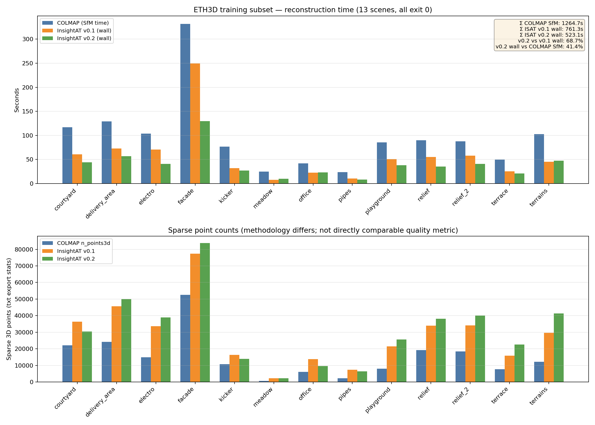

# InsightAT

[](https://doi.org/10.5281/zenodo.20042104)

**InsightAT: All-in-one Automated 3D Reconstruction System**

InsightAT is an open-source GPU-accelerated Structure-from-Motion system for turning a folder of photos into an automated sparse 3D reconstruction.

**English | [简体中文](README_zh.md)**

## Why InsightAT?

- One-shot photo-to-sparse-reconstruction pipeline with `isat_sfm`
- GPU-accelerated feature extraction and matching, with CUDA and GLSL paths
- Docker build, Ubuntu AppImage, and a beginner-friendly desktop GUI source tree
- Camera and sparse point-cloud inspection with `at_bundler_viewer`
- COLMAP-compatible sparse output for downstream workflows



Benchmark methodology and hardware notes: [benchmarks/README.md](benchmarks/README.md).

## 🚀 Quick Start

### Download a prebuilt AppImage

The current stable release is [v0.2.4](https://github.com/huluoboge/InsightAT/releases/tag/v0.2.4).
For Ubuntu, download the AppImage that matches your system:

- [Ubuntu 24.04 / CUDA 12.8](https://github.com/huluoboge/InsightAT/releases/download/v0.2.4/InsightAT-0.2.4-cuda12.8-x86_64-ubuntu24.04.AppImage)
- [Ubuntu 22.04 / CUDA 12.8](https://github.com/huluoboge/InsightAT/releases/download/v0.2.4/InsightAT-0.2.4-cuda12.8-x86_64.ubuntu22.04.AppImage)

See all assets and release notes on the [Releases page](https://github.com/huluoboge/InsightAT/releases).

### Build via Docker

```bash
git clone https://github.com/huluoboge/InsightAT.git
cd InsightAT
docker build -t insightat:cuda11.8 -f cuda11.8.dockerfile .
```

For CUDA-version-specific local builds, AppImage packaging, or the CUDA 12.8 Docker pipeline, see [`scripts/README.md`](scripts/README.md).

### Basic Usage
The core executable is `isat_sfm`.
- `-i`: Set image folder path, subdirectories are supported. Images from different cameras are recommended to be placed in separate subfolders.
- `-w`: Set working directory to store reconstruction files.

Final reconstruction results are saved in `working_dir/incremental_sfm`.
You can use `at_bundler_viewer` to visualize cameras and sparse point clouds.

```bash
isat_sfm -i /data/images -w /data/work
at_bundler_viewer /data/work/incremental_sfm
```

### Run the AppImage on Ubuntu

After downloading an AppImage, make it executable and run the same pipeline
without compiling the project:

```bash
chmod +x InsightAT-0.2.4-cuda12.8-x86_64-ubuntu24.04.AppImage

# Start reconstruction
./InsightAT-0.2.4-cuda12.8-x86_64-ubuntu24.04.AppImage isat_sfm -i /data/images -w /data/work

# View reconstruction result
./InsightAT-0.2.4-cuda12.8-x86_64-ubuntu24.04.AppImage at_bundler_viewer /data/work/incremental_sfm
```

### Beginner-friendly GUI

The repository includes a small Electron GUI for the CLI pipeline. It lets
you create or open a work directory, add image folders, and run SfM from a
simple desktop workflow. See [simple-gui/README.md](simple-gui/README.md) for
setup instructions.

## Community and feedback

If InsightAT is useful for your reconstruction, photogrammetry, or computer
vision workflow, please consider [starring the repository](https://github.com/huluoboge/InsightAT).
Bug reports, compatibility notes, and reconstruction examples are welcome in
[Issues](https://github.com/huluoboge/InsightAT/issues).

## License
MIT License

Copyright (c) 2026 Yang Hu

## Citation

@software{yang2026insightat,
  author = {Yang, Hu},
  title = {InsightAT: All-in-one Automated 3D Reconstruction System},
  year = {2026},
  doi = {10.5281/zenodo.20042104},
  url = {https://github.com/huluoboge/InsightAT}
}
