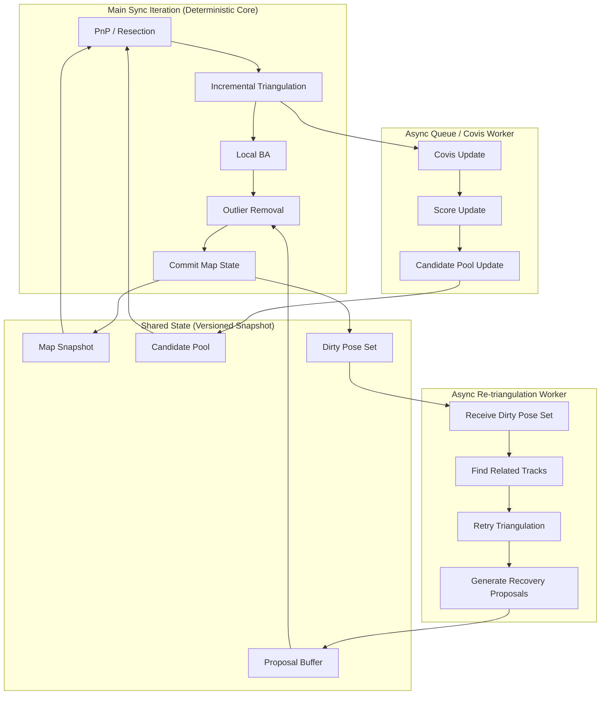
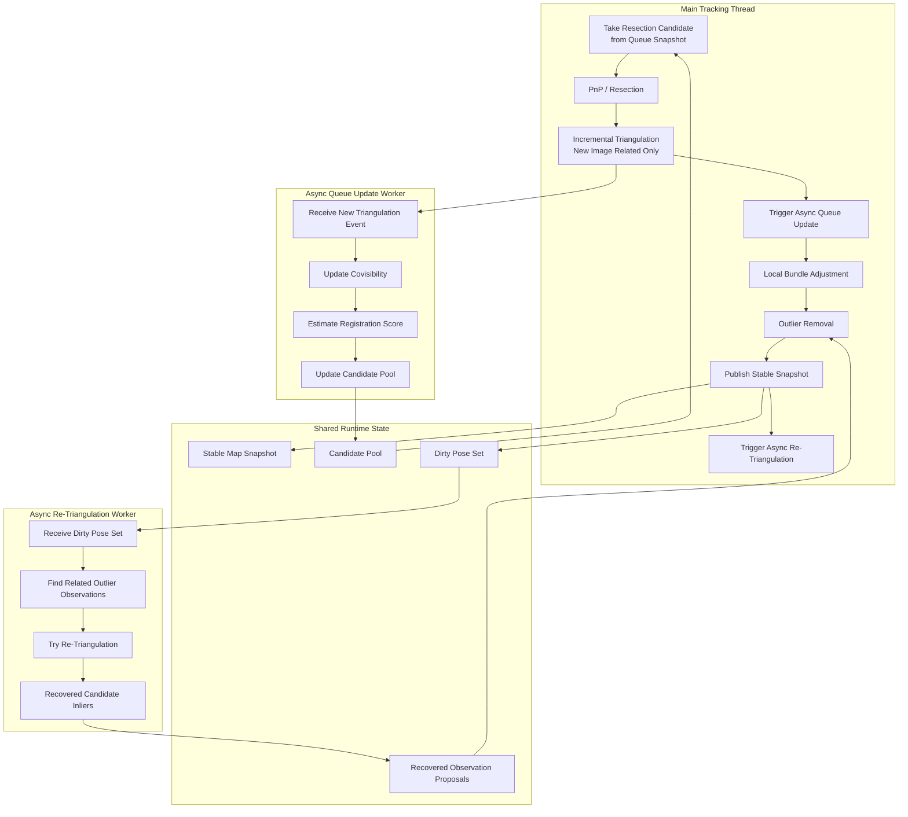

# 异步SfM优化设计

**User:** Anonymous  
**Created:** 5/15/2026 10:11:42  
**Updated:** 5/15/2026 11:16:03  
**Exported:** 5/15/2026 11:19:06  
**Link:** [https://chatgpt.com/c/6a0680bd-c250-83ea-ae53-c0ef6886c42e](https://chatgpt.com/c/6a0680bd-c250-83ea-ae53-c0ef6886c42e)  

## Response:
5/15/2026, 11:15:36 AM

下面我帮你整理成一份**可以直接放进项目 README / 设计文档级别的系统说明**。我会按“设计原则 → 架构 → 执行模型 → 数据结构 → 流程图 → 关键细节 → 风险点”来写，保证你后面可以直接扩展成论文或工程文档。

---

# InsightAT Incremental SfM System Design

---

# 1. 核心设计原则

本系统采用一种**“同步语义 + 异步加速执行层”**的架构。

## 1.1 语义模型（Strong Consistency）

系统在逻辑上是一个严格同步的迭代状态机：

```text id="p1q8kz"
Iteration i:

PnP(i)
→ Triangulation(i)
→ Local BA(i)
→ Outlier Removal(i)
→ Commit Map State(i)
```

特点：

- 每一轮 iteration 有明确边界
- Map state 只在 commit 点更新
- 保证完全可复现（deterministic）

---

## 1.2 执行模型（Speculative Async Execution）

为了降低延迟，引入异步计算层：

```text id="k3m9dx"
Async tasks:
- Covisibility update
- Re-triangulation
- Queue scoring
- Track repair
```

特点：

- 不修改主 map state
- 只生成 proposal / cache
- 为下一 iteration 提前准备数据

---

## 1.3 核心哲学

> 异步只是“提前计算”，不是“改变语义”

---

# 2. 系统总体架构



---

# 3. 关键执行流程

---

## 3.1 主迭代流程（同步核心）

```text id="flow_main"
1. 从 Candidate Pool 取候选图像
2. 执行 PnP（resection）
3. 执行 Incremental Triangulation
4. 触发 Async Queue Update
5. 执行 Local BA
6. Outlier Removal
7. Commit Map State
8. 标记 Dirty Pose Set
9. 触发 Async Re-triangulation
```

---

## 3.2 Queue Update（异步）

触发条件：

```text id="flow_queue"
Triangulation 完成
```

流程：

```text id="flow_queue2"
1. 更新 covisibility graph
2. 更新 image score
3. 更新 candidate priority pool
```

特点：

- 局部更新
- 不做全局重计算

---

## 3.3 Re-triangulation（异步）

触发条件：

```text id="flow_retri"
BA commit → dirty poses
```

流程：

```text id="flow_retri2"
1. 收集 dirty poses
2. 找到相关 outlier observations
3. 尝试重新三角化
4. 生成 recovery proposals（不直接修改 map）
```

---

# 4. 数据结构设计

---

## 4.1 Map Snapshot（只读）

```cpp id="ds1"
struct MapSnapshot {
    int epoch;
    PoseSet poses;
    PointSet points;
    TrackGraph tracks;
};
```

特点：

- immutable
- worker only reads

---

## 4.2 Candidate Pool

```cpp id="ds2"
struct Candidate {
    image_id;
    score;
    visibility;
    uncertainty_gain;
    last_updated;
};
```

---

## 4.3 Dirty Pose Set

```cpp id="ds3"
struct DirtyPose {
    image_id;
    delta_rotation;
    delta_translation;
};
```

---

## 4.4 Re-tri Proposal

```cpp id="ds4"
struct ReTriProposal {
    track_id;
    new_point;
    confidence;
    type; // recover / refine
};
```

---

# 5. 关键设计机制

---

## 5.1 Epoch一致性机制（非常关键）

所有 worker 必须绑定：

```text id="e1"
map_epoch
```

保证：

- 不同线程不会混用状态
- debug 可追踪

---

## 5.2 Dirty Region Propagation

BA之后：

```text id="d1"
pose变化 → track → observations → re-tri candidates
```

只处理影响区域。

---

## 5.3 Proposal-based update

任何 async worker：

❌ 不允许直接修改 map  
✔ 只能生成 proposal

---

## 5.4 Lazy Priority Update

Candidate score：

- 不全局重算
- 只更新 affected region

---

# 6. 系统执行时间线

```text id="timeline"
Iteration i:

[MAIN]
PnP(i)
Triangulation(i)
trigger Queue Update
BA(i)
Outlier Removal(i)
Commit(i)

[ASYNC RUNNING IN BACKGROUND]
Queue Update(i) -------->
Re-triangulation(i) ----->

Iteration i+1 starts using updated pool
```

---

# 7. 设计优势

---

## 7.1 高吞吐

- BA 与 queue update 重叠执行
- retriangulation 永远不阻塞主流程

---

## 7.2 强一致语义

- iteration boundary clear
- deterministic execution

---

## 7.3 易 debug

可以随时回放：

```text id="dbg"
epoch i map state
```

---

## 7.4 易扩展 GPU

async tasks 天然 batch-friendly：

- triangulation
- residual evaluation
- covis update

---

# 8. 潜在风险（重要）

---

## 8.1 stale state

解决：epoch + snapshot

---

## 8.2 queue lag

解决：frontier + local scoring

---

## 8.3 retri重复恢复

解决：proposal + commit validation

---

## 8.4 track状态不一致

解决：track lifecycle state machine

---

# 9. 总体系统定位

本系统属于：

> Deterministic Incremental SfM System with Speculative Async Execution Layer

也可以理解为：

> SfM runtime system，而非 SfM pipeline

---

# 如果你下一步要继续升级（建议路线）

我可以帮你再往上推三层：

## Level 2
- frontier-based scheduling
- track lifecycle system

## Level 3
- GPU batch triangulation
- async residual evaluation

## Level 4
- fully task graph SfM runtime（类似 DAG scheduler）

---

如果你愿意，我可以下一步帮你把这个系统：

👉 直接升级成“可发表论文级 architecture + pseudo-code + complexity analysis”


---
Powered by [ChatGPT Exporter](https://www.chatgptexporter.com)




