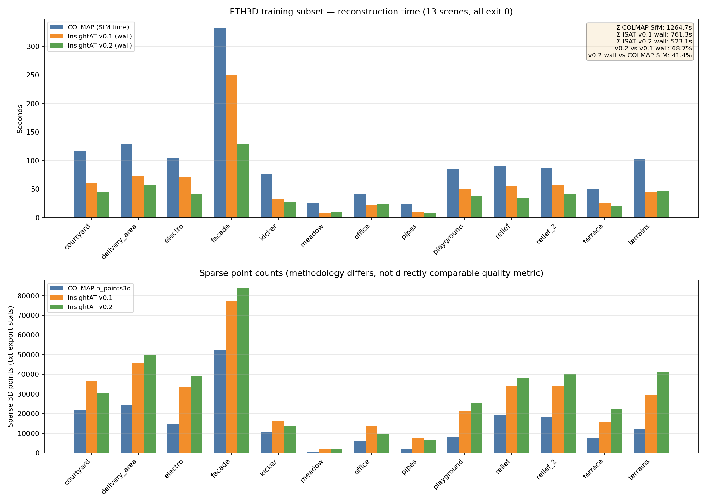

# InsightAT v0.2.0 发布说明

发布日期：2026-05-06（与仓库标签 `v0.2.0` 对齐时使用该日期）。

## 相对 v0.1.0 的亮点

1. **CUDA 12.8 构建**：默认关闭 **SiftGPU**（上游未适配 CUDA 12）。若需要 SiftGPU，可在 **CUDA 11.8** 环境下将 `INSIGHTAT_ENABLE_SIFTGPU` 打开单独构建。CUDA 12.x 构建可与 **Ceres 2.3+** 的 **CUDA_SPARSE（cuDSS / cuSPARSE）** 联动，加速大规模稀疏 BA。
2. **Ceres CUDA 稀疏求解**：全局 BA 等路径优先尝试 `CUDA_SPARSE`，失败时回退 SUITE_SPARSE / EIGEN_SPARSE（见 `bundle_adjustment_analytic.cpp`）。
3. **Cascade Hash 匹配**：新增 **cpu_cascade_hash** 与 **gpu_cascade_hash**；SfM 默认匹配后端为 **gpu_cascade_hash**。可与 PopSift 等提取后端组合使用。
4. **at_bundler_viewer**：重建加载进度、主点估计与取景、Qt 部署（AppImage）相关显示与打包问题修复。
5. **整体性能**：几何批处理、IDC 写入与 GPU cascade 调度、三角化/路径热路径、BA 观测采样等优化。

## ETH3D 训练子集批跑对比（13 scenes，全部 `code=0`）

**指标说明**

- **COLMAP**：`elapsed_sfm_s` 为重建阶段耗时；总时间含 `txt_export`（约 0.3–1.5s/scene）。
- **InsightAT**：日志中的 **wall** 为端到端墙钟（含特征/匹配/BA 等，与 COLMAP 分段口径不完全相同，仅作量级参考）。
- **n_points3d**：COLMAP 与 InsightAT 稀疏导出统计方式不同，**点数不可直接当作“质量分数”对比**。

### 墙钟 / SfM 时间（秒）

| scene | COLMAP SfM | ISAT v0.1 wall | ISAT v0.2 wall | v0.2 / v0.1 |
| --- | ---: | ---: | ---: | ---: |
| courtyard | 117.1 | 60.6 | 44.3 | 0.73 |
| delivery_area | 129.1 | 72.7 | 57.0 | 0.78 |
| electro | 104.0 | 70.6 | 40.7 | 0.58 |
| facade | 331.7 | 249.6 | 129.7 | 0.52 |
| kicker | 76.5 | 32.0 | 27.1 | 0.85 |
| meadow | 24.8 | 7.9 | 9.8 | 1.24 |
| office | 42.2 | 22.5 | 23.4 | 1.04 |
| pipes | 24.0 | 10.6 | 8.3 | 0.78 |
| playground | 85.6 | 51.0 | 37.9 | 0.74 |
| relief | 89.9 | 55.2 | 35.6 | 0.64 |
| relief_2 | 87.8 | 58.1 | 40.7 | 0.70 |
| terrace | 49.5 | 25.4 | 21.3 | 0.84 |
| terrains | 102.5 | 45.1 | 47.3 | 1.05 |
| **Σ** | **1264.7** | **761.3** | **523.1** | **0.69** |

### 稀疏点数 n_points3d（导出统计）

| scene | COLMAP | ISAT v0.1 | ISAT v0.2 |
| --- | ---: | ---: | ---: |
| courtyard | 22125 | 36422 | 30375 |
| delivery_area | 24251 | 45681 | 50007 |
| electro | 14812 | 33654 | 38960 |
| facade | 52577 | 77308 | 83770 |
| kicker | 10794 | 16254 | 14002 |
| meadow | 638 | 2159 | 2309 |
| office | 6140 | 13775 | 9626 |
| pipes | 2290 | 7401 | 6384 |
| playground | 8050 | 21538 | 25672 |
| relief | 19234 | 33883 | 38180 |
| relief_2 | 18367 | 34176 | 40066 |
| terrace | 7736 | 15923 | 22584 |
| terrains | 12174 | 29568 | 41335 |

### 复现命令（与记录一致）

**COLMAP**

```bash
python3 ./benchmarks/sfm_compare/run_colmap_batch.py -d /path/to/01-eth3d/ \
  --colmap-bin-dir /path/to/colmap/install/bin \
  --summary /path/to/01-eth3d/colmap_batch_summary.json
```

**InsightAT v0.1.0**

```bash
python3 ./benchmarks/sfm_compare/run_insightat_batch.py -d /path/to/01-eth3d/ \
  --insightat-bin-dir /path/to/InsightAT/build \
  --extract-backend cuda --match-backend cuda -v \
  --summary /path/to/01-eth3d/insightat_batch_summary.json
```

**InsightAT v0.2.0**

```bash
python ./benchmarks/sfm_compare/run_insightat_batch.py -d /path/to/01-eth3d/ \
  --use-pop-sift -v \
  --summary /path/to/01-eth3d/insightat_batch_summary_cuda.json \
  --insightat-bin-dir /path/to/InsightAT/build-ceres-12.8/
```

### 对比图（自动生成）

```bash
python3 ./benchmarks/sfm_compare/plot_eth3d_release_triple.py \
  -o doc/images/benchmarks/eth3d_colmap_vs_insightat_0.1_vs_0.2.png
```

输出：`doc/images/benchmarks/eth3d_colmap_vs_insightat_0.1_vs_0.2.png`。



## 自 v0.1.0 以来的提交摘要（git）

```
feat(sfm): add configurable geo backend with cuda default
fix(match): write scales in cascade match outputs
perf(sfm): add BA observation sampling and reusable log analyzer
render: 重建加载进度、主点估尺寸与取景改进
perf(sfm): pipeline/triangulation hot paths and project image paths
optimize idc writer blob append and gpu cascade scheduling
add cuda batched geo ransac and align sfm matching defaults
add gpu cascade hash matcher and sfm integration
optimize cascade hash pipeline and unify matching postprocess
appimage: fix qt deployment for at_bundler_view failed
```

完整差异：`git log v0.1.0..v0.2.0 --oneline`（打标签后）。
