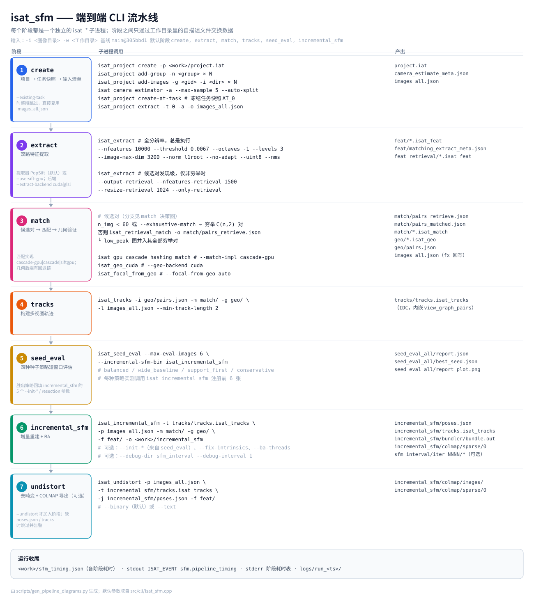
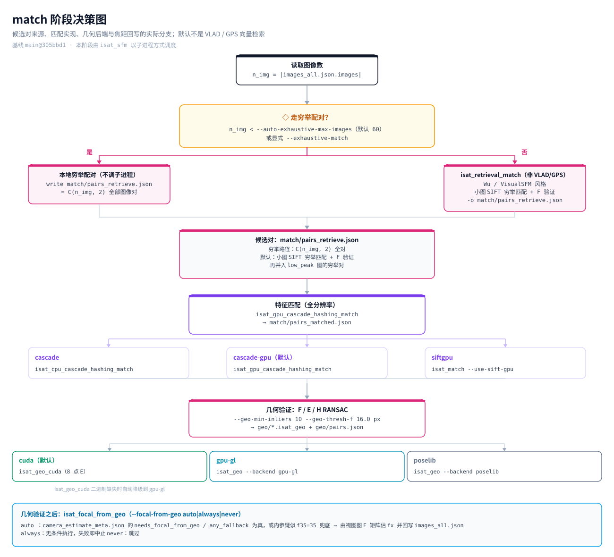
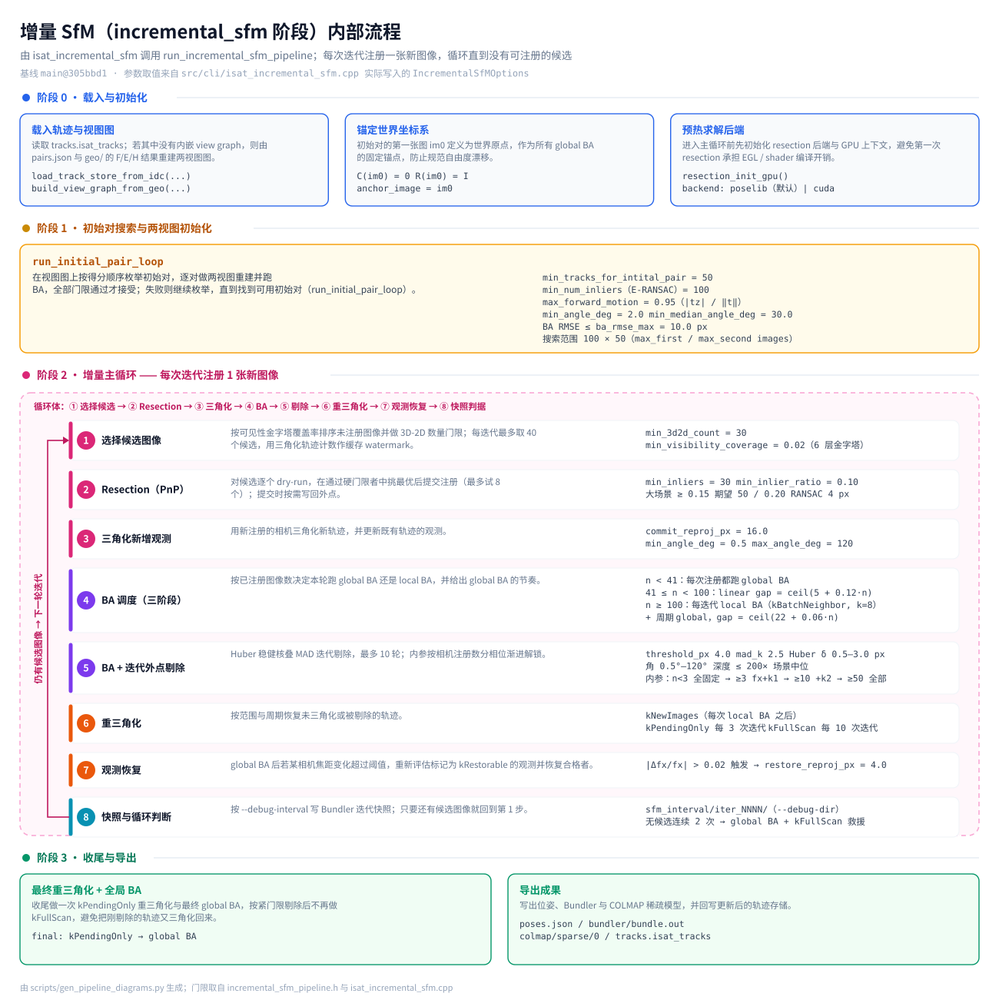

# InsightAT Technical Status

**InsightAT: Simple Automated Aerial Triangulation**

[Simplified Chinese](TECHNICAL_STATUS.md) | **English**

| Item | Value |
|------|-------|
| Software | InsightAT (Aerial Triangulation) |
| Version | `0.2.5` (`VERSION`) |
| Code baseline | `main`, commit `305bbd1` |
| Status date | 2026-09-28 |
| License | MIT License, Copyright (c) 2026 Yang Hu |
| Citation | DOI [10.5281/zenodo.20042104](https://doi.org/10.5281/zenodo.20042104) |

> This document describes what the code **actually does** at the stated baseline: command-line tools, effective defaults, output files, implemented algorithms, and measured benchmark results.
> Capabilities that are not implemented are collected in Section 10. Design documents are subordinate to the current code. Historical documents are archived under `docs/archive/2026-09-28/`.

---

## Executive Summary

- **System shape:** a CLI-first, file-driven, single-machine sparse-reconstruction pipeline. `isat_sfm` orchestrates stages, and each algorithmic stage runs as an independent `isat_*` process.
- **Input contract:** the project is frozen into `ATTask::InputSnapshot`; `extract -t` and `intrinsics -t` export the image list and intrinsics from that snapshot, making each reconstruction input reproducible.
- **GPU boundary:** feature extraction, cascade-hash matching, and two-view geometry use the GPU by default. BA still runs in CPU Ceres, with `CUDA_SPARSE` used when the linear solver is available.
- **Measured gains:** the ETH3D 13-scene end-to-end total time falls from 761.3 s in v0.1 to 523.1 s in v0.2. The IPI path in the GPU geometric degenerate-model solver is 34-76x faster than Jacobi.
- **Main current boundary:** there is no cluster partitioning, Sim3 merging, pose-graph optimization, or multi-node scheduling. CRS, GNSS, IMU, and GCP data do not enter the default solve.

---

## 1. System Overview

InsightAT is a **C++17 + CUDA**, **CLI-first** aerial-triangulation (SfM) system.

- **Input:** an image directory plus EXIF metadata and the bundled camera-sensor database (`data/config/camera_sensor_database.txt`) for intrinsics estimation.
- **Output:** incremental sparse reconstruction with camera poses (`poses.json`, Bundler `bundle.out`), sparse points, and a COLMAP-compatible `sparse/0` model. Optional undistorted images and a COLMAP sparse model are available for 3DGS / MVS.
- **Product shape:** the default build is CLI-only (`isat_*`); the product UI is the Electron application described in Section 8.
- **Platforms:** Ubuntu 22.04 and Windows with CUDA 12.8. Distributed artifacts include AppImage, `.deb`, Docker images, and a Windows zip.

Run the complete pipeline with:

```bash
isat_sfm -i /data/images -w /data/work
# Results: /data/work/incremental_sfm/
```

---

## 2. Architecture and Code Organization

### 2.1 Runtime Shape

The real system is a **CLI-first, file-driven, single-machine chain of processes**. It is not an application with global in-memory state owned by a UI. Stages exchange products through disk files:

| Layer | Main location | Current responsibility |
|-------|---------------|------------------------|
| Product UI | `sfm-gui/`, `sfm-viewer/` | Electron UI for project/task operations, CLI invocation, log tracking, and COLMAP result viewing |
| Pipeline driver | `src/cli/isat_sfm.cpp` | Starts sibling `isat_*` processes in order and records stage timing/logs; it does not implement algorithms |
| Stage CLIs | `src/cli/` | Extraction, candidate-pair discovery, matching, geometry verification, track building, seed evaluation, incremental SfM, and undistortion |
| Algorithm modules | `src/algorithm/modules/` | No Qt dependency and no dependency on `src/database/`; operate on minimal intrinsics structs and plain C++ containers |
| Containers and export | `src/algorithm/io/`, `src/algorithm/export/` | IDC I/O, EXIF/geopack, and COLMAP sparse export |
| Project data layer | `src/database/` | `Project` / `ImageGroup` / `ATTask` / `CameraModel` types and Cereal serialization; used by the project CLIs |
| Legacy UI | `src/ui/`, `src/render/`, `src/tools/at_bundler_viewer/` | Legacy Qt 5.15 implementation; not built by default and not the product route |

Earlier documents described a `Project -> AT Task -> Output` three-layer application. The current code implements those layers to different degrees:

| Earlier design layer | Current implementation |
|----------------------|------------------------|
| Project | Project, image-group, camera, and measurement types exist and are used by `isat_project` / `isat_camera_estimator`. CRS is metadata only, and GNSS / IMU / GCP do not enter the default solve. |
| AT Task | `InputSnapshot` is the actual input contract. The task tree is displayed through `prev_task_id`, but pose seeding from a parent task is not implemented. |
| Output | `poses.json`, Bundler, and COLMAP sparse outputs are written. Export in a target CRS or OPK / YPR convention is not implemented. |

### 2.2 Process, File, and Identity Contracts

- **One process per stage:** the driver invokes sibling `isat_*` executables. A required stage failure aborts the pipeline; optional stages may degrade to a warning according to policy.
- **stdout / stderr split:** stdout carries machine-readable `ISAT_EVENT` NDJSON only. Progress, logs, and diagnostics go to stderr.
- **Files are the only cross-stage interface:** IDC stores binary features, matches, and tracks; JSON stores project manifests, pair relationships, and configuration. There is no shared in-memory database.
- **Identity is the array index:** the solver uses `image_index in [0, num_images)`, and `image_to_camera_index[]` selects the camera. Every stage in one task must consume the same `images_all.json`.
- **Resume:** `--existing-task` reuses an exported `images_all.json`. The Electron flow reuses a frozen task through `create-at-task -> extract -t <id> -> isat_sfm --existing-task`.

### 2.3 Code Layout

```text
InsightAT/
|-- CMakeLists.txt      # C++17; CLI-only by default; SiftGPU / CUDA options
|-- VERSION             # 0.2.5
|-- src/
|   |-- cli/            # all isat_* command-line tools
|   |-- algorithm/
|   |   |-- io/         # IDC, geopack, EXIF
|   |   |-- export/     # COLMAP export
|   |   `-- modules/    # camera / extraction / retrieval / matching /
|   |                   # cpu_cascade_hash / gpu_cascade_hash / geometry / sfm
|   |-- database/       # Project / ATTask / ImageGroup / camera models + Cereal
|   |-- render/         # legacy OpenGL viewer (not built by default)
|   |-- ui/             # legacy Qt 5.15 main window (not built by default)
|   |-- tools/          # at_bundler_viewer (legacy Qt, not built by default)
|   `-- util/
|-- third_party/        # popsift, SiftGPU, PoseLib, cereal, nlohmann, nanoflann, ImageIO...
|-- benchmarks/         # ETH3D preparation + COLMAP / InsightAT batch comparison
|-- docs/               # homepage index.html + images + archive
|-- packaging/          # linux / docker / appimage / deb / windows / legacy
|-- sfm-gui/            # Electron shell that drives the CLI pipeline
`-- sfm-viewer/         # Electron + Three.js COLMAP sparse-result viewer
```

### 2.4 Technology Stack and Build Defaults

| Area | Selection |
|------|-----------|
| Language | C++17 (`CMAKE_CXX_EXTENSIONS OFF`) |
| Math | Eigen3; Ceres Solver for BA |
| Vision | OpenCV (only required modules such as `calib3d`) |
| Features | PopSift by default; SiftGPU through `--use-sift-gpu` |
| GPU | CUDA 12.8; custom CUDA kernels; EGL + OpenGL 4.3 compute shaders |
| Logging | glog to stderr |
| Serialization | Cereal + nlohmann/json |
| Build | CMake >= 3.16; vcpkg on Windows |

CMake defaults:

| Option | Default | Meaning |
|--------|---------|---------|
| `INSIGHTAT_BUILD_QT_UI` | `OFF` | Legacy Qt GUI, `at_bundler_viewer`, and `render`; not built by default |
| `INSIGHTAT_BUILD_GUI_ONLY` | `OFF` | Build only legacy Qt GUI targets and skip CUDA / algorithm components |
| `INSIGHTAT_BUILD_RENDER_TESTS` | `OFF` | Legacy render tests |
| `INSIGHTAT_ENABLE_SIFTGPU` | `ON` | Enable the SiftGPU feature path |
| `SIFTGPU_ENABLE_CUDA` | `ON` when CUDA Toolkit is detected, otherwise `OFF` | SiftGPU CUDA backend |

Backend defaults are compile-time decisions. When CUDA Toolkit is found, `isat_sfm` defaults to `extract=cuda / match=cuda / geo=cuda`, with `cascade-gpu` matching and PopSift extraction. Otherwise it falls back to `glsl / cpu / gpu`, SiftGPU, and `cascade`.

**SiftGPU compatibility with CUDA 12.x is fixed.** Commit `679a1ae` (`fix(siftgpu): port COLMAP texture-object API for CUDA 12.8`) replaces removed texture-reference binding with `cudaTextureObject` while retaining CUDA 11.8 compatibility.

### 2.5 Hardware and Parallelism Model

| Dimension | Current implementation |
|-----------|------------------------|
| Single machine / single GPU | One local GPU device per pipeline run; no multi-GPU or cross-node scheduling |
| GPU stages | PopSift extraction, cascade-hash matching, and F / E / H RANSAC use CUDA by default; GLSL / EGL is the fallback without CUDA or when explicitly selected |
| CPU stages | Incremental SfM main loop, track-state management, and Ceres BA |
| Threads | `--io-threads` for stage I/O, `--ba-threads` for BA, and OpenMP in selected SfM loops |
| Concurrency limit | The GL / EGL geometry path owns global context and static SSBO state and is not thread-safe; parallelism is mainly across processes or batches |

---

## 3. End-to-End Pipeline

`isat_sfm` is the driver. It contains no algorithms; it schedules sibling CLIs as subprocesses, prints a per-stage timing table, and writes `sfm_timing.json`.

Default stage set:

```text
create, extract, match, tracks, seed_eval, incremental_sfm
```

`undistort` is optional. `-s/--steps` selects a subset, and `--existing-task` resumes from an existing task.

The following diagram shows the seven stages, their subprocesses, and their product files (generated by `scripts/gen_pipeline_diagrams.py` at baseline `305bbd1`):



### 3.1 Stages

**create**: project -> task snapshot -> input manifest:

1. `isat_project create -p <work>/project.iat`
2. `add-group` x N and `add-images` x N to import image directories under `-i`
3. `isat_camera_estimator -p project.iat -a` for EXIF-based per-group intrinsics (`--max-sample` defaults to 5); results are written back to the project
4. `isat_project create-at-task -p project.iat` to freeze the current project state (image groups + intrinsics + measurements + input CRS) as `AT_0`
5. `isat_project extract -p project.iat -t 0 -o images_all.json -a` to export `<work>/images_all.json` **from that task snapshot only**

**extract** invokes `isat_extract` once for full-resolution features and once for low-resolution features used in candidate-pair discovery:

| Purpose | Parameter | Value |
|---------|-----------|-------|
| Full-resolution | `--nfeatures` | 10000 |
| Full-resolution | `--threshold` | 0.0067 (overridable by `--sift-threshold`) |
| Full-resolution | `--octaves` / `--levels` | `-1` automatic / `3` |
| Full-resolution | `--image-max-dim` | 3200 |
| Full-resolution | `--norm` | `l1root` |
| Full-resolution | NMS | Grid NMS enabled by default; `--no-grid` disables it |
| Candidate discovery level | `--nfeatures-retrieval` / `--resize-retrieval` | 1500 / 1024 px |

When `isat_extract` runs standalone, its `--image-max-dim` default is **6000**. The value 3200 is passed by `isat_sfm`; the help string still says `default: 6000` and has not been updated.

**match** performs candidate generation, feature matching, and geometry verification:

- Default `--match-impl cascade-gpu` (CUDA cascade-hash). `cascade` (CPU) and SiftGPU-like paths are also available.
- **Candidate pairs are not produced by VLAD or GPS retrieval.** The default path is the Wu / VisualSFM-style retrieval-by-matching in `isat_retrieval_match`: generate every `C(n,2)` image pair, exhaustively match low-resolution SIFT features extracted from small images, and verify them with F RANSAC (16 px, minimum 6 inliers). The tool then builds a verified-neighbour graph and adds exhaustive pairs for images with fewer than 5 neighbours. This measures low-resolution matching support, not global-descriptor similarity.
- When the image count is at most `--auto-exhaustive-max-images` (default 60), `isat_sfm` skips `isat_retrieval_match` entirely, generates every image pair, and proceeds directly to regular full-resolution matching.
- Default `--geo-backend cuda` invokes `isat_geo_cuda` (CUDA F / E / H RANSAC -> E decomposition -> full triangulation). If that binary is missing, it falls back to `gpu` (`isat_geo --backend gpu-gl`, EGL + OpenGL) and then `poselib` (CPU).
- `--geo-min-inliers` defaults to 10; `--geo-thresh-f` defaults to 16.0 px (Sampson error).
- `--focal-from-geo` (`auto`, `always`, `never`, default `auto`): after geometry verification, if the intrinsic prior is considered unreliable (EXIF fallback or suspected `f35=35` fallback), `isat_focal_from_geo` estimates `fx` from the view-graph F matrices and writes it back to `images_all.json`. This step gets its own timing row. Under `always`, failure aborts; under `auto` or `never`, the pipeline warns or skips.

The full branch structure for this stage:



**tracks**: `isat_tracks` fuses verified pairs, `.isat_match`, `.isat_geo`, and the image manifest into `<work>/tracks/tracks.isat_tracks` (IDC with embedded `view_graph_pairs`). `--min-track-length` defaults to 2.

**seed_eval**: `isat_seed_eval` evaluates four initial-pair strategies (`balanced`, `wide_baseline`, `support_first`, `conservative`) over a short window (`--seed-eval-max-images` defaults to 6; it calls `isat_incremental_sfm` internally) and writes `seed_eval_all/{report.json,best_seed.json,report_plot.png}`. The `incremental_sfm` stage reads `best_seed.json` and propagates the winning `init_min_inliers`, `init_max_forward_motion`, `init_min_angle_deg`, `init_min_median_angle_deg`, and `resection_min_inliers` to `isat_incremental_sfm`. If unavailable, it falls back to defaults and warns.

**incremental_sfm**: `isat_incremental_sfm` is the core solve stage (see Section 6). It writes to `<work>/incremental_sfm/`:

- `poses.json`: poses for registered images
- `bundler/bundle.out`: Bundler format
- `colmap/sparse/0`: COLMAP-compatible sparse model
- `tracks.isat_tracks`: updated track store

`--output-interval-sfm` additionally writes per-iteration snapshots under `<work>/sfm_interval/iter_NNNN/` (`bundle.out` + `list.txt`).

**undistort (optional)**: `--undistort` invokes `isat_undistort`, which uses `tracks.isat_tracks` and `poses.json` to write undistorted images and a COLMAP sparse model (PINHOLE, `%08d` naming) for 3DGS / MVS. `--binary` controls binary COLMAP output.

### 3.2 Work Directory Layout

The code calls this layout "scheme B": pair JSON files live in `match/`, tracks in `tracks/`, and Bundler output in `incremental_sfm/bundler/`.

```text
<work>/
|-- project.iat                     # project file
|-- images_all.json                 # input manifest; focal-from-geo may rewrite fx
|-- camera_estimate_meta.json       # intrinsic-estimation provenance
|-- feat/                           # full-resolution .isat_feat
|-- feat_retrieval/                 # low-resolution features for candidate discovery
|-- match/
|   |-- pairs_retrieve.json         # candidate pairs (exhaustive or retrieval-by-matching)
|   |-- pairs_matched.json          # matched pairs
|   `-- *.isat_match
|-- geo/                            # *.isat_geo + pairs.json (verified pairs)
|-- tracks/tracks.isat_tracks
|-- seed_eval_all/                  # report.json / best_seed.json / report_plot.png
|-- retrieval_match_work/
|-- incremental_sfm/
|   |-- poses.json
|   |-- tracks.isat_tracks
|   |-- bundler/bundle.out
|   `-- colmap/sparse/0
|-- sfm_interval/                   # optional per-iteration snapshots
|-- logs/run_<timestamp>/           # console.log / detail.log / events.ndjson
`-- sfm_timing.json                 # per-stage timing; also emitted as ISAT_EVENT
```

`--no-log-file` disables log-file output.

---

## 4. Project, Task Snapshot, and Input Contract

`isat_project` subcommands: `create`, `add-group`, `add-images`, `set-camera`, `set-cs`, `inspect`, `ls`, `create-at-task`, `delete-at-task`, `extract`, and `intrinsics`.

**The task snapshot is the current pipeline input contract.** `create-at-task` freezes the project into an `ATTask`; `extract -t <task-id>` and `intrinsics -t <task-id>` read **only from that snapshot** and export `images_all.json` plus per-image camera intrinsics. Intrinsics estimation therefore happens before the snapshot, and later project edits cannot affect that reconstruction.

- `--parent-task-id` writes `initialization.prev_task_id`; the Electron GUI renders the task tree from it.
- `intrinsics -a/--all` supports multi-camera output with `schema: multi_camera_v1` keyed by `group_id`; `extract -a` embeds `camera_id=group_id` in the manifest.
- `set-cs --type local|enu|epsg|wkt` writes the coordinate reference system into project metadata. New projects default to `local`.

`--existing-task` skips `create` and directly reuses `<work>/images_all.json`. The Electron continuation flow uses this mode: `create-at-task -> extract -t <id> -> isat_sfm --existing-task`.

The SfM side reads only a thin project subset: **the image manifest plus per-image camera intrinsics**, both exported from the task snapshot. The project data layer (`src/database/database_types.h`) also defines `CoordinateSystem`, `InputPose`, `Measurement`, `ATTask`, `ImageGroup`, `CameraModel`, and `CameraRig`, with versioned Cereal serialization. This layer contains no Qt and can be read/written in a headless environment.

---

## 5. Data Formats

### 5.1 IDC (InsightAT Data Container)

The pipeline-wide binary container combines a binary payload with a readable JSON header. It is self-describing, versioned, and 8-byte aligned.

```text
┌──────────────┬──────────────┬──────────────┬──────────────────┬──────────────┬─────────┐
│ Magic "ISAT" │ version u32  │ json_size u64│ JSON descriptor  │ padding 0-7B │ payload │
│     4 B      │     4 B      │     8 B      │     variable     │ align to 8B  │  blob   │
└──────────────┴──────────────┴──────────────┴──────────────────┴──────────────┴─────────┘

header_size    = 4 + 4 + 8 + json_size
padding        = (8 - (header_size % 8)) % 8
payload_offset = header_size + padding          // multiple of 8
```

The 8-byte alignment supports SIMD access, GPU upload, consistent layout across ARM64 / x86_64, and well-defined direct `float*` access after `mmap`.

Every blob in the JSON descriptor must contain `name`, `dtype`, `shape`, `offset`, and `size`. A missing `dtype` can crash downstream consumers.

| Product | Blob | dtype / shape |
|---------|------|---------------|
| Feature extraction | `keypoints` | `float32` / `[N, 4]` (`x, y, scale, orientation`) |
| Feature extraction | `descriptors` | `uint8` or `float32` / `[N, D]` |
| Feature matching | `indices` | `uint16` / `[N, 2]` |
| Feature matching | `coords_pixel` | `float32` / `[N, 4]` (`x1,y1,x2,y2`) |
| Feature matching | `distances` | `float32` / `[N]` |

The format intentionally stores **pixel coordinates rather than normalized coordinates**: F-matrix estimation uses pixels directly, and the E-matrix path applies `K^-1` normalization when needed. `uint16` indices require fewer than 65536 features per image.

Work-directory extensions include `.isat_feat`, `.isat_match`, `.isat_geo`, and `.isat_tracks`. I/O is implemented in `src/algorithm/io/idc_reader.*` and `idc_writer.*`. `IDCReader` provides O(1) name lookup while preserving the full original JSON descriptor.

### 5.2 Track Store `.isat_tracks`

Schema versions defined in `src/algorithm/io/track_store_idc.cpp`:

| Version | Contents |
|---------|----------|
| `1.0` | Base tracks |
| `1.1` | Embedded `view_graph_pairs` |
| `1.2` | Tracks written by the SfM pipeline |
| `1.3` | Additional embedded pose and intrinsics blobs |

### 5.3 Identity and Indexing

Image identity is the array index `0..num_images()-1` in `images_all.json`; there is no external ID in the solver. The repository has no `IdMapping` or similar densification step (`src/cli/project_loader.h` explicitly says "no IdMapping") because the input is already dense. `poses.json` also identifies images through `image_index` and provides camera indices through `image_to_camera_index`.

---

## 6. Key Algorithms

### 6.1 Candidate Discovery: Retrieval Modules vs the Default Path

The repository does implement VLAD, PCA whitening, and GPS spatial retrieval, but they are **not part of the default `isat_sfm` pipeline**:

| Module | Implemented capability | Actual use |
|--------|------------------------|------------|
| `vlad_encoding` / `vlad_retrieval` | VLAD global-descriptor encoding and top-k similarity retrieval | `isat_retrieve --strategy vlad`, which requires a codebook from `isat_train_vlad`. Not called by the default pipeline. |
| `pca_whitening` / `pca_whitening_cuda` | Dimensionality reduction and whitening for VLAD | Used by the `isat_retrieve` VLAD path. Not called by the default pipeline. |
| `spatial_retrieval` | GNSS-position / pose neighborhood retrieval | Used by `isat_retrieve --strategy gps`. Not called by the default pipeline. |
| `retrieval_types` | `ImageInfo`, `ImagePair`, `RetrievalOptions`, and related types | Supports the standalone `isat_retrieve` tool. |

The default `match` stage uses **retrieval-by-matching**, not vector retrieval:

1. Generate every image pair `C(n,2)` as a candidate.
2. Exhaustively match low-resolution SIFT features in `feat_retrieval/`; the default matcher is `cascade-gpu`.
3. Verify pairs with F RANSAC (16 px, minimum 6 inliers).
4. Build a verified-neighbour graph and add exhaustive pairs for images with fewer than 5 neighbours.
5. Write `match/pairs_retrieve.json`.

This follows the Wu / VisualSFM retrieval-by-matching strategy: **use small-image matching to identify related pairs before full-resolution matching**. The repository's VLAD / PCA / GPS modules are side tools, not the current default candidate-pair algorithm. For fewer than 60 images, `isat_sfm` skips this low-resolution filtering step entirely and performs exhaustive full-resolution matching.

### 6.2 Cascade-Hash Matching

Introduced in v0.2.0 and made the default in v0.2.1, with CPU and CUDA implementations. Hash bucketing reduces descriptor matching from O(N1*N2) brute force to comparisons within buckets.

The CPU implementation (`src/algorithm/modules/cpu_cascade_hash/cpu_cascade_hash.h`) uses a cache-friendly SoA layout:

```cpp
struct ImageFeatures {
  std::vector<std::array<uint64_t, 2>> compressed_hashes;  // 128-bit hash per descriptor
  std::vector<uint16_t> bucket_ids_flat;                   // descriptor x bucket_groups bucket IDs
  std::vector<int> bucket_counts;                          // (group, bucket) -> bucket length
  std::vector<int> bucket_offsets;                         // (group, bucket) -> start offset
  std::vector<int> bucket_indices;                         // descriptor indices ordered by bucket
};
```

Defaults: `hash_bits=128`, `bucket_groups=6`, `bucket_bits=8`, `candidate_top_min/max=6/10`, `min_match_list_len=16`, `ratio_test=0.8`, `mutual_best=true`, and `use_bucket_secondary_hash=true`.

The GPU implementation `GpuCascadeHashBlockMatcher` operates on **image blocks** (`add_image` -> `finalize` -> `match_pairs`). `--cascade-gpu-image-block-size` (default 1000), `--cascade-gpu-sample-images` (default 256, for estimating the global mean descriptor), and `--cascade-gpu-min-output-matches` (default 16) control memory use and output volume.

### 6.3 Geometric Verification (F / E / H RANSAC)

`src/algorithm/modules/geometry/` estimates two-view geometric models for F / E / H and provides two GPU paths: pure CUDA (`cuda_geo_ransac.cu`) and EGL + OpenGL 4.3 compute shaders (`gpu_geo_ransac.cpp`).

Confirmed implementation details:

- `gpu_ransac_F` and `gpu_ransac_E` both use an **8-point minimum sample** (normalized 8-point method) with squared Sampson distance. The caller must multiply E inputs by `K^-1`. Neither path performs inlier re-refinement.
- The default `--geo-backend cuda` in `isat_sfm` invokes `isat_geo_cuda`, which uses this 8-point E path.
- Standalone `isat_geo` defaults to `poselib` (5-point method).
- The EGL / GL path is **not thread-safe** (global EGL context and static SSBOs; see `gpu_geo_ransac.cpp` and `gpu_geo_ransac.h`). Concurrent calls require external locking.
- The EGL path enumerates devices and prefers NVIDIA without requiring `__NV_PRIME_RENDER_OFFLOAD`.
- The degenerate-model solver can switch between Jacobi and IPI (Inverse Power Iteration).

`src/algorithm/modules/geometry/design.md` records measurements on a GTX 1060 6GB with N=2048, workgroup=32, and 50-run averages:

| n | Model | Jacobi (ms) | IPI (ms) | Speedup |
|---:|:-----:|------------:|---------:|--------:|
| 100 | H | 46.2 | 0.61 | 75.7x |
| 100 | F | 46.2 | 0.73 | 63.3x |
| 300 | E | 46.4 | 0.86 | 53.9x |
| 500 | H | 46.6 | 0.92 | 50.7x |
| 1000 | H | 46.6 | 1.26 | 37.0x |
| 1000 | E | 46.9 | 1.36 | 34.5x |

Two conclusions have been established:

1. Jacobi time is nearly independent of point count (about 46 ms). The bottleneck is **GPU register spilling**: `null_vector` contains about 234 dynamically indexed `float` arrays (`B[81]+V[81]+A[72]`), which GLSL cannot fully map to registers. `GL_TIME_ELAPSED` timer queries show dispatch itself costs 44 ms while `glMemoryBarrier` costs only 0.013 ms, so synchronization is not the issue.
2. IPI is 34-76x faster for `n=100..1000` with correct results: `B = A^T A` plus regularization `mu = trace(B)/1000` makes `B_mu` positive definite, followed by in-place Cholesky and six inverse iterations.

### 6.4 Track Construction (TrackStore)

`src/algorithm/modules/sfm/track_store.h`:

- **SoA layout:** `xyz[3*cap]`, `flags[cap]`; observations are flat structures carrying `obs_track_id`.
- **Index-only identity:** see Section 5.3.
- **Logical deletion:** flags are changed without moving arrays. Track flags include `kAlive`, `kNeedsRetriangulation`, `kHasTriangulated`, and `kSkipFromBA`; observation flags include `kAlive` and `kRestorable`.
- **Reverse index** `image_index -> observation-index list`, making operations such as removing outlier observations on one image O(obs_in_image).
- **Restorable observations:** observations removed for reprojection error (MAD threshold) carry `kRestorable` and can be re-evaluated by `restore_observations_from_cameras` when intrinsics change materially (for example, early-BA focal drift). Observations removed for geometric reasons (depth <= 0, triangulation angle, PnP outlier) are not automatically restored.

### 6.5 Incremental SfM

The entry point is `run_incremental_sfm_pipeline` (`src/algorithm/modules/sfm/incremental_sfm_pipeline.cpp`); options are assembled by `isat_incremental_sfm`:



**Initialization:** load `tracks.isat_tracks` (with its view graph; if missing, rebuild from `pairs.json` and `geo/`). `run_initial_pair_loop` enumerates initial pairs by score with thresholds of 50 tracks after MAD, 100 E-RANSAC inliers, `|tz|/||t|| < 0.95`, minimum angle 2.0 degrees, minimum median angle 30.0 degrees, and BA RMSE <= 10 px. The search limit is 100 x 50. The first image `im0` of the initial pair is the world origin and remains fixed in every global BA.

**Main loop** (register one image per iteration until no candidates remain):

| Step | Effective threshold / behavior |
|------|--------------------------------|
| 1. Candidate selection | Visibility-pyramid coverage ordering (0.02, 6 levels) plus 3D-2D count >= 30; at most 40 candidates per iteration with score caching |
| 2. Resection | Dry-run up to 8 candidates; `min_inliers 30`, `min_inlier_ratio 0.10` (0.15 in large scenes), target 50 / 0.20; PnP RANSAC 4 px; commit the best |
| 3. Triangulation | Newly registered cameras triangulate new tracks; `commit_reproj_px 16.0`; angle 0.5-120 degrees |
| 4. BA scheduling | `n<41`: global BA after every registration; `41<=n<100`: linear gap `ceil(5+0.12n)`; `n>=100`: local BA every iteration (`kBatchNeighbor`, k=8) plus periodic global BA `ceil(22+0.06n)` |
| 5. BA outlier rejection | Huber robust loss plus MAD iteration; `threshold_px 4.0`, `mad_k 2.5`, Huber delta 0.5-3.0 px, angle 0.5-120 degrees, depth <= 200x scene median; up to 10 iterations |
| 6. Retriangulation | `kNewImages` after each local BA; `kPendingOnly` every 3 iterations; `kFullScan` every 10 iterations |
| 7. Observation restoration | After global BA, if a camera changes by `|dfx/fx| > 0.02`, re-evaluate `kRestorable` observations and restore those passing a 4 px threshold |
| 8. Snapshot and loop | `--debug-dir` plus `--debug-interval` write `sfm_interval/iter_NNNN/`; two consecutive no-candidate iterations trigger global BA + `kFullScan` rescue |

Intrinsics unlock per **camera's own registered-image count**: `n<3` all fixed -> `>=3` unlock fx + k1 -> `>=10` add k2 -> `>=50` unlock all (`--fix-intrinsics` keeps them fixed throughout). Finalization performs one `kPendingOnly` retriangulation and final global BA, with no subsequent `kFullScan`.

### 6.6 Bundle Adjustment

Camera and observation model:

```text
xu = (u - cx)/fx ; yu = (v - cy)/fy
r2 = xu^2 + yu^2
dx = xu*(1 + k1*r2 + k2*r2^2 + k3*r2^3) + tang_x
dy = yu*(1 + k1*r2 + k2*r2^2 + k3*r2^3) + tang_y
u  = fx*dx + cx ; v = sigma*fx*dy + cy
```

- **Distortion:** Brown-Conrady five-parameter model with Bentley tangential convention (`tang_x = 2*p2*xu*yu + p1*(r2 + 2*xu^2)`, `tang_y = 2*p1*xu*yu + p2*(r2 + 2*yu^2)`).
- **Sigma parameterization:** `fy = sigma * fx`; a fixed `sigma=1` reduces to a single-focal model.
- **Observation weights:** pixel-domain standard deviation `std_sigma_obs_px`, mapped from feature scale (`sigma_feat < 2 -> 1.0`, `< 4 -> 1.2`, `< 8 -> 1.4`, otherwise `1.6`). Since v0.2.1, incremental SfM and resection share explicit pixel-domain observation standard deviations.
- **Robust kernel:** Huber, default delta 4.0 px, optionally estimated from residuals (`compute_huber_delta`).
- **Regularization and priors:** Tikhonov regularization (`tikhonov_lambda`), focal prior weight (`focal_prior_weight`), and a weak inter-camera distance prior (`BACameraDistancePrior`) to limit baseline-direction scale drift after fixing the anchor.
- **Solver selection and fallback:** `DENSE_SCHUR` for small problems; `SPARSE_SCHUR` for large problems with sparse-backend priority `CUDA_SPARSE (cuDSS/cuSPARSE) -> SUITE_SPARSE (CHOLMOD) -> EIGEN_SPARSE`; if none is available, fall back to `ITERATIVE_SCHUR + JACOBI`. Alternating BA (`run_alternating_ba`) is also available.
- **Overrides (`BASolverOverrides`):** `gradient_tolerance`, `function_tolerance`, `parameter_tolerance`, `dense_schur_max_variable_cams` (default 30, the DENSE/SPARSE threshold), `max_num_iterations`, `huber_loss_delta`, `tikhonov_lambda`, and `num_threads`; the pipeline exposes `isat_incremental_sfm --ba-threads`.
- **Pose representation:** quaternion plus camera centre `[qx,qy,qz,qw,Cx,Cy,Cz]`; internal angles use radians.

---

## 7. Engineering Contracts

### 7.1 CLI I/O

| Channel | Contract |
|---------|----------|
| Exit code | `0` success; nonzero failure. Failures do not emit a success payload to stdout. |
| stderr | Logs, hints, warnings, errors, and progress (`PROGRESS: 0.35`); glog writes to stderr by default |
| stdout | Machine-readable output only |

Machine-readable lines are compact single-line JSON with a fixed prefix, in NDJSON style:

```text
ISAT_EVENT {"type":"project.create","ok":true,"data":{"project_path":"demo.iat","uuid":"..."}}
ISAT_EVENT {"type":"project.add_group","ok":false,"error":"project file not found"}
```

The prefix `ISAT_EVENT ` (with trailing space) protects against third-party libraries accidentally writing to stdout. Fields are `type`, `ok`, and `data`; failures also include `error`.

Log-level priority (high to low): `--log-level` > `-q` > `-v` > default `warn`. `error/warn/info` map to glog `minloglevel`; `debug` also enables `VLOG(1)`.

### 7.2 Dependency Rules

- `src/algorithm/`: **no Qt headers or linkage**; uses `std::string` / STL / Eigen; **does not depend on `src/database/`**. Intrinsics and distortion use the minimal `insight::camera::Intrinsics` type (`fx, fy, cx, cy, width, height, k1, k2, k3, p1, p2`). `isat_project extract` / `intrinsics` export project data from the task snapshot to JSON before the solver consumes it. The GUI also invokes only these CLIs.
- `src/database/`: **no Qt**. Types must serialize and deserialize in a headless environment.

The practical benefit is that the algorithm layer compiles independently, can be driven directly by unit tests, and runs without a display.

### 7.3 Tests and CI

- Module-local unit tests include `test_ba_analytic`, `test_track_ray_lambda_ceres`, `test_track_store_state_cache`, `test_incremental_triangulation`, `test_pnp_resection`, `test_sfm_diag2`, and `test_seed_eval_common`.
- The geometry module provides CPU reference implementations for CUDA kernel comparison (`test_cuda_geo_ransac.cpp`).
- CI: `.github/workflows/linux-build.yml` (`ubuntu-latest`), `windows-build.yml` (`windows-2022`), and `electron-gui.yml` (Electron packaging). Windows dependencies are installed by vcpkg (`vcpkg.json`: `ceres[lapack,schur,suitesparse]`, `eigen3`, `glog`, `gflags`, `glew`, `egl`, `gdal`, `nlohmann-json`, and `opencv4[calib3d,jpeg,png,thread,tiff]`).
- Performance changes are expected to pass ETH3D regression: registration count must not decrease and RMSE difference must be <= 0.01 px.

### 7.4 Packaging and Reproducibility

| Path | Purpose |
|------|---------|
| `packaging/linux/build.sh` | Local CMake build; outputs `./build/isat_*` |
| `packaging/docker-build.sh` + `packaging/Dockerfile` | Release image that builds Ceres + cuDSS internally and produces AppImage and deb packages |
| `packaging/appimage/build.sh` | AppImage packaging |
| `packaging/deb/package.sh` | Debian package |
| `packaging/windows/package.ps1` | Windows zip staging (CI output) |
| `packaging/legacy/qt-gui.sh` | Legacy Qt GUI packaging script |

The Docker release image builds **Ceres + cuDSS internally** to avoid coupling to the host Ceres and CUDA versions. Local development scripts first reuse `~/.local/ceres-cuda128`, then fall back to apt `libceres-dev` (`INSIGHTAT_USE_SYSTEM_CERES=1` forces the system path). This "relaxed local / strict release" strategy is documented in `packaging/README.md`.

---

## 8. Interface

- **`sfm-gui/`:** Electron shell that drives the CLI pipeline: project creation, intrinsics estimation, `create-at-task`, `extract -t <id>`, and `isat_sfm --existing-task`; it manages tasks and stage continuation and renders `prev_task_id` as a task tree.
- **`sfm-viewer/`:** Electron + Three.js viewer for COLMAP sparse results.
- **`src/ui/`, `src/render/`, `src/main.cpp`, `src/tools/at_bundler_viewer/`:** legacy Qt 5.15 + OpenGL implementation, not built by default (`INSIGHTAT_BUILD_QT_UI=OFF`). It exists only for inspection of the old implementation; Qt is no longer the product UI route.

---

## 9. Performance and Benchmarks

### 9.1 ETH3D Comparison (v0.1 / v0.2 / COLMAP)

Batch run over 13 ETH3D training scenes, all with `code=0`:

| scene | COLMAP SfM (s) | ISAT v0.1 wall (s) | ISAT v0.2 wall (s) | v0.2 / v0.1 |
| --- | ---: | ---: | ---: | ---: |
| courtyard | 117.1 | 60.6 | 44.3 | 0.73 |
| delivery_area | 129.1 | 72.7 | 57.0 | 0.78 |
| electro | 104.0 | 70.6 | 40.7 | 0.58 |
| facade | 331.7 | 249.6 | 129.7 | 0.52 |
| kicker | 76.5 | 32.0 | 27.1 | 0.85 |
| meadow | 24.8 | 7.9 | 9.8 | 1.24 |
| office | 42.2 | 22.5 | 23.4 | 1.04 |
| pipes | 24.0 | 10.6 | 8.3 | 0.78 |
| playground | 85.6 | 51.0 | 37.9 | 0.74 |
| relief | 89.9 | 55.2 | 35.6 | 0.64 |
| relief_2 | 87.8 | 58.1 | 40.7 | 0.70 |
| terrace | 49.5 | 25.4 | 21.3 | 0.84 |
| terrains | 102.5 | 45.1 | 47.3 | 1.05 |
| **Total** | **1264.7** | **761.3** | **523.1** | **0.69** |

The following qualifications are required whenever this table is cited:

- Reference hardware was an **NVIDIA GTX 1060 6GB**, an older consumer GPU sensitive to large images and dense SIFT pyramids. All timings are machine-dependent.
- The COLMAP column is `elapsed_sfm_s` (features + matching + mapper) and excludes `BIN->TXT` export (about 0.3-1.5 s per scene). InsightAT columns are end-to-end wall time including features / matching / BA. **The two timing scopes are not identical and should be used only for order-of-magnitude comparison.**
- `n_points3d` is counted differently, so **point counts are not direct quality scores**.
- COLMAP uses its own SIFT implementation (often CUDA-accelerated in CUDA builds), which is different from PopSift / SiftGPU. `--use-sift-gpu` can provide a SiftGPU-class comparison.
- The benchmark plots also include GT alignment error. Models are matched by image basename, and an Umeyama similarity transform is fitted from reference camera centres to estimated camera centres. RMSE, median, maximum error, and scale are reported.

For CPU-only or no-CUDA reproduction, use the headless GLSL path (`--extract-backend glsl --match-backend glsl` and related options). Batch and plotting entry points are `benchmarks/sfm_compare/run_colmap_batch.py`, `run_insightat_batch.py`, `compare_dataset_batch.py`, and `plot_eth3d_benchmark.py`.

### 9.2 Geometric Verification

See Section 6.3: IPI is 34-76x faster than Jacobi for `n=100..1000`, reducing geometric verification to the **1 ms range** (GTX 1060 6GB, N=2048, 50-run averages).

### 9.3 Full-CUDA Incremental SfM (Design Target, Not Integrated)

The tree contains CUDA SfM primitive files (`src/algorithm/modules/sfm/cuda/cuda_triangulation.*`, `cuda_resection.*`, and `cuda_reproj.*`), but they are not in the `sfm_module` CMake source list and are not called by `incremental_sfm_pipeline`. The compiled and integrated CUDA path is the two-view `gpu_twoview_sfm_cuda.cu`. BA still runs in CPU Ceres. "Full-CUDA incremental SfM" is a design target, not a current capability.

The archived design proposes:

- **Not implementing full BA in GLSL:** EGL / GLSL / SSBO fit single-shot "upload, process, download" batches. LM iterations require residuals, Hessian assembly, linear solving, and parameter updates to remain on the GPU across iterations.
- **Not using iSAM2-style incremental BA:** aerial photography is not a strict temporal stream; the next resection batch may come from another flight strip, and a tree-structured factor graph would create high fill-in.
- **Using incremental rank updates on a persistent GPU Hessian:** `H_new = H_old + J_new^T W J_new`, accumulating only new-camera contributions while maintaining per-point 3x3 inverses on demand.
- **Persisting GPU state:** poses, intrinsics, track XYZ, track / observation flags, observation SoA, and CSR indices remain in VRAM to avoid PCIe round trips.
- **Mixed precision:** FP32 + Kahan summation for Hessian accumulation, FP64 Schur elimination and solving, FP64 deltas with FP32 parameter storage. Rebuild the full Hessian periodically to control floating-point drift.

For "1000 images x 500K tracks x 8 observations on average", the design estimates about **640 MB** of VRAM, including roughly 392 MB for the dense Schur block. An RTX 3090 is estimated to need 4-5 GB for 5000 images; beyond 10000 images, Schur storage should become sparse.

| Stage | Current CPU estimate | Phase 1 estimate (non-BA CUDA) | Phase 2 estimate (CUDA BA) |
|-------|---------------------:|-------------------------------:|----------------------------:|
| Full triangulation | ~8 min | ~20 s | ~8 s |
| Outlier rejection (5 passes) | ~3 min | ~0.5 s | ~0.5 s |
| Resection (100 images) | ~2 min | ~15 s | ~15 s |
| Local BA (per batch) | ~30 s | ~30 s | ~3 s |
| Periodic global BA | ~5 min | ~5 min | ~30 s |
| **1000-image full reconstruction** | **~45 min** | **~12 min** | **~3 min** |

> The table above contains **design estimates**, not current measurements. Neither Phase 1 nor Phase 2 is integrated. Until then, performance conclusions remain those measured in Sections 9.1 and 9.2.

---

## 10. Current Boundaries and Roadmap

### 10.1 Not Implemented

The following capabilities are **not implemented** at `305bbd1` and must not be cited as current features:

| Item | Current state |
|------|---------------|
| Large-scale / distributed processing | No cluster partitioning, merge / Sim3 alignment, pose-graph optimization, or cross-node scheduling; scale limits are unverified |
| Pose seeding from a parent task | `ATTask::Initialization::initial_poses` has no writer; `--parent-task-id` currently writes only `prev_task_id` for task-tree display |
| CRS-driven reconstruction | `CoordinateSystem` (`local` / `enu` / `epsg` / `wkt`) exists only as project metadata; the solve applies no coordinate transform or vertical-datum conversion |
| GNSS / IMU / GCP constraints in the solve | The model layer has `Measurement`; `spatial_retrieval` is used only by `isat_retrieve`; the default pipeline does not use them as constraints |
| Vocabulary-tree retrieval | No vocab-tree implementation is present. The default pipeline does not use VLAD either; it uses low-resolution exhaustive matching plus F verification in `isat_retrieval_match`. VLAD remains available only through the standalone `isat_retrieve` tool. |
| SQLite backend | Not implemented |
| 5-point E matrix and inlier re-refinement | The GPU geometry path uses 8-point E and does not re-refine inliers |
| Full-CUDA incremental SfM | Only unintegrated CUDA primitives exist; there is no `GpuSfMState`, persistent incremental-Hessian BA, or CUDA-pipeline switch |

Additional limits: the GL geometry path is not thread-safe (Section 6.3), and the benchmark hardware is old with differing timing scopes (Section 9.1).

### 10.2 Future Direction

The following items come from archived design documents. They describe direction, not commitments or schedules:

**Parallel hybrid SfM.** Partition tens of thousands of aerial images into clusters of 500-1000, run incremental SfM per cluster in parallel, merge with Sim3 alignment and optional pose-graph optimization, and finish with a first global BA. A second level then uses level-1 poses for full-resolution guided matching and high-accuracy relative geometry, followed by a second global BA. The current implementation is the degenerate "one cluster, no merge" case.

**Full-CUDA incremental SfM.** Start with a `GpuSfMState` state skeleton, then migrate outlier rejection, triangulation, PnP, local BA, and global BA in order. Keep Ceres as ground truth while replacing BA kernels incrementally. See Section 9.3 for design details and budgets.

**Cloud and distributed execution.** The "one stage per container, shared filesystem or object storage for products" model is technically orchestratable, but the repository contains no scheduler, queue, retry logic, or cross-node artifact service. Single-machine execution is still the only implementation.

**Other engineering work.** Vocabulary-tree retrieval and query caching; additional exports such as Agisoft-style XML and industry POS formats; an optional SQLite backend for very large block matching; and learned matchers with automatic strategy selection.

---

## 11. Conclusion

InsightAT's main engineering value is that it turns "replaceable algorithms" into executable boundaries:

1. **Clear stage contracts.** CLI-first orchestration, self-describing files, process-level isolation, and an algorithm layer independent of Qt and `src/database/` allow the extractor, matcher, geometry backend, and BA solver to be replaced behind stable interfaces without rewriting the pipeline.
2. **Measured performance improvements.** From v0.1 to v0.2, total ETH3D 13-scene end-to-end wall time falls about 31% (761.3 s -> 523.1 s). The GPU geometry solver gains 34-76x on the tested range by replacing Jacobi with Cholesky inverse iteration.
3. **The current bottleneck is scale, not the product entry point.** The task-snapshot workflow and Electron interface can drive single-machine reconstruction; what remains unsolved is clustering, merging, pose-graph optimization, and cross-node scheduling for large tasks.
4. **Boundaries must be read with the results.** The GL geometry path is not thread-safe, GPU E still uses the 8-point method without inlier re-refinement, large-scale limits are unverified, and the ETH3D data uses old hardware with inconsistent timing scopes. These limitations are stated in the text rather than omitted.

---

## Appendix A - CLI Tools

| Tool | Responsibility |
|------|----------------|
| `isat_sfm` | End-to-end pipeline driver |
| `isat_project` | Project/task management and input-manifest export |
| `isat_camera_estimator` | EXIF-based per-group camera intrinsics estimation |
| `isat_calibrate` | Focal calibration aggregation: global 1D optimization over two-view focal estimates, writes `K.json` (offline helper; requires an external two-view directory) |
| `isat_extract` | SIFT feature extraction (PopSift / SiftGPU; full-resolution and candidate-discovery level) |
| `isat_retrieve` | Standalone image-pair retrieval tool (exhaustive / sequential / GPS / VLAD); not called by default `isat_sfm` |
| `isat_train_vlad` | Train a VLAD codebook for standalone `isat_retrieve --strategy vlad`; not called by the default pipeline |
| `isat_retrieval_match` | Default candidate-pair path: low-resolution small-image SIFT exhaustive matching + F verification + neighbour fallback |
| `isat_match` | Feature matching (`--match-backend cuda/glsl`) |
| `isat_cpu_cascade_hashing_match` | CPU cascade-hash matching |
| `isat_gpu_cascade_hashing_match` | CUDA cascade-hash matching |
| `isat_geo` | Two-view geometry verification (default `poselib`, optional `gpu-gl`) |
| `isat_geo_cuda` | Pure CUDA geometry pipeline (F+E+H RANSAC, E decomposition, full triangulation) |
| `isat_focal_from_geo` | Estimate camera focal length `fx` from view-graph F matrices |
| `isat_tracks` | Build track IDC from matches + geometry |
| `isat_seed_eval` | Multi-strategy seed-pair evaluation |
| `isat_incremental_sfm` | Incremental SfM + BA solve |
| `isat_undistort` | Undistorted images + COLMAP sparse model for 3DGS / MVS |

`isat_tools` exists only inside the AppImage; it is not a source-build target.

---

## Appendix B - Key Default Parameters

| Stage | Parameter | Default |
|-------|-----------|---------|
| Pipeline | Stages | `create,extract,match,tracks,seed_eval,incremental_sfm` |
| Pipeline | `--extract-backend` / `--match-backend` / `--geo-backend` | `cuda` / `cuda` / `cuda` when CUDA is available |
| Pipeline | `--match-impl` | `cascade-gpu` |
| Pipeline | `--focal-from-geo` | `auto` |
| Pipeline | `--image-max-dim` | 3200 |
| Pipeline | `--sift-threshold` | 0.0067 |
| Pipeline | `--auto-exhaustive-max-images` | 60 |
| Pipeline | `--seed-eval-max-images` | 6 |
| Pipeline | `--cascade-gpu-image-block-size` / `--cascade-gpu-sample-images` | 1000 / 256 |
| Pipeline | `--cascade-gpu-min-output-matches` / `--retrieval-min-output-matches` | 16 / 16 |
| Extraction | `--nfeatures` / `--nfeatures-retrieval` | 10000 / 1500 |
| Extraction | `--resize-retrieval` | 1024 px |
| Extraction | `--image-max-dim` when running `isat_extract` standalone | 6000 |
| Matching | Ratio test / mutual best | 0.8 / true |
| Cascade hash | `hash_bits` / `bucket_groups` / `bucket_bits` | 128 / 6 / 8 |
| Geometry | `--geo-min-inliers` / `--geo-thresh-f` | 10 / 16.0 px |
| Tracks | `--min-track-length` | 2 |
| BA | Huber delta / DENSE-SPARSE threshold | 4.0 px / 30 cameras |
| BA | Sparse solver priority | `CUDA_SPARSE -> SUITE_SPARSE -> EIGEN_SPARSE`, then `ITERATIVE_SCHUR + JACOBI` |
| Coordinates | Internal angle unit | radians |

---

## Appendix C - Documentation Map

| Content | Location |
|---------|----------|
| Project homepage | `docs/index.html` |
| Chinese technical status | `docs/TECHNICAL_STATUS.md` |
| English technical status | `docs/TECHNICAL_STATUS_EN.md` |
| Historical documents (old design drafts, development notes, early reports) | `docs/archive/2026-09-28/` |
| Archive guide | `docs/archive/2026-09-28/README.md` |
| Module designs kept beside the code | `src/algorithm/modules/matching/DESIGN.md`, `src/algorithm/modules/geometry/design.md`, `src/algorithm/modules/extraction/DISTRIBUTION_COMPARISON.md` |
| Benchmark notes and scripts | `benchmarks/README.md`, `benchmarks/sfm_compare/`, `docs/images/benchmarks/` |
| Pipeline diagrams and generator | `docs/images/pipeline/`, `scripts/gen_pipeline_diagrams.py` |

Citation:

```bibtex
@software{hu2026insightat,
  author = {Hu, Yang},
  title = {InsightAT: Simple Automated Aerial Triangulation},
  year = {2026},
  doi = {10.5281/zenodo.20042104},
  url = {https://github.com/huluoboge/InsightAT}
}
```

---

**Baseline:** `main` @ `305bbd1` | **Status date:** 2026-09-28
