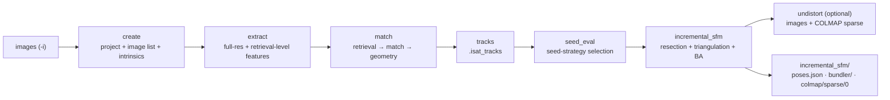

# 11 - System architecture (current state)

**Scope.** This document describes InsightAT **as implemented** in this repository (baseline `305bbd1`). It replaces the earlier "Project / AT task / Output" layered description, which described an application that was never built — that text is archived in [`../../archive/design/10_introduction.md`](../../archive/design/10_introduction.md) and [`../../archive/README.md`](../../archive/README.md). Where a document and the code disagree, **the code wins**.

---

## 1. What the system is

A **CLI-first, file-driven, single-machine sparse reconstruction pipeline**:

- One driver, `isat_sfm`, sequences **stage CLIs** (`isat_*`) as subprocesses.
- Stages exchange **self-describing files on disk** (IDC containers + JSON), never in-process state.
- The GPU is used for feature extraction, cascade matching, and two-view geometry; bundle adjustment runs in CPU Ceres.
- One process per stage. There is no cluster partitioning, no cluster-merge step, and no distributed scheduler.
- The **product front-end is an Electron GUI** (`sfm-gui/`, plus `sfm-viewer/` for COLMAP results). It drives the same CLI surface; it is not a separate implementation.

### The input contract: project → AT task snapshot → image list

Every run's inputs come from a **frozen ATTask snapshot**, not from the live project:

1. `isat_project create` + `add-group` + `add-images` + `isat_camera_estimator` build the project
   (groups, images, estimated intrinsics, measurements, input CRS).
2. `isat_project create-at-task -p <project.iat>` freezes that state into `ATTask::InputSnapshot`.
3. `isat_project extract -t <task_id> -o images_all.json -a` (and `intrinsics -t <task_id>`) export the
   image list and cameras **from that snapshot only**.
4. `isat_sfm` consumes `images_all.json`.

`isat_sfm`'s own `create` step runs exactly this sequence (`create → add-group/add-images →
isat_camera_estimator → create-at-task → extract -t 0`). The Electron GUI uses the same contract for
continue/rebuild: `create-at-task → extract -t <id> → isat_sfm --existing-task`. Editing the project
after the snapshot therefore cannot change a run that has already been frozen.

`--parent-task-id` records `prev_task_id`, which the GUI uses to render a task tree. Seeding a child's
poses from its parent (`Initialization::initial_poses`) has no writer yet.

### Not part of the current system

| Thing | Reality |
|-------|---------|
| Qt GUI as the product UI | **Dropped.** `src/ui/`, `src/render/`, `src/tools/at_bundler_viewer/`, `src/main.cpp` are legacy, opt-in (`INSIGHTAT_BUILD_QT_UI=OFF`). The product UI is Electron: `sfm-gui/` (drives the CLI) + `sfm-viewer/`. |
| Pose seeding from a parent task | `prev_task_id` is recorded and rendered as a tree, but `initial_poses` is never written |
| CRS / EPSG / ENU transforms during reconstruction | Not used — the solve runs in a local, geodetically unanchored frame |
| GNSS / IMU / GCP priors in the solve | Not used by the default pipeline (`spatial_retrieval` exists, but only `isat_retrieve` calls it) |
| Cluster-parallel SfM + merge | Design proposal only — see [archived 01](../../archive/design/01_algorithm_sfm_philosophy.md) |
| Distributed / multi-node execution | Not implemented |

---

## 2. Layers that exist

| Layer | Location | Rules |
|-------|----------|-------|
| **Product UI** | `sfm-gui/`, `sfm-viewer/` | Electron. `sfm-gui` sequences the CLI (`create-at-task` → `extract -t` → `isat_sfm --existing-task`), tails run logs, and opens `sfm-viewer` for COLMAP results. |
| **Pipeline driver** | `src/cli/isat_sfm.cpp` | Sequences stages, records per-stage timings, sets up run logs. Orchestration only — no algorithms. |
| **Stage CLIs** | `src/cli/isat_*.cpp` | One executable per stage; machine-readable `ISAT_EVENT` on stdout, logs on stderr (see [05](05_cli_io_conventions.md)). |
| **Algorithm modules** | `src/algorithm/modules/` | **No Qt.** Does **not** include `src/database/`; intrinsics/distortion enter as minimal structs. |
| **IO / containers** | `src/algorithm/io/` | IDC reader/writer ([13](13_idc_format_spec.md)), EXIF, geopack. |
| **Data model + task records** | `src/database/` | Plain C++ + Cereal, **no Qt**. `Project` / `ImageGroup` / `ATTask` / `InputSnapshot` are used by `isat_project` (which exports the image list from the task snapshot) and `isat_camera_estimator`. See [09](09_data_model.md). |
| **Legacy UI** | `src/ui/`, `src/render/`, `src/tools/at_bundler_viewer/`, `src/main.cpp` | Qt; opt-in build only, product route dropped. See [archived 06](../../archive/design/06_ui_framework.md). |
| **Benchmarks / packaging** | `benchmarks/`, `packaging/` | ETH3D comparison harness; AppImage / deb / Docker / Windows zip. |

### Pipeline flow



Stage names are the values accepted by `isat_sfm -s/--steps`. Default set: `create,extract,match,tracks,seed_eval,incremental_sfm`; `undistort` is opt-in via `--undistort`.

---

## 3. Process and data contracts

1. **Every stage is a separate process.** The driver shells out to a sibling `isat_*` binary next to itself. A failing stage aborts the pipeline (`run_or_die`); optional stages (`focal-from-geo`, `undistort`) may downgrade to a warning.
2. **stdout is machine-readable, stderr is for humans.** See [05](05_cli_io_conventions.md).
3. **Artifacts are files.** The work directory layout (called "scheme B" in the code) is:

   ```text
   <work>/
   ├── project.iat, images_all.json, camera_estimate_meta.json
   ├── feat/, feat_retrieval/
   ├── match/{pairs_retrieve.json, pairs_matched.json, *.isat_match}
   ├── geo/{pairs.json, *.isat_geo}
   ├── tracks/tracks.isat_tracks
   ├── seed_eval_all/
   ├── incremental_sfm/{poses.json, tracks.isat_tracks, bundler/, colmap/}
   ├── sfm_interval/            # optional per-iteration Bundler snapshots
   ├── logs/run_<timestamp>/    # console.log, detail.log, events.ndjson
   └── sfm_timing.json
   ```

4. **Run logs are per invocation.** `isat_sfm` writes `logs/run_<timestamp>/{console.log, detail.log, events.ndjson}`; `events.ndjson` mirrors the `ISAT_EVENT` stream.

---

## 4. Frames, units, and rotations

- **Frame.** Reconstruction happens in a **local frame anchored by the initial image pair**: the anchor image is at identity rotation and zero translation, and the scale is arbitrary (it is not tied to any geodetic CRS or to GNSS).
- **Identity.** Inside the solver, images and tracks are identified by **index** (`0..num_images()-1`); the mapping back to external image ids happens at the export boundary.
- **Rotation representation.** Poses are stored and optimized as a **unit quaternion + camera centre**, `[qx, qy, qz, qw, Cx, Cy, Cz]` (see `bundle_adjustment_analytic.h`). Angles are handled in **radians** internally.
- **Camera model.** `[fx, sigma, cx, cy, k1, k2, k3, p1, p2]` with `fy = sigma * fx`; Brown–Conrady radial distortion and Bentley-convention tangential terms.
- **CRS metadata.** `CoordinateSystem` (local / ENU / EPSG / WKT) can be written into a project file by `isat_project set-cs --type local|enu|epsg|wkt` (a new project defaults to `local`), but **no stage applies a CRS transform**. OPK / yaw-pitch-roll conversion code lives in `src/database/` and (legacy) `src/ui/utils/`; the design document that specified them is [archived](../../archive/design/08_coordinate_and_rotation.md).

---

## 5. Hardware and parallelism model

| Concern | Current behaviour |
|---------|-------------------|
| GPU backends | CUDA by default when the toolkit is present: PopSift extraction, cascade-hash matching, F/E/H RANSAC (`isat_geo_cuda`). GLSL/EGL compute paths exist as fallback. SiftGPU also builds against CUDA 12.x (`679a1ae`), and with CUDA 11.8. |
| Single GPU | One device per stage process (e.g. `--cascade-gpu-device`). No multi-GPU. |
| Bundle adjustment | CPU Ceres; linear solver prefers `CUDA_SPARSE` (cuDSS/cuSPARSE) when the Ceres build supports it, else `SUITE_SPARSE` → `EIGEN_SPARSE`, with an `ITERATIVE_SCHUR + JACOBI` retry. |
| Threads | `--io-threads` (stage I/O), `--ba-threads` (Ceres). |
| Known constraint | The geometry RANSAC library owns a global EGL/GL context and is **not thread-safe**; parallel work is across processes, not threads. |

---

## 6. See also

- [04](04_functional_at_toolkit.md) — what the CLI chain is and how stages are meant to be composed
- [05](05_cli_io_conventions.md) — stdout/stderr/exit-code and `ISAT_EVENT` contract
- [09](09_data_model.md) — data-model types and which parts the pipeline actually uses
- [13](13_idc_format_spec.md) — IDC container format
- [12](12_implementation_details.md) — implementation rules and pitfalls
- [../../report/insightat-technical-report.md](../../report/insightat-technical-report.md) — consolidated as-is technical report, including algorithms and benchmarks
