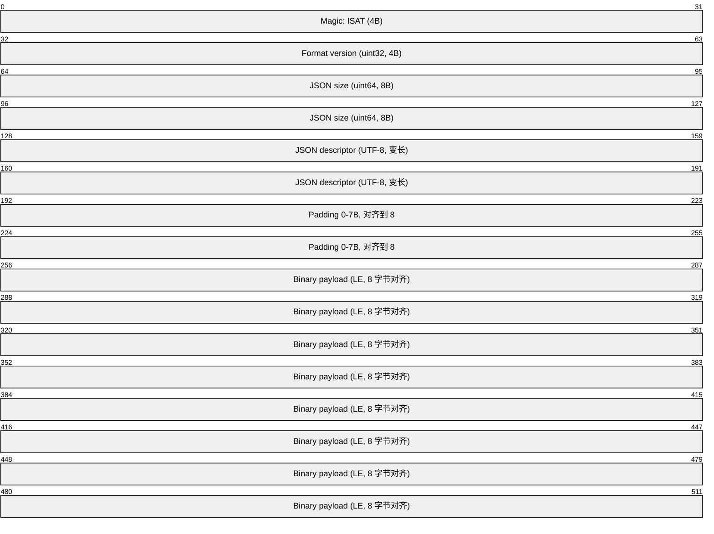
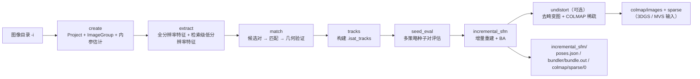
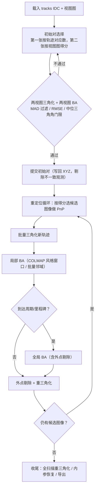

# InsightAT 技术报告

**开源一站式自动化三维重建系统**

| 项目 | 内容 |
|------|------|
| 软件名称 | InsightAT（All-in-one Automated 3D Reconstruction System） |
| 版本 | `0.2.5`（`VERSION`；面向用户的 `CHANGELOG.md` 最新条目为 `0.2.2`） |
| 代码基线 | `main` 分支，提交 `305bbd1`（初稿基于 `a5f1b10`；已按 `doc/` → `docs/` 重命名与 SfM 侧更新重新对齐） |
| 许可 | MIT License，Copyright (c) 2026 Yang Hu |
| 引用 | DOI [10.5281/zenodo.20042104](https://doi.org/10.5281/zenodo.20042104) |
| 报告日期 | 2026-09-28 |
| 报告范围 | 覆盖架构、数据格式、流水线、算法、工程契约与性能基准；**严格区分“已实现的代码”与“仅有数据模型/设计稿的能力”** |

> **说明一**：正文中的数值型默认参数取自当前代码（`src/cli/`、`src/algorithm/`），版本与性能数据取自 `VERSION`、`docs/develop/design/`、`docs/dev-notes/` 与 `benchmarks/`。
>
> **说明二（重要）**：`docs/develop/design/` 下的一部分文档（尤其 04/08/10/11/12）描述的是**构想中的系统形态**，与当前代码存在明显落差。本报告在相关位置逐一标注了落地情况；**请勿把设计文档中的能力当作现有功能引用**。核心落差见「1. 概述 · 现状边界」。

---

## 1. 概述

InsightAT 是一个以 **C++17 为主体、CUDA 加速、CLI 优先（CLI-first）** 的开源运动恢复结构（Structure-from-Motion, SfM）系统，目标是让摄影测量/航空三角测量（Aerial Triangulation, AT）从“需要研究者调参的代码库”变成一个 **开箱即用、默认参数可用** 的产品；容器化已落地，**规模化尚未实现**（见下方“现状边界”）。

能力边界可以概括为：

- **输入**：一组（航拍/近景/倾斜摄影）图像目录，配合 EXIF 与相机传感器数据库（内置 `data/config/camera_sensor_database.txt`）估计内参。
- **输出**：增量式稀疏重建结果，包括相机位姿（`poses.json`、Bundler `bundle.out`）、稀疏点云、COLMAP 兼容的 `sparse/0`，以及可选的去畸变图像与 COLMAP 稀疏模型（面向上游 3DGS / MVS 流程）。
- **形态**：默认构建为纯 CLI（`isat_*` 系列工具），提供 Ubuntu 22.04 / Windows + CUDA 12.8 支持，并可通过 AppImage、`.deb`、Docker 镜像与 Windows zip 分发；**产品界面为 Electron 应用**：`sfm-gui/`（驱动 CLI 流水线、管理任务快照与阶段续跑）与 `sfm-viewer/`（查看 COLMAP 稀疏成果）；纯 CLI 构建不含它们。

### 现状边界（务请注意）

以下边界按**当前代码**逐条核对（早期设计文档曾把这些写成现有能力；相关过时文档已归档，未实现项汇总在 `docs/develop/design/14_roadmap.md`）：

| 设计文档中的提法 | 代码现状 |
|------------------|----------|
| Qt GUI 作为产品界面 | **已弃用**。`src/ui/`、`src/render/`、`src/main.cpp`、`src/tools/at_bundler_viewer/` 是遗留实现，默认不参与构建（`INSIGHTAT_BUILD_QT_UI=OFF`）。**产品界面是 Electron GUI**（`sfm-gui/` 驱动流水线，`sfm-viewer/` 看 COLMAP 成果） |
| ATTask 任务层 | **已实现并接入流水线**。`isat_project create-at-task` 冻结当前项目为任务，`ls` / `inspect` / `delete-at-task` 管理任务记录；父任务链接（`--parent-task-id`）用于任务树展示 |
| 任务输入快照 `InputSnapshot` | **已实现且是流水线的输入契约**。`isat_project extract` / `intrinsics -t <task-id>` **只从任务快照**导出 `images_all.json` 与相机参数；`isat_sfm` 的 `create` 阶段本身就是「建项目 → 估内参 → create-at-task → extract -t 0」，Electron GUI 的续跑流程则是「create-at-task → extract -t → `isat_sfm --existing-task`」 |
| CRS / EPSG / ENU 等大地测量能力 | **已淡化**。类型与 `isat_project set-cs --type local/enu/epsg/wkt` 保留（新建项目默认 `local`），但重建求解不做 CRS 变换 |
| 大任务量（数万张）与云/分布式规模 | **未实现**。无簇划分、无合并/Sim3 对齐、无跨机调度 |
| GNSS / IMU 先验参与重建 | 模块层有（`spatial_retrieval`、EXIF/GPS 读取），但**默认重建链路不把它们作为约束** |

端到端一条命令：

```bash
isat_sfm -i /data/images -w /data/work
# 成果：/data/work/incremental_sfm/
```

---

## 2. 设计目标与定位

`docs/develop/design/00_why_Insight_AT.md` 把立项动机归结为四点，本报告沿用这一提法，并补充**各自的实际完成度**：

1. **易用性（Usability）** —— 现有开源摄影测量栈普遍需要大量调参和代码级理解，面向研究者与开发者而非最终用户。InsightAT 追求“合理默认值 + 少量配置即可跑通”。**完成度：主线已落地**（一条 `isat_sfm` 命令跑通，默认参数可用）。
2. **性能（Performance）** —— 开源流水线往往偏慢，目标是在关键环节达到商业级吞吐量级。**完成度：部分落地**（GPU 全链路 + 级联哈希匹配 + 几何验证求解器替换，见第 8 章；BA 仍以 CPU Ceres 为主）。
3. **云与规模（Cloud and scale）** —— 大量开源算法并未按分布式/容器化运行设计；要求整条栈面对 Docker/Kubernetes 集群友好。**完成度：容器化已落地（Docker 发布镜像），分布式/集群调度未实现**。
4. **大任务量（Large missions）** —— 航空摄影动辄数万张影像；需要能扩展到大型工程的路径。**完成度：未实现**。当前是单机、单进程、阶段串联的流水线；“簇并行 + 合并 + 全局 BA”的并行混合 SfM 仍停留在设计稿（见 9.4 与 `docs/develop/design/14_roadmap.md`）。

因此，现阶段的**真实能力边界**是：**单机、单进程串联、GPU 加速的稀疏重建**；能稳定处理的是中小规模（数十至数千张）数据集，而不是集群化的大规模求解。

前两条目标决定了几条贯穿全项目的架构约束：

- **文件驱动、无中心服务**：各阶段通过自描述文件交换数据，天然适配 Docker/NFS/对象存储；编排交给外部调度器或 shell（**仓库内不含调度实现**）。
- **算法层零 UI 依赖**：核心算法可在无头（headless）批处理中运行。
- **GPU 优先（BA 除外）**：特征提取 / 匹配 / 几何验证默认走 GPU 后端，CPU 仅作回退；**BA 目前仍以 CPU Ceres 为主**（全 CUDA BA 见 8.3，属规划中）。
- **一切可脚本化**：稳定退出码 + `stdout` 机器可读 + `stderr` 人类日志。

---

## 3. 系统架构

### 3.1 系统形态：设计模型 vs 实际落地

系统当前的真实形态是 **CLI-first、文件驱动、单机单进程串联的稀疏重建流水线**（见 `docs/develop/design/11_architecture_overview.md`，该文档已改写为“按现状描述”）。

早期设计文档（现已归档于 `docs/archive/design/10_introduction.md`）曾提出一个 **Project / AT Task / Output 三层应用模型**。它的各层落地程度差异很大，特此对照说明，避免误读：

| 设计层的说法 | 实际落地情况 |
|--------------|--------------|
| Layer 1 · Project：项目元数据、输入 CRS、相机库、GNSS/IMU/GCP 观测 | 类型存在于 `src/database/`，由 `isat_project` / `isat_camera_estimator` 使用；**GNSS/IMU/GCP 观测不进入求解**，CRS 仅作为项目元数据 |
| Layer 2 · AT Task：`InputSnapshot` 冻结输入、BA 只更新任务内位姿副本 | **已实现**：`create-at-task` 冻结快照，`extract`/`intrinsics -t` 从快照导出输入，`isat_sfm` 的 `create` 阶段即按此流程组织；求解时内参与位姿都在求解器自己的副本上迭代 |
| Layer 2 · 任务树继承父任务位姿 | **部分实现**：`--parent-task-id` 写 `prev_task_id`，Electron/Qt 界面据此展示任务树；从父任务**播种位姿**（`initialization.initial_poses`）尚无写入方 |
| Layer 2 的 Qt 求解-UI 形态 | **已弃用**：产品界面改为 Electron（`sfm-gui/`）。求解器不含 Qt 这条依赖约束仍然成立 |
| Layer 3 · Output：DBPose 与衍生成果、按目标 CRS 与旋转约定导出 | 稀疏成果以 `poses.json` / Bundler / COLMAP 形式落盘；**不按目标 CRS 或 OPK/YPR 约定导出**（该能力列入 [未实现](../develop/design/14_roadmap.md)） |

被代码严格执行的两条依赖约束是：`src/algorithm/` 不含 Qt、且不依赖 `src/database/`（保证求解器可无头运行于批处理）。任务快照层是**已落地的现有能力**；CRS 驱动的重建与导出、以及大规模/分布式仍是设计意图。未实现项汇总见 `docs/develop/design/14_roadmap.md`。

### 3.2 功能式 AT 工具箱（CLI-first）

`docs/develop/design/04_functional_at_toolkit.md` 给出了算法侧的组织原则，可归纳为“**每个阶段都是一个可独立运行、可单独测试的 CLI**”：

- 每个阶段只依赖**普通数据类型**，不依赖 `Project` / `ProjectDocument`。
- 阶段之间通过**自描述文件**交换数据，而非共享的内存数据库。
- 流水线按**无状态纯函数**设计：相同输入 ⇒ 相同输出。
- 优先使用 Eigen3 / Ceres 与显式、可审计的几何核（自研 GLSL/CUDA 鲁棒估计），避免 OpenCV 高层黑盒几何入口（本仓库**不引入 RansacLib**）。
- 每一步都设计了多种后端挂在稳定接口之后；**实际落地的是 PopSift / SiftGPU 两条提取路径，以及 CPU/GPU 两套匹配与几何后端**；ORB 特征与 GNSS/IMU 先验目前没有接入求解。
- **“分布式就绪”属于设计意图**：文件式 IO 与“一阶段一进程”为外部编排留了空间，但仓库不含调度器、队列或多机执行。

### 3.3 代码与目录结构

```text
InsightAT/
├── CMakeLists.txt          # 顶层：C++17、CLI-only 默认、SiftGPU/CUDA 选项
├── VERSION                 # 0.2.5
├── src/
│   ├── cli/                # isat_* 全套命令行工具
│   ├── algorithm/
│   │   ├── io/             # IDC 读写、geopack、EXIF
│   │   ├── export/         # COLMAP 导出
│   │   └── modules/        # camera / extraction / retrieval / matching /
│   │                       # cpu_cascade_hash / gpu_cascade_hash /
│   │                       # geometry / sfm
│   ├── database/           # Project/ATTask/ImageGroup/相机模型 + Cereal 序列化
│   ├── render/             # OpenGL 视图与 Bundler/COLMAP 加载（遗留，默认不构建）
│   ├── ui/                 # Qt 5.15 主窗口（遗留，路线已否决）
│   ├── tools/              # at_bundler_viewer（遗留 Qt，默认不构建）
│   └── util/               # 字符串、数值等横切工具
├── third_party/            # popsift、SiftGPU、PoseLib、cereal、nlohmann、nanoflann、
│                           # cmdLine、progress、ImageIO、stlplus3、task_queue
├── benchmarks/             # ETH3D 数据准备 + COLMAP/InsightAT 批跑与对比
├── docs/                   # 文档（design / user / dev-notes / experiment / report / archive）
├── packaging/              # linux/ docker/ appimage/ deb/ windows/ legacy/
├── sfm-gui/                # Electron 轻量外壳（驱动 CLI 流水线）
└── sfm-viewer/             # Electron + Three.js 的 COLMAP 稀疏成果查看器
```

### 3.4 技术栈与依赖

| 层次 | 选型 |
|------|------|
| 语言/标准 | C++17（`CMAKE_CXX_EXTENSIONS OFF`） |
| 数学 | Eigen3；Ceres Solver（BA） |
| 视觉/几何 | OpenCV（仅 `calib3d` 等必要模块） |
| 大地测量 | GDAL / PROJ —— **已淡化**：仅出现在 CRS 元数据、EXIF/GPS 解析与相机内参估计等边界环节，不参与重建求解 |
| 日志 | glog（默认走 `stderr`） |
| GPU | CUDA 12.8；SiftGPU（OpenGL/EGL 与可选 CUDA 后端）；PopSift；自定义 CUDA kernel |
| 序列化 | Cereal（二进制/JSON）+ nlohmann/json |
| UI | Electron 轻量外壳（`sfm-gui/`）与查看器（`sfm-viewer/`）；Qt 5.15 Widgets + OpenGL（`src/ui/`、`src/render/`、`src/main.cpp`）为**已被否决的遗留实现**，默认不构建 |
| 构建/分发 | CMake ≥ 3.16（Windows 经 vcpkg）、Docker、AppImage、deb、Windows zip |

CUDA 相关的两个关键点：

- **Ceres 与 CUDA 稀疏求解**：当 Ceres ≥ 2.3 且构建时可用，BA 的稀疏路径优先使用 `CUDA_SPARSE`（cuDSS / cuSPARSE）；CMake 会按 CUDA 工具链主版本自动选择匹配的 `libcudss/<major>`（例如 CUDA 12 → cuDSS 12），避免误链到更新的大版本。
- **后端由编译期默认值决定**：`isat_sfm` 在找到 CUDA toolkit 时，把默认值编译为 `extract=cuda / match=cuda / geo=cuda / impl=popsift + cascade-gpu`；否则回退为 `glsl / cpu / gpu / siftgpu + cascade`。

### 3.5 构建与分发

| 路径 | 作用 |
|------|------|
| `packaging/linux/build.sh` | 本地 cmake 构建，产物 `./build/isat_*` |
| `packaging/docker-build.sh` + `packaging/Dockerfile` | 发布镜像：镜像内自建 Ceres（hy）+ cuDSS，产出 AppImage 与 deb |
| `packaging/appimage/build.sh` | AppImage 打包 |
| `packaging/deb/package.sh` | Debian 包 |
| `packaging/windows/package.ps1` | Windows zip 暂存（CI 产出） |
| `packaging/legacy/qt-gui.sh` | 遗留 Qt GUI 打包脚本（路线已否决，归入 legacy） |

顶层构建选项默认值体现了“CLI 优先”的产品取向：

- `INSIGHTAT_BUILD_QT_UI`（默认 `OFF`）：**遗留的 Qt GUI，路线已否决**，仅在需要核查旧实现时打开。
- `INSIGHTAT_BUILD_GUI_ONLY`（默认 `OFF`）。
- `INSIGHTAT_ENABLE_SIFTGPU`（默认 `ON`）、`SIFTGPU_ENABLE_CUDA`（有 CUDA 时默认 `ON`）。

---

## 4. 数据模型与 IDC 容器

### 4.1 InsightAT Data Container（IDC）

IDC 是贯穿全流水线的二进制容器格式（`docs/develop/design/13_idc_format_spec.md`），设计目标为：**快速二进制体 + 可读 JSON 头 + 自描述 + 版本化 + 8 字节对齐**。



| 字段 | 说明 |
|------|------|
| Magic | `"ISAT"`（4 字节） |
| Format version | `uint32_t`，当前版本 `1` |
| JSON size | `uint64_t`，JSON 描述符字节数 |
| JSON descriptor | UTF-8 变长，描述每个 blob |
| Padding | 0–7 字节，使 payload 起始偏移为 8 的倍数 |
| Binary payload | 原始数据 blob，8 字节对齐 |

对齐计算：

```cpp
header_size  = 4 + 4 + 8 + json_size;
padding      = (8 - (header_size % 8)) % 8;
payload_offset = header_size + padding;   // 必为 8 的倍数
```

选择 8 字节对齐的原因：SIMD 访存、GPU 上传、跨架构（ARM64/x86_64）一致性，以及 `mmap` 后直接按 `float*` 访问的良定义性。

JSON 描述符中每个 blob 必须包含：

- `name` —— 唯一标识
- `dtype` —— 数据类型（**关键字段**，缺失会导致下游崩溃）
- `shape` —— 维度数组，如 `[N, 4]`
- `offset` —— 相对 payload 起点的字节偏移
- `size` —— 字节数

常见 blob 约定：

| 产物 | blob 名 | dtype / shape |
|------|---------|---------------|
| 特征提取 | `keypoints` | `float32` / `[N, 4]`（x, y, scale, orientation） |
| 特征提取 | `descriptors` | `uint8` 或 `float32` / `[N, D]` |
| 特征匹配 | `indices` | `uint16` / `[N, 2]` |
| 特征匹配 | `coords_pixel` | `float32` / `[N, 4]`（`x1,y1,x2,y2`） |
| 特征匹配 | `distances` | `float32` / `[N]` |

设计上有意**存储像素坐标而非归一化坐标**：检索阶段的内参可能被标记为低置信度（`"confidence": "low"`），F 矩阵估计直接使用像素坐标；E 矩阵估计时再动态调用 `K⁻¹` 归一化。索引使用 `uint16` 的前提是单图特征数 < 65536。

在 work 目录中可见的 IDC 扩展名包括 `.isat_feat`、`.isat_match`、`.isat_geo`、`.isat_tracks`。

读写实现位于 `src/algorithm/io/idc_reader.{h,cpp}` 与 `idc_writer.{h,cpp}`；`IDCReader` 维护 O(1) 的 blob 名索引，但**必须完整保留**原始 JSON 描述符字段（尤其是 `dtype`），这是文档反复强调的兼容性红线。

### 4.2 项目数据层：模型能力 ≠ 实际使用

`src/database/database_types.h` 定义了项目侧的领域模型：`CoordinateSystem`、`InputPose`、`Measurement`、`ATTask`、`Project`、`ImageGroup`、`CameraModel`、`CameraRig` 等，使用 Cereal 做版本化（反）序列化。这一层**不含 Qt**，保证无头环境可读写。

关键区分在于：这些类型描述的是“项目/任务**应当**如何组织”的模型能力，**不等于当前流水线的实际执行路径**。

| 模型能力 | 相关类型 | 当前状态 |
|----------|----------|----------|
| 任务输入快照 | `ATTask::InputSnapshot`（`input_coordinate_system` + `measurements` + `image_groups`） | **已接入**：`isat_project extract` / `intrinsics -t <task-id>` 从快照导出 `images_all.json` 与相机参数，`isat_sfm` 直接消费 |
| 任务继承 / 位姿播种 | `ATTask::Initialization`（`prev_task_id` + `initial_poses`） | `--parent-task-id` 写 `prev_task_id` 并驱动任务树展示；`initial_poses`（从父任务播种位姿）尚无写入方 |
| 原始观测不可变 | `Measurement`（GNSS/IMU/GCP） | 模型层面成立；**当前重建不使用这些观测** |
| 输入/输出坐标参考系 | `CoordinateSystem`（local / ENU / EPSG / WKT） | 保留在项目元数据与 `isat_project set-cs`；**重建求解不依赖它** |
| 多相机固定几何 | `CameraRig` | 类型存在；重建主线按 `image → camera_index` 逐图取内参 |

而当前 SfM 流水线真正读取的“项目”信息很薄：**图像清单（`images_all.json`）+ 逐图相机内参索引**——两者都由 `isat_project extract/intrinsics` **从任务快照**导出。`isat_project` 的 `create` / `add-group` / `add-images` / `create-at-task` / `extract` 正是为了让每个重建任务有自己冻结、可复现的输入。

换言之：**快照是设计并能跑通的现有能力**（`create-at-task` → `extract -t` → `isat_sfm`），任务树也已用于界面展示；只有「从父任务播种位姿」这一步还没有实现。

### 4.3 TrackStore：增量 SfM 的内存模型

`src/algorithm/modules/sfm/track_store.h` 描述了一个为增量重建优化的轨迹存储：

- **SoA 布局**：`xyz[3*cap]`、`flags[cap]`，观测以扁平结构存储并带 `obs_track_id`。
- **纯索引身份**：图像身份就是 `images_all.json` 中 `images[]` 的数组下标 `0..num_images()-1`，**全程不带外部 id**（也没有 `IdMapping` 之类的稠密化步骤——输入本来就是稠密的）。`poses.json` 同样以 `image_index` 指代图像，并在 `image_to_camera_index` 里给出相机下标。
- **逻辑删除**：删除只改标志位，不做数组搬移。轨迹位：`kAlive`、`kNeedsRetriangulation`、`kHasTriangulated`、`kSkipFromBA`；观测位：`kAlive`、`kRestorable`。
- **反向索引**：`image_index → 观测下标列表`，使“删除某图上的外点观测”这类操作是 `O(obs_in_image)` 而非 `O(num_observations_total)`。
- **可恢复观测**：因重投影误差（MAD 阈值）被删的观测带 `kRestorable`；当相机内参显著变化（如早期 BA 的焦距漂移）时，可由 `restore_observations_from_cameras` 重新评估恢复。因几何原因（深度 ≤ 0、三角角、PnP 外点）删除的观测不带该标志，永不自动恢复。

---

## 5. 端到端流水线

### 5.1 总览

`isat_sfm` 是端到端驱动器：它本身不实现算法，而是**按阶段调度同目录下的兄弟 CLI**（子进程方式），并在结束时输出每阶段耗时表与 `sfm_timing.json`。

默认阶段集合：

```text
create, extract, match, tracks, seed_eval, incremental_sfm
```

可选阶段：`undistort`。也可用 `-s/--steps` 指定子集（阶段名用逗号分隔），配合 `--existing-task` 在既有 ATTask 上续跑。



### 5.2 各阶段

#### 阶段 1 · create

本阶段是「项目 → 任务快照 → 输入清单」三段，按顺序调用：

1. `isat_project create -p <work>/project.iat`
2. `add-group` × N、`add-images` × N —— 把 `-i` 下的图像目录分组导入
3. `isat_camera_estimator -p project.iat -a` —— **基于 EXIF 的分组相机内参估计**（采样 `--max-sample`，默认 5 张），结果写回 `project.iat`
4. **`isat_project create-at-task -p project.iat`** —— 冻结当前项目（图像组 + 内参 + 测量 + 输入 CRS）为 `AT_0` 任务快照
5. **`isat_project extract -p project.iat -t 0 -o images_all.json -a`** —— **只从该任务快照**导出 `<work>/images_all.json`（图像清单 + `cameras[]` + `image_to_camera_index`）

也就是说：流水线的输入不是「当前项目」，而是「任务 0 的快照」——估内参发生在快照之前，之后对项目的改动不会影响这次重建。

`--existing-task` 模式下跳过本阶段，直接复用 `<work-dir>/images_all.json`（Electron GUI 的续跑/重建流程即此模式：先 `create-at-task`，再 `extract -t <id>`，最后 `isat_sfm --existing-task`）。

#### 阶段 2 · extract

调用 `isat_extract`，并且**总是先做一次全分辨率提取**，再（在非穷举模式下）追加一次仅用于检索的低分辨率提取：

| 用途 | 参数 | 值 |
|------|------|-----|
| 全分辨率 | `--nfeatures` | 10000 |
| 全分辨率 | `--threshold`（可由 `--sift-threshold` 覆盖） | `0.0067` |
| 全分辨率 | `--octaves` / `--levels` | `-1`（自动）/ `3` |
| 全分辨率 | `--image-max-dim` | 3200（`isat_sfm.cpp` 的实际默认值；其 `--help` 文案仍写 6000，是陈旧字符串） |
| 全分辨率 | `--norm` | `l1root` |
| 全分辨率 | NMS | 默认启用网格 NMS（`--no-grid` 关闭） |
| 检索级 | `--output-retrieval` | `<work>/feat_retrieval` |
| 检索级 | `--nfeatures-retrieval` / `--resize-retrieval` | 1500 / 1024 px |
| 检索级 | `--threshold` | `0.02` |

提取实现可选 PopSift（默认）或 SiftGPU（`--use-sift-gpu`）；后端可选 `cuda` 或 `glsl`。`l1root` 归一化 + `uint8` 描述子是后续级联哈希匹配能高效工作的前提。

特征分布策略有两条实现路径，见 `src/algorithm/modules/extraction/DISTRIBUTION_COMPARISON.md`：

- **ORB-SLAM 式四叉树 NMS**（`key_points_node.cpp`，指借鉴该策略而非使用 ORB 描述子）：按图像长宽比初始化网格，对特征过密的单元递归四分，直到达到目标数量；每个叶节点保留响应最强的一个点。复杂度 `O(n log n)`，在稀疏区域覆盖更好。
- **固定网格 NMS**（`feature_distribution.cpp`）：按固定网格（如 32 px）分块，每块保留 top-k 最强点，并可保留同一位置的多朝向特征。复杂度约 `O(n)`，实现简单、可配置。

#### 阶段 3 · match（候选对 → 匹配 → 几何验证）

这是全流水线中契约最严格的一段。v0.2.1 起，配对 JSON 被显式拆成**三态**，避免“让几何阶段去读一个从未产出匹配文件的候选对”：

| 文件 | 含义 |
|------|------|
| `<work>/match/pairs_retrieve.json` | 候选对（检索或穷举发现） |
| `<work>/match/pairs_matched.json` | 匹配对（确实写出了 `.isat_match` 的对） |
| `<work>/geo/pairs.json` | 验证对（通过几何验证的对），即真正的视图图边 |

候选对生成有两条路径：

- **穷举**：`--exhaustive-match` 强制，或图像数 `< --auto-exhaustive-max-images`（默认 60）时自动触发。生成 `n(n-1)/2` 对；超过 80 张会给出“可能极慢且吃内存”的告警。
- **检索**：调用 `isat_retrieval_match`，先用低分辨率特征做快速匹配得到候选对，并支持“低峰谷提升”（low-peak boost）——从 `feat/matching_extract_meta.json` 读取具有可用低分辨率特征峰值的图像索引并合并进候选对。检索阶段的 `--max-features` 为 4096，最小输出匹配数默认 16。

匹配阶段按 `--match-impl` 分派：

| `--match-impl` | 调用的工具 | 后端 |
|----------------|-----------|------|
| `cascade-gpu`（默认） | `isat_gpu_cascade_hashing_match` | CUDA kernel |
| `cascade` | `isat_cpu_cascade_hashing_match` | CPU |
| `gpu` | `isat_match` | 由 `--match-backend`（`cuda`/`glsl`）决定 |

几何验证按 `--geo-backend` 分派：`cuda`（默认，调用 `isat_geo_cuda`，若二进制不存在则降级到 `isat_geo --backend gpu-gl`）、`gpu`（`isat_geo --backend gpu-gl`）、`poselib`（CPU，通常较慢）。关键阈值：

- `--geo-min-inliers`：RANSAC 内点数门限，默认 10（困难场景可收紧到 12–15）。
- `--geo-thresh-f`：F 矩阵内点的 Sampson 误差门限，默认 16.0 px。
- `--focal-from-geo`（`auto` | `always` | `never`，默认 `auto`）：几何验证之后，若判定相机内参先验不可靠（EXIF 走 fallback，或参数疑似 `f35=35` 兜底），调用 `isat_focal_from_geo` 由视图图的 F 矩阵估计 `fx` 并回写 `images_all.json`；耗时单独记为 `focal-from-geo` 一行。`always` 下该步失败即中止，`auto`/`never` 下仅告警或跳过。

#### 阶段 4 · tracks

调用 `isat_tracks`，把「验证对 + `.isat_match` + `.isat_geo` + 图像清单」融合成单个 `<work>/tracks/tracks.isat_tracks`（IDC，内含 `view_graph_pairs`，schema 1.1），默认 `--min-track-length 2`。该文件同时是增量 SfM 与种子评估的输入。

#### 阶段 5 · seed_eval

调用 `isat_seed_eval`，对四组**初始对选择策略**（`balanced` / `wide_baseline` / `support_first` / `conservative`）做短窗口（默认 `--seed-eval-max-images 6`，通过调用 `isat_incremental_sfm` 实测）评估，输出：

- `seed_eval_all/report.json` —— 各策略得分
- `seed_eval_all/best_seed.json` —— 最优策略及其参数
- `seed_eval_all/report_plot.png` —— 可视化

`incremental_sfm` 阶段会读取 `best_seed.json`，把胜出策略的 `init_min_inliers`、`init_max_forward_motion`、`init_min_angle_deg`、`init_min_median_angle_deg`、`resection_min_inliers` 回填给 `isat_incremental_sfm`；若不可用则退回默认值并告警。设计动机见 `docs/dev-notes/2026-05-17-seed-eval-cli-design.md`：单一静态分数无法同时适配航片、ETH3D、COLMAP 小场景等不同分布。

#### 阶段 6 · incremental_sfm

调用 `isat_incremental_sfm`，核心求解阶段（详见第 6 节）。输出到 `<work>/incremental_sfm/`：

- `poses.json` —— 每张已注册图像的位姿
- `bundler/bundle.out` —— Bundler 格式（可用 `at_bundler_viewer` 查看；该查看器属遗留 Qt GUI，需 `INSIGHTAT_BUILD_QT_UI=ON` 才构建）
- `colmap/sparse/0` —— COLMAP 兼容稀疏模型
- `tracks.isat_tracks` —— 更新后的轨迹存储

`--output-interval-sfm` 会在 `<work>/sfm_interval/iter_NNNN/` 写每轮迭代快照（`bundle.out` + `list.txt`），便于观察收敛过程。

#### 阶段 7 · undistort（可选）

`--undistort` 触发 `isat_undistort`，基于 `tracks.isat_tracks` 与 `poses.json` 输出**去畸变图像 + COLMAP 稀疏模型（PINHOLE，`%08d` 命名）**，作为 3DGS / MVS 训练的输入；`--binary` 控制写二进制 `.bin`。

### 5.3 工作目录产物

代码注释把该约定称为 “scheme B”：**配对 JSON 收进 `match/`，tracks 阶段收进 `tracks/`，Bundler 导出收进 `incremental_sfm/bundler/`**。

```text
<work>/
├── project.iat                     # CLI 侧项目文件
├── images_all.json                 # 全量图像清单（focal-from-geo 会回写 fx）
├── camera_estimate_meta.json       # 内参估计来源元数据（决定是否触发 focal-from-geo）
├── feat/                           # 全分辨率特征 (.isat_feat) + matching_extract_meta.json
├── feat_retrieval/                 # 检索级低分辨率特征
├── match/
│   ├── pairs_retrieve.json         # 候选对
│   ├── pairs_matched.json          # 匹配对
│   └── *.isat_match                # 匹配结果
├── geo/                            # *.isat_geo + pairs.json（验证对）
├── tracks/                         # tracks.isat_tracks（轨迹存储，视图图内嵌）
├── seed_eval_all/                  # report.json / best_seed.json / report_plot.png
├── retrieval_match_work/           # 检索阶段中间目录
├── incremental_sfm/
│   ├── poses.json                  # 相机位姿
│   ├── tracks.isat_tracks          # 更新后的轨迹存储
│   ├── bundler/bundle.out          # Bundler 格式（遗留 Qt 查看器 at_bundler_viewer）
│   └── colmap/sparse/0             # COLMAP 兼容稀疏模型
├── sfm_interval/                   # 可选：每轮迭代 Bundler 快照
├── logs/run_<时间戳>/              # console.log / detail.log / events.ndjson（--no-log-file 可关）
└── sfm_timing.json                 # 各阶段耗时（同时以 ISAT_EVENT 打到 stdout）
```

注意：`match/`、`tracks/`、`incremental_sfm/bundler/` 这种分层是当前 HEAD 的布局；`a5f1b10` 及更早版本把 `pairs_*.json` 与 `tracks.isat_tracks` 直接放在 `<work>` 根目录。

---

## 6. 关键算法

### 6.1 检索（Retrieval）

`src/algorithm/modules/retrieval/` 提供多条候选对生成路线：

| 模块 | 作用 |
|------|------|
| `vlad_encoding` / `vlad_retrieval` | VLAD 全局描述子编码与 top-k 相似检索（默认 `vlad_clusters=64`、`top_k=20`） |
| `pca_whitening` / `pca_whitening_cuda` | 降维与白化，提升近邻可分性（含 CUDA 实现） |
| `spatial_retrieval` | 基于 GNSS 位置/姿态的邻域与半径批量检索（`radius_search_batch`） |
| `retrieval_types` | `ImageInfo`（含可选 GNSS/IMU）、`ImagePair`、`RetrievalOptions`、去重合并工具 |

设计上支持「空间先验（GNSS/IMU）+ 视觉检索」的组合，并按得分排序、去重、合并。**但要注意模块能力与流水线默认路径的区别**：`spatial_retrieval`（GNSS 空间检索）只被 `isat_retrieve` 使用，`isat_sfm` 默认走的是 `isat_retrieval_match`（低分辨率视觉匹配），不启用 GNSS 先验。

`docs/dev-notes/VOCAB_TREE_COMPLETE.md` 记录了词汇树（vocabulary tree）方案的设计，宣称在 > 10K 图像规模上比 VLAD 快 10–50×，属于**规划/探索**方向，未实现。

配套可视化工具：`scripts/visualize_vlad_retrieval.py`。

### 6.2 级联哈希匹配（Cascade Hashing）

这是 v0.2.0 引入、v0.2.1 起成为默认的匹配算法，同时有 CPU（`cpu_cascade_hash`）与 CUDA（`gpu_cascade_hash`）实现。核心思想是**用哈希分桶把描述子匹配从 O(N₁·N₂) 的暴力搜索降到候选桶内的比较**。

CPU 实现（`src/algorithm/modules/cpu_cascade_hash/cpu_cascade_hash.h`）的数据结构刻意做了 SoA 布局以提升缓存局部性：

```cpp
struct ImageFeatures {
  std::vector<std::array<uint64_t, 2>> compressed_hashes;  // 每个描述子的 128-bit 哈希
  std::vector<uint16_t> bucket_ids_flat;                   // 描述子 × bucket_groups 的桶号
  std::vector<int> bucket_counts;                          // (group, bucket) → 桶长度
  std::vector<int> bucket_offsets;                         // (group, bucket) → 起始偏移
  std::vector<int> bucket_indices;                         // 按桶连续的描述子下标
};
```

默认参数：

| 参数 | 默认值 | 含义 |
|------|--------|------|
| `hash_bits` | 128 | 压缩哈希位数 |
| `bucket_groups` | 6 | 桶组数（多组哈希取交集提升精度） |
| `bucket_bits` | 8 | 每组桶位数 |
| `candidate_top_min` / `candidate_top_max` | 6 / 10 | 每描述子候选桶数量范围 |
| `min_match_list_len` | 16 | 参与比率检验的最小候选列表长度 |
| `ratio_test` | 0.8 | Lowe 比率阈值 |
| `mutual_best` | true | 互为最近邻 |
| `use_bucket_secondary_hash` | true | 二次投影生成桶号（论文设计） |

GPU 版本 `GpuCascadeHashBlockMatcher` 以**图像块**为单位管理特征（`add_image` → `finalize` → `match_pairs`），配合检索/匹配阶段的 `--cascade-image-block-size`（默认 1000）、`--cascade-sample-images`（默认 256，用于估计全局平均描述子）与 `--cascade-min-output-matches`（默认 16）控制显存与输出规模。

### 6.3 GPU 几何验证（F / E / H RANSAC）

`src/algorithm/modules/geometry/` 实现两视图几何模型估计，支持 **F（基础矩阵）/ E（本质矩阵）/ H（单应）** 三种模型的 RANSAC，并有纯 CUDA 路径（`cuda_geo_ransac.cu`）与 EGL + OpenGL Compute Shader 路径（`gpu_geo_ransac.cpp`）。

架构特征：

- **headless EGL 上下文 + OpenGL 4.3 Compute Shader + SSBO**：自动枚举并优先选择 NVIDIA 设备，无需手动设置 `__NV_PRIME_RENDER_OFFLOAD`。
- **退化模型求解器可切换**：`null_vector` 提供 Jacobi 与 IPI（Inverse Power Iteration）两种求解器。
- **`isat_geo_cuda`** 进一步把「F+E+H RANSAC → E 分解 → 全量三角化」串成一条纯 GPU 流水线。

`design.md` 记录了一组实测对比（GTX 1060 6GB，N=2048，workgroup=32，50 次均值）：

| n | 模型 | Jacobi 均值 (ms) | IPI 均值 (ms) | 加速比 |
|---:|:---:|---:|---:|---:|
| 100 | H | 46.2 | 0.61 | **75.7×** |
| 100 | F | 46.2 | 0.73 | **63.3×** |
| 300 | E | 46.4 | 0.86 | **53.9×** |
| 500 | H | 46.6 | 0.92 | **50.7×** |
| 1000 | H | 46.6 | 1.26 | **37.0×** |
| 1000 | E | 46.9 | 1.36 | **34.5×** |

两个关键观察：

1. Jacobi 的耗时几乎与点数无关（≈ 46 ms）——瓶颈不是计算量，而是 **GPU 寄存器溢出（register spilling）**：`null_vector` 内部使用约 234 个动态索引 `float` 数组（B[81]+V[81]+A[72]），GLSL 编译器无法全部映射到寄存器，被迫溢出到 Local Memory（≈100 周期延迟 vs 寄存器 1 周期）。已用 `GL_TIME_ELAPSED` Timer Query 确认 dispatch 本身耗时 44 ms，而 `glMemoryBarrier` 返回仅 0.013 ms——**不是同步开销**。
2. IPI 求解器在 `n=100~1000` 上快 34–76×，且结果正确。其步骤为：`B = AᵀA` 并加微小正则化 `μ = trace(B)/1000` 使 `B_μ` 严格正定 → 原地 Cholesky 分解 `B_μ = L·Lᵀ`（约 9³/6 ≈ 135 次操作）→ 6 轮逆迭代（前向/后向代换 + 规范化）。选择 Cholesky 逆迭代而非幂迭代的原因：幂迭代收敛率 `1 − λ₂/λmax`，在 RANSAC 产生近退化配置（`λ₂ ≪ λmax`）时 40 步不足以收敛，会导致零向量求解失效；逆迭代收敛率 `(μ/λ₂)^k`，6 轮即可稳定求解。

已知限制（同一文档）：

- 线程安全：全局 EGL context / SSBO，**不支持多线程并发调用**。
- 最小点数：H ≥ 4 对，F/E ≥ 8 对（E 使用 **8 点法而非 5 点法**；纯平移场景无退化，但精度略低于 5 点法）。
- E 矩阵：调用方负责 `K⁻¹` 归一化，库内仅做 Hartley 二次归一化。
- 无精化步骤：输出 RANSAC 最优模型；工业使用建议用内点集再做一次全点 DLT/LM 精化。

### 6.4 轨迹构建

`isat_tracks` 把验证对、匹配与几何结果融合为轨迹（track），默认最短轨迹长度为 2。轨迹内嵌视图图（schema 1.1），供增量 SfM 直接消费；当 IDC 内没有内嵌视图图时，才回退去读 `pairs.json` / `geo` 目录。

### 6.5 增量 SfM

`src/algorithm/modules/sfm/incremental_sfm_pipeline.cpp`（约 5300 行）是求解主体，入口为 `run_incremental_sfm_pipeline`，可概括为「**初始对 → 重定位循环 → 三角化 → 局部/全局 BA → 外点剔除与修复**」。



关键机制：

- **初始对选择**（`run_initial_pair_loop`）：第一张图按轨迹对应关系排序，第二张按视图图得分排序；对每对候选做「两视图三角化 → 两视图 BA → MAD 稳健过滤 → 内点数/RMSE 门限 → **中位三角角**门限」。中位角门限（`min_median_angle_deg`）专门剔除近退化的前向运动对——这类对每个点的角度可能都过门限，但中位角仍极小，基线/景深比很差、尺度不稳定。**试错过程不改动 store**，只有接受时才提交（写回三维点并按图像反向索引剔除不一致观测）。
- **重定位（resection）**：对未注册图像按得分排序做 PnP；支持候选缓存与失活（`resection_score_cache.invalidate_all()`），连续无候选会触发救援路径（重三角化后重试）。
- **局部 BA 调度**：`LocalBAStrategy::kColmap`（COLMAP 风格局部窗口）或 `kBatchNeighbor`（批量邻域，覆盖全部已注册图像）。局部 BA 失败会自动回退到全局 BA。局部 BA 强制使用紧收敛阈值（`function_tolerance=1e-6`、`gradient_tolerance=1e-10`、`parameter_tolerance=1e-8`），不与全局 BA 的宽松中间轮参数混用。
- **周期/里程碑全局 BA**：支持「固定每 N 张」与「线性间隔 `gap = a + b·n`」两种策略，适配「前期密集、后期稀疏」的收敛规律。
- **外点剔除**：多视图重投影误差采用 **MAD（中位绝对偏差）** 推导阈值，另有角度与深度两类过滤器（`reject_outliers_angle_multiview`、`reject_outliers_depth`）。
- **内参渐进冻结**：`IntrinsicsSchedule::fix_mask_for(n_registered)` 按已注册图像数给出逐相机的 9 位内参冻结掩码（`fx, sigma, cx, cy, k1, k2, k3, p1, p2`），实现「早期放开、后期收紧」的渐进策略；`--fix-intrinsics` 可全局关闭内参优化。
- **内参变化后的观测恢复**：若某相机焦距相对上次快照变化超过阈值，对该相机带 `kRestorable` 的已删观测重新评估并恢复（`restore_observations_from_cameras`）——那些观测很可能是在错误内参下被误删的。
- **重三角化**：全局 BA 之后做全扫描重三角化（`RetriangulationScope::kFullScan`），并区分“新轨迹 / 跳过 BA 的轨迹”两类输入构造路径。
- **场景归一化**：按迭代数或已注册图像数周期性执行 `normalize_scene_median_tracks_and_poses`，把轨迹与相机中心按中位数尺度重归一，抑制数值漂移。
- **调试与限流开关**：`--debug-dir` + `--debug-interval` 写 Bundler 快照；`--max-registered-images` 限制规模；`--ba-grid-subset` / `--ba-grid-target` / `--ba-fixed-pose-skip` / `--skip-2degree-tracks` 用于 BA 的观测采样与提速实验。

### 6.6 光束法平差（BA）

`src/algorithm/modules/sfm/bundle_adjustment_analytic.cpp` 是自实现的解析雅可比 BA（而非依赖 Ceres 自动微分），头文件把相机模型写得非常明确：

```text
内参  intr[9] = [fx, sigma, cx, cy, k1, k2, k3, p1, p2]   （fy = sigma · fx）
位姿  pose[7] = [qx, qy, qz, qw, Cx, Cy, Cz]              （单位四元数 + 相机中心）
点    pt[3]   = [X, Y, Z]

投影：Xw = X − C；Xc = R(q)·Xw；xu = xc/zc；yu = yc/zc；r² = xu² + yu²
      dx = xu·(1 + k1·r² + k2·r⁴ + k3·r⁶) + tang_x
      dy = yu·(1 + k1·r² + k2·r⁴ + k3·r⁶) + tang_y
      u  = fx·dx + cx ;  v = sigma·fx·dy + cy
```

要点：

- **畸变模型**：Brown–Conrady 五参数，切向畸变遵循 Bentley 约定（`tang_x = 2·p2·xu·yu + p1·(r² + 2·xu²)`，`tang_y = 2·p1·xu·yu + p2·(r² + 2·yu²)`）。
- **sigma 参数化**：`fy = sigma · fx`；当 `sigma` 固定为 1 时退化为单焦距模型。这比「fx、fy 独立」更符合像元各向同性假设，同时减少一个自由度。
- **观测权重**：观测带像素域标准差 `std_sigma_obs_px`，由特征尺度映射而来（`sigma_feat < 2 → 1.0`，`< 4 → 1.2`，`< 8 → 1.4`，否则 `1.6`）。v0.2.1 把权重从“特征尺度导出的 sigma”改为“显式像素域观测标准差”，并同步到增量 SfM 与 resection 路径。
- **稳健核**：Huber 损失，δ 默认 4.0 px，可由残差自适应估计（`compute_huber_delta`）。
- **正则与先验**：支持 Tikhonov 正则（`tikhonov_lambda`）、焦距先验权重（`focal_prior_weight`），以及相机间距离弱先验（`BACameraDistancePrior`，在固定锚点后约束基线方向的尺度漂移）。
- **求解器选择与回退链**：
  - 小问题：`DENSE_SCHUR`。
  - 大问题：`SPARSE_SCHUR`，稀疏后端优先级 `CUDA_SPARSE (cuDSS/cuSPARSE) → SUITE_SPARSE (CHOLMOD) → EIGEN_SPARSE`；若不可用，则回退 `ITERATIVE_SCHUR + JACOBI`（即 v0.2.0 之前的大问题路径）。
  - 另有交替 BA（`run_alternating_ba`）作为联合 `SPARSE_SCHUR`/CHOLMOD 失败时的兜底。
- **可调性**：`BASolverOverrides` 暴露 `gradient_tolerance`、`function_tolerance`、`parameter_tolerance`、`dense_schur_max_variable_cams`（默认 30，DENSE↔SPARSE 阈值）、`max_num_iterations`、`huber_loss_delta`、`tikhonov_lambda`、`num_threads`；`isat_incremental_sfm --ba-threads` 可从流水线层面传入线程数。

### 6.7 坐标与旋转约定（**已淡化**，与重建主线关联很弱）

**这一节在设计文档中细节密度最高，但与当前重建主线的关联已经很弱。** 现阶段的 SfM 在**无大地基准的局部坐标系**中完成：轨迹与图像身份都是下标（`TrackStore` 只认 `0..num_images()-1`），求解过程不引入任何 CRS 变换，也不使用 GNSS/IMU 先验。

已归档的设计文档 `docs/archive/design/08_coordinate_and_rotation.md` 记录的约定仍然保留在数据模型与项目元数据中，主要服务于未来导出与（已否决的）UI，而非求解本身：

| 约定 | 领域 | 定义 |
|------|------|------|
| Omega–Phi–Kappa（ω, φ, κ） | 经典摄影测量 | **外旋** Z–Y–X |
| Yaw–Pitch–Roll | UAS / 导航 / 机器人 | **内旋** Z–Y′–X″（常配 NED 或 ENU 机体系） |

实际落地情况：

- `CoordinateSystem` 覆盖 local / ENU / EPSG / WKT 四类，可通过 `isat_project set-cs --type local|enu|epsg|wkt`（新建项目默认 `local`）写入项目文件；**但重建链路不使用它做坐标变换或高程基准转换**。
- GDAL/PROJ 相关代码出现在 EXIF/GPS 解析、`isat_camera_estimator` 等边界环节，而不是求解内核。
- 候选对检索中的空间先验（`spatial_retrieval`，基于 GNSS 位置/姿态）只被 `isat_retrieve` 使用，**默认流水线（`isat_retrieval_match`）不启用**。
- 旋转表示内部以四元数 + 相机中心 `[qx,qy,qz,qw,Cx,Cy,Cz]` 存储与优化（见 6.6）；OPK/ypr 等约定主要在 `src/database/database_types.*` 与 UI 侧 `src/ui/utils/coordinates.*` 中处理。**注意：设计文档提到的 `rotation_utils.h` 在仓库中并不存在**，属于未实现的设计内容。

因此，把 CRS / EPSG / 大地测量描述为 InsightAT 的核心能力会与现状不符。

---

## 7. 工程契约与质量保障

### 7.1 CLI 契约

`docs/develop/design/05_cli_io_conventions.md` 对全部 `isat_*` 工具做了统一约束，这是“可编排”的基础：

| 通道 | 约定 |
|------|------|
| 退出码 | `0` 成功；非 0 失败，且失败时 `stdout` 不输出“成功载荷” |
| `stderr` | 日志、提示、警告、错误、进度（`PROGRESS: 0.35`）；glog 默认也走 stderr |
| `stdout` | **仅机器可读输出** |

机器可读行采用 NDJSON 风格且带固定前缀：

```text
ISAT_EVENT {"type":"project.create","ok":true,"data":{"project_path":"demo.iat","uuid":"..."}}
ISAT_EVENT {"type":"project.add_group","ok":false,"error":"project file not found"}
```

- 前缀 `ISAT_EVENT `（含尾随空格）用于抵御第三方库误写 stdout。
- 每行必须是**单行紧凑 JSON**，便于 `grep` / `awk` / 日志管道消费。
- 建议字段：`type`、`ok`、`data`，失败时附 `error`。

日志级别优先级（高 → 低）：`--log-level` > `-q` > `-v` > 默认 `warn`；`error/warn/info` 映射 glog `minloglevel`，`debug` 额外打开 `VLOG(1)`。

### 7.2 分层依赖规则

`docs/develop/design/12_implementation_details.md` 把依赖边界写成硬规则：

- `src/algorithm/` —— **禁止 Qt 头文件与链接**；使用 `std::string` / STL / Eigen；**不依赖 `src/database/`**，内参与畸变由最小类型描述（`insight::camera::Intrinsics`：`fx, fy, cx, cy, width, height, k1, k2, k3, p1, p2`）。项目数据先由 `isat_project extract` / `intrinsics` 从任务快照导成 JSON，再由各阶段 CLI 传入求解器；GUI 也只调用这些 CLI。
- `src/database/` —— **禁止 Qt**；类型必须是可在无头环境（反）序列化的普通 C++ 结构。

这条规则的实际收益：算法层可独立编译、可被单元测试直接驱动、可在无显示设备的环境中运行，也便于未来替换为服务化/分布式执行。

### 7.3 测试与 CI

- 仓库内包含与模块同目录的单元测试，例如 `test_ba_analytic`、`test_track_ray_lambda_ceres`、`test_track_store_state_cache`、`test_incremental_triangulation`、`test_pnp_resection`、`test_sfm_diag2`、`test_seed_eval_common`。
- 几何模块提供 CUDA kernel 的 CPU 参考实现用于对比验证（`test_cuda_geo_ransac.cpp`）。
- CI：`.github/workflows/linux-build.yml`（`ubuntu-latest`）、`windows-build.yml`（`windows-2022`）与 `electron-gui.yml`（打包 Electron 界面）；Windows 侧经 vcpkg 装配依赖（`vcpkg.json`：ceres[lapack,schur,suitesparse]、eigen3、glog、gflags、glew、egl、gdal、nlohmann-json、opencv4[calib3d,jpeg,png,thread,tiff]）。
- 性能改动要求用 ETH3D 基准回归：`registered count` 不退步、RMSE 差 ≤ 0.01 px（`docs/dev-notes/2026-05-09-incremental-sfm-perf-plan.md`）。

### 7.4 打包与可复现

Docker 发布镜像在容器内**自建 Ceres + cuDSS**，避免宿主机 Ceres 与 CUDA 版本的耦合；本地开发脚本则优先复用 `~/.local/ceres-cuda128`，否则退回 apt `libceres-dev`（可用 `INSIGHTAT_USE_SYSTEM_CERES=1` 强制）。这一「本地宽松 / 发布严格」的双轨策略在 `packaging/README.md` 中明确记录。

---

## 8. 性能与基准

### 8.1 ETH3D 对比（v0.1 / v0.2 / COLMAP）

`docs/dev-notes/release-v0.2.0.md` 记录了 ETH3D 训练子集 13 个场景的批跑（全部 `code=0`）：

| scene | COLMAP SfM (s) | ISAT v0.1 wall (s) | ISAT v0.2 wall (s) | v0.2 / v0.1 |
| --- | ---: | ---: | ---: | ---: |
| courtyard | 117.1 | 60.6 | 44.3 | 0.73 |
| delivery_area | 129.1 | 72.7 | 57.0 | 0.78 |
| electro | 104.0 | 70.6 | 40.7 | 0.58 |
| facade | 331.7 | 249.6 | 129.7 | 0.52 |
| kicker | 76.5 | 32.0 | 27.1 | 0.85 |
| meadow | 24.8 | 7.9 | 9.8 | 1.24 |
| office | 42.2 | 22.5 | 23.4 | 1.04 |
| pipes | 24.0 | 10.6 | 8.3 | 0.78 |
| playground | 85.6 | 51.0 | 37.9 | 0.74 |
| relief | 89.9 | 55.2 | 35.6 | 0.64 |
| relief_2 | 87.8 | 58.1 | 40.7 | 0.70 |
| terrace | 49.5 | 25.4 | 21.3 | 0.84 |
| terrains | 102.5 | 45.1 | 47.3 | 1.05 |
| **Σ** | **1264.7** | **761.3** | **523.1** | **0.69** |

**口径与注意事项（引用该表时必须同时给出）**：

- 参考硬件为 **NVIDIA GTX 1060 6GB**（较老的消费级卡，对大幅面图像/密集 SIFT 金字塔的显存非常敏感）；所有时间数据均与机器强相关。
- COLMAP 列为 `elapsed_sfm_s`（特征 + 匹配 + mapper），总时间还含 `BIN→TXT` 导出（约 0.3–1.5 s/scene）；InsightAT 列为端到端 wall（含特征/匹配/BA），**两者分段口径并不完全一致，只作量级参考**。
- `n_points3d` 的统计方式不同（COLMAP vs InsightAT 稀疏导出），**点数不可直接当作质量分数对比**。
- COLMAP 使用自带 SIFT（CUDA 构建时常为 CUDA 加速），与 InsightAT 的 PopSift / SiftGPU 并非同一实现；仓库提供 `--use-sift-gpu` 以在“同为 SiftGPU 类实现”的前提下做对照。
- 图中除时间/点数外还包含 **GT 对齐误差**：先按图像基名匹配两侧模型，再用 Umeyama 相似变换拟合「参考相机中心 → 估计相机中心」，报告 RMSE / 中位 / 最大误差与尺度。

无 CUDA 或需要纯 CPU 复现时，仓库提供无头 GLSL 路径（`--extract-backend glsl --match-backend glsl` 等）。批跑与绘图入口：`benchmarks/sfm_compare/run_colmap_batch.py`、`run_insightat_batch.py`、`compare_dataset_batch.py`、`plot_eth3d_benchmark.py`。

### 8.2 GPU RANSAC 求解器（几何验证）

见 6.3 节实测表：IPI 相对 Jacobi 在 `n=100~1000` 上提速 **34–76×**，把几何验证的绝对耗时压到 **1 ms 量级**（GTX 1060 6GB，N=2048，50 次均值）。由于 Jacobi 的瓶颈是寄存器溢出而非计算量，这是典型的「算法等价替换带来数量级收益」案例。

### 8.3 全 CUDA 增量 SfM（规划中）

`docs/dev-notes/2026-05-09-incremental-sfm-cuda-architecture.md` 给出了把增量 SfM 全面 CUDA 化的架构设计，核心结论与预算是：

- **为什么要离开 OpenGL Compute Shader**：EGL + GLSL + SSBO 适合 per-pair 的「上传-处理-下载」流式处理，但 BA 的 LM 迭代需要在 GPU 内完成「算残差 → 组装 Hessian → 解线性系统 → 更新参数 → 接受/拒绝」的整环，中间状态必须跨迭代驻留 VRAM；SSBO 生命周期与 C++ 函数调用绑定，做不到这一点。
- **为什么不做 iSAM2 式 iLBA**：航拍非序列 SfM 不满足「时序到达 + 树形因子图 + 相邻帧大量共视」的前提（下一个 resection batch 可能是对面航带，共视点仅 30%–50%），Bayes tree fill-in 成本高。替代方案是**持久化 GPU Hessian 上的增量 rank-update**：`H_new = H_old + J_newᵀ W J_new`，只对新相机的贡献做 atomic 累加；`H_pp⁻¹`（逐点 3×3 逆）按需增量维护。
- **持久 GPU 状态**（`GpuSfMState`）：位姿 `[N×7] float64`、内参 `[N_cam×9] float64`、轨迹 XYZ `[T×3] float32`、轨迹/观测标志位、观测 SoA（`u, v, img, track, cam, flags`）、CSR 索引。
- **混合精度**：Hessian 累加 FP32 + Kahan 求和，Schur 消元与 `lsvchol` 求解 FP64，参数更新 FP64 delta × FP32 参数。理由：消费级 GPU（如 RTX 4090）FP64 吞吐仅为 FP32 的 1/56，需把 FP64 算量压到总 BA 的约 20%。
- **风险与对策**：CSR 索引仅在 batch 边界重建（外点剔除只改 flag，不改结构）；增量 Hessian 每 N 次（默认 5）做一次完整重建以抑制浮点漂移，最终由 Ceres 做 polish；CUDA kernel 均有 CPU 参考实现参与 CI 对比。

VRAM 预算（1000 图 × 500K 轨迹 × 平均 8 观测 = 4M 观测）：

| 数据 | 精度 | 内存 |
|------|------|------|
| poses (1000×7) | FP64 | ~56 KB |
| intrinsics (10×9) | FP64 | ~720 B |
| track_xyz (500K×3) | FP32 | ~6 MB |
| track_flags (500K) | uint8 | ~500 KB |
| obs u/v (4M×2) | FP32 | ~32 MB |
| obs img/track/cam/flags (4M×4) | uint32 | ~64 MB |
| CSR indices (4M×4) | int32 | ~64 MB |
| H_pp (500K×9×2) | FP64 | ~72 MB |
| Schur S（dense 1000×1000×7×7） | FP64 | ~392 MB |
| **合计** | | **~640 MB** |

即 RTX 3090（24 GB）在 5000 图规模下约需 4–5 GB；> 10000 图时 Schur 需改为稀疏存储（cuSPARSE CSR），预计 2 GB 以内。

同文档给出的预期收益（RTX 3090、1000 图、500K 轨迹、4M 观测）：

| 阶段 | 当前 CPU | Phase 1 | Phase 2 |
|---|---:|---:|---:|
| 三角化（全扫描） | ~8 min | ~20 s | ~8 s |
| 外点剔除（5 passes） | ~3 min | ~0.5 s | ~0.5 s |
| Resection（100 图） | ~2 min | ~15 s | ~15 s |
| Local BA（每批） | ~30 s | ~30 s | ~3 s |
| Global BA（定期） | ~5 min | ~5 min | ~30 s |
| **总计（1000 图完整重建）** | **~45 min** | **~12 min** | **~3 min** |

> 该表为**设计文档中的预估**，非当前实测结果；Phase 2（CUDA BA + 增量 Hessian）属于路线图。

---

## 9. 现状、限制与路线图

### 9.1 已实现（对应当前代码）

- 完整 CLI 工具箱：`isat_extract`、`isat_match`、`isat_cpu_cascade_hashing_match`、`isat_gpu_cascade_hashing_match`、`isat_retrieve`、`isat_train_vlad`、`isat_geo`、`isat_geo_cuda`、`isat_project`、`isat_tracks`、`isat_incremental_sfm`、`isat_seed_eval`、`isat_camera_estimator`、`isat_retrieval_match`、`isat_undistort`、`isat_calibrate`、`isat_sfm`。
- **任务与快照工作流**：`isat_project create` / `add-group` / `add-images` / `set-camera` / `set-cs` / `create-at-task`（冻结 `InputSnapshot`）/ `ls` / `inspect` / `delete-at-task` / `extract` / `intrinsics`。重建输入一律经任务快照导出，可复现、可续跑。
- **Electron 产品界面**（`sfm-gui/`）：内置 CLI 自动探测、`create-at-task → extract -t → isat_sfm --existing-task` 流程编排、阶段级 Continue/Rebuild、日志跟踪与进度；`sfm-viewer/` 是独立的 COLMAP 稀疏成果查看器。打包覆盖 AppImage / deb / Windows。
- IDC 容器格式、`database` 领域模型与 Cereal 版本化序列化。
- SIFT 提取：PopSift（默认）与 **SiftGPU（CUDA 12.x 已适配**，见 `679a1ae`，与 11.8 兼容）。
- 检索（VLAD、PCA 白化含 CUDA）、CPU/GPU 级联哈希匹配、GPU 几何 RANSAC（F/E/H）、两视图重建、轨迹构建、增量 SfM 与解析雅可比 BA。
- 三态配对契约、种子对自动评估、内参渐进冻结与恢复、MAD 稳健外点剔除、局部/周期/全量三级 BA 调度。
- 打包与 CI：Docker 发布镜像（自建 Ceres + cuDSS）、AppImage、deb、Windows zip、Linux/Windows 构建工作流。

### 9.2 未实现（不要当作现有能力引用）

- **大任务量 / 云与分布式规模**：没有簇划分、没有 merge/Sim3 对齐、没有位姿图融合、没有跨机调度。`src/algorithm/modules/sfm/` 下不存在相关代码路径；“单容器一阶段”目前只是**可对接的形态**，不是已实现的编排。**这是当前最主要的未实现项。**
- **从父任务播种位姿**：`--parent-task-id` 只记录 `prev_task_id`（用于任务树展示），`ATTask::Initialization::initial_poses` 没有写入方，child 任务不会继承 parent 的位姿作为初值。
- **CRS 驱动的重建与导出**：CRS 元数据可写入项目文件，但重建与稀疏导出不做坐标变换，也不按目标 CRS / OPK–YPR 约定导出。
- **GNSS / IMU / GCP 先验参与求解**：结构存在、`spatial_retrieval` 可用，但默认重建链路不把它们作为约束。
- **词汇树检索**：仅为设计稿（`vocab_tree_retrieval` 未进入仓库）。

> 已废弃（不是「待实现」）：Qt GUI。产品界面已确定为 Electron，遗留 Qt 目录不再维护。

### 9.3 已知限制

- **规模上限未验证**：既然是单机单进程串联、无簇并行，数万张影像的“大任务”既没有实现路径，也没有基准数据支撑；第 8 章的 ETH3D 场景规模都在单场景量级。
- **文档与代码落差**：早期设计文档存在两类偏差——把 Qt UI 写成产品界面、把任务/快照与 CRS 写成求解能力，同时又把已实现的 SiftGPU CUDA 12 支持写成未适配。本报告已按代码与 git 历史逐条核对；设计稿以现有实现为准，过时文档移入 `docs/archive/`，未实现项收敛到 `docs/develop/design/14_roadmap.md`。引用任何设计文档前仍必须以代码为准（`docs/README.md` 已明确“the code wins”）。
- **几何 RANSAC 库非线程安全**：依赖全局 EGL context / SSBO，单进程内不能并发调用；跨对并行目前靠批处理与多进程。
- **E 矩阵求解随后端而异**：`isat_sfm` 默认 `--geo-backend cuda` 走 `isat_geo_cuda`，其中 E 用 **8 点法**（`gpu_geo_ransac.h` 记载），精度低于 5 点法；单独调用 `isat_geo` 的默认后端是 `poselib`（PoseLib，5 点 Nistér）。两条路径都只输出 RANSAC 最优模型，没有内点集二次精化。
- **SiftGPU 与 CUDA**：**已适配 CUDA 12.x**（`679a1ae` 用 `cudaTextureObject` 替换被移除的 texture-reference 绑定，同时兼容 11.8）；`SIFTGPU_ENABLE_CUDA` 在检测到 CUDA 时默认 `ON`。默认提取器仍是 PopSift（未显式指定 `--use-sift-gpu` 时）。
- **OpenGL/EGL 依赖**：几何验证的 GLSL 路径需要 EGL 与 GLEW；无显示环境需走 EGL surfaceless。
- **大规模检索仍在演进**：VLAD 是当前可用路径；词汇树方案与查询缓存仍属设计/待实现。
- **发布口径易被误读**：ETH3D 表的时间与点数口径不一致、参考硬件较老，直接引用容易得出错误结论（仓库已在 `benchmarks/README.md` 中显式警告）。

### 9.4 路线图

#### 并行混合 SfM（两级设计，已归档：`docs/archive/design/01_algorithm_sfm_philosophy.md`）

**这是设计稿，代码中尚无实现**（`src/algorithm/modules/sfm/` 下不存在簇划分、Sim3 合并或位姿图对齐的代码路径，`isat_sfm` 也没有对应阶段）。其构想是面向航空/倾斜/城市级、数万张图像的目标架构：

- **Level 1（粗 SfM，仅设计）**：`按簇并行增量 SfM → 合并（Sim3 对齐/融合 + 可选图像级位姿图优化）→ 第一层全局 BA`。以「拓扑正确 + 全局一致」为验收标准而非最终精度；簇按 500–1000 张切分，每簇额外接收「强连接但在簇外」的邻域图像作为缓冲与融合桥；允许局部失败，困难图像在合并/全局 BA 后再用 PnP + 局部 BA 回收。
- **Level 2（高精度 SfM，仅设计）**：在全分辨率特征上做**位姿引导匹配**（用 Level 1 位姿收窄搜索范围）、高精度相对几何（亚像素匹配 + 两视图模型精化）以及第二轮全局 BA。

当前实际运行的仍是**单机、单簇的增量式重建**，即上述两级结构的“特例”（簇 = 全部图像，无 merge 阶段）。

#### 全 CUDA 增量 SfM

见 8.3 节：`GpuSfMState` 持久化、CUDA 三角化/外点剔除/PnP/BA、持久 Hessian 增量更新、混合精度 Schur 求解；落地顺序建议为「CMake CUDA → 状态骨架 → 外点剔除 → 三角化 → PnP → 局部 BA → 全局 BA」。

#### 云端与分布式

**未实现**。设计口径为「一个容器跑一个阶段，共享文件系统或对象存储交换产物」（`04_functional_at_toolkit.md`）。可以说的是：CLI 契约与 `ISAT_EVENT` 事件流**具备被外部调度器编排的条件**，但仓库内没有提供任何调度、队列或分布式执行实现。

#### 其他

- 词汇树检索与查询缓存；**更多**标准导出（COLMAP 已实现，Agisoft 风格 XML 与行业 POS 输出未实现）；v2 数据后端（可选 SQLite，面向超大块匹配）；学习式匹配器与自动策略选择。

---

## 10. 结论

InsightAT 的工程价值主要体现在两点，第三点是需要正视的边界：

1. **把「算法可替换」变成了可执行的工程契约**。CLI-first + 自描述文件 + 算法层零 Qt/零 database 依赖，使每个阶段都能独立测试与替换（PopSift/SiftGPU、CPU/GPU 匹配器、几何后端、BA 求解器），而不必改动整条流水线。
2. **在真实数据集上取得了可验证的提速**。v0.2 相对 v0.1 在 ETH3D 13 场景上端到端墙钟下降约 31%（761.3 s → 523.1 s，Σ）；GPU 几何验证通过把退化模型求解器从 Jacobi 换成 Cholesky 逆迭代，获得 34–76× 的单点提速，把几何阶段压进毫秒量级。
3. **仍未实现的是「规模」，而不是「产品形态」**。大任务量与云/分布式规模（簇划分、Sim3 合并、位姿图、跨机调度）没有实现，这是最主要的边界。相反，任务快照工作流（`create-at-task` → `extract -t` → `isat_sfm`）与 Electron 产品界面都已落地并接入流水线。本次已按实现与 git 历史重写设计文档：过时文档移入 `docs/archive/`，未实现项收敛到 `docs/develop/design/14_roadmap.md`。

需要客观看待的部分同样明确：几何库单线程（GPU 路径依赖全局 GL/EGL 上下文）、GPU 路径的 E 矩阵用 8 点法且无内点重精化、规模上限未验证、以及基准数据口径与硬件的局限。这些都在文档中被显式记录。

---

## 附录 A · CLI 工具清单

| 工具 | 职责 |
|------|------|
| `isat_sfm` | 端到端流水线驱动器（调度下列兄弟工具） |
| `isat_project` | 项目与输入清单的创建、检查、导出（含 ATTask 记录；任务层语义未接入重建流水线） |
| `isat_camera_estimator` | 基于 EXIF 的逐组相机内参估计 |
| `isat_calibrate` | 焦距标定聚合：汇总两视图焦距估计做全局一维优化，输出 `K.json`（离线辅助工具，需外部两视图目录） |
| `isat_extract` | SIFT 特征提取（PopSift / SiftGPU，全分辨率与检索级） |
| `isat_retrieve` | 图像对检索 |
| `isat_train_vlad` | VLAD 码本训练 |
| `isat_retrieval_match` | 低分辨率匹配式候选对发现 + F 验证 |
| `isat_match` | 特征匹配（`--match-backend cuda/glsl`） |
| `isat_cpu_cascade_hashing_match` | CPU 级联哈希匹配 |
| `isat_gpu_cascade_hashing_match` | CUDA 级联哈希匹配 |
| `isat_geo` | 两视图几何验证（`--backend gpu-gl/poselib` 等） |
| `isat_geo_cuda` | 纯 CUDA 几何流水线（F+E+H RANSAC、E 分解、全量三角化） |
| `isat_focal_from_geo` | 由视图图 F 矩阵估计相机焦距 `fx`（EXIF 缺失或先验不可靠时使用） |
| `isat_tracks` | 由匹配 + 几何构建轨迹 IDC |
| `isat_seed_eval` | 多策略种子对评估 |
| `isat_incremental_sfm` | 增量 SfM + BA 求解 |
| `isat_undistort` | 去畸变图像 + COLMAP 稀疏（3DGS/MVS 输入） |

## 附录 B · 关键默认参数速查

| 阶段 | 参数 | 默认值 |
|------|------|--------|
| 流水线 | 默认阶段 | `create,extract,match,tracks,seed_eval,incremental_sfm` |
| 流水线 | `--extract-backend` / `--match-backend` / `--geo-backend` | `cuda` / `cuda` / `cuda`（有 CUDA 时） |
| 流水线 | `--match-impl` | `cascade-gpu` |
| 流水线 | `--focal-from-geo` | `auto`（仅当内参先验不可靠时触发） |
| 流水线 | `--image-max-dim` | 3200 |
| 流水线 | `--sift-threshold` | 0.0067 |
| 流水线 | `--auto-exhaustive-max-images` | 60 |
| 流水线 | `--seed-eval-max-images` | 6 |
| 流水线 | `--cascade-gpu-image-block-size` / `--cascade-gpu-sample-images` | 1000 / 256 |
| 流水线 | `--cascade-gpu-min-output-matches` / `--retrieval-min-output-matches` | 16 / 16 |
| 提取 | `--nfeatures` / `--nfeatures-retrieval` | 10000 / 1500 |
| 提取 | `--resize-retrieval` / 检索阈值 | 1024 px / 0.02 |
| 匹配 | 比率检验 / 互近邻 | 0.8 / true |
| 级联哈希 | `hash_bits` / `bucket_groups` / `bucket_bits` | 128 / 6 / 8 |
| 几何 | `--geo-min-inliers` / `--geo-thresh-f` | 10 / 16.0 px |
| 轨迹 | `--min-track-length` | 2 |
| BA | Huber δ / DENSE↔SPARSE 阈值 | 4.0 px / 30 相机 |
| BA | 稀疏求解优先级 | `CUDA_SPARSE → SUITE_SPARSE → EIGEN_SPARSE`，回退 `ITERATIVE_SCHUR + JACOBI` |
| 坐标 | 内部角度单位 | 弧度 |

## 附录 C · 参考

- 设计文档（现状）：`docs/develop/design/00_why_Insight_AT.md`、`04_functional_at_toolkit.md`、`05_cli_io_conventions.md`、`07_serialization.md`、`09_data_model.md`、`11_architecture_overview.md`、`12_implementation_details.md`、`13_idc_format_spec.md`、`14_roadmap.md`（未实现项汇总）
- 已归档设计文档（不描述现状）：`docs/archive/design/01_algorithm_sfm_philosophy.md`、`06_ui_framework.md`、`08_coordinate_and_rotation.md`、`10_introduction.md`，归档原因见 `docs/archive/README.md`
- 工程记录：`docs/dev-notes/release-v0.2.0.md`、`release-v0.2.1.md`、`CHANGELOG.md`、`2026-05-09-incremental-sfm-cuda-architecture.md`、`2026-05-17-seed-eval-cli-design.md`
- 模块设计：`src/algorithm/modules/matching/DESIGN.md`、`src/algorithm/modules/geometry/design.md`、`src/algorithm/modules/extraction/DISTRIBUTION_COMPARISON.md`
- 基准：`benchmarks/README.md`、`benchmarks/sfm_compare/`、`docs/images/benchmarks/`
- 引用格式：

```bibtex
@software{yang2026insightat,
  author = {Hu, Yang},
  title = {InsightAT: All-in-one Automated 3D Reconstruction System},
  year = {2026},
  doi = {10.5281/zenodo.20042104},
  url = {https://github.com/huluoboge/InsightAT}
}
```
