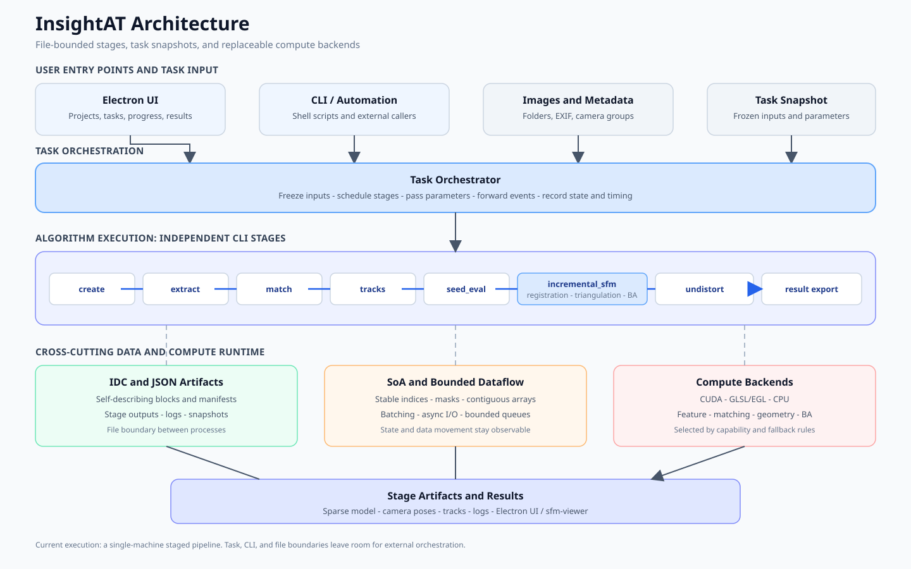
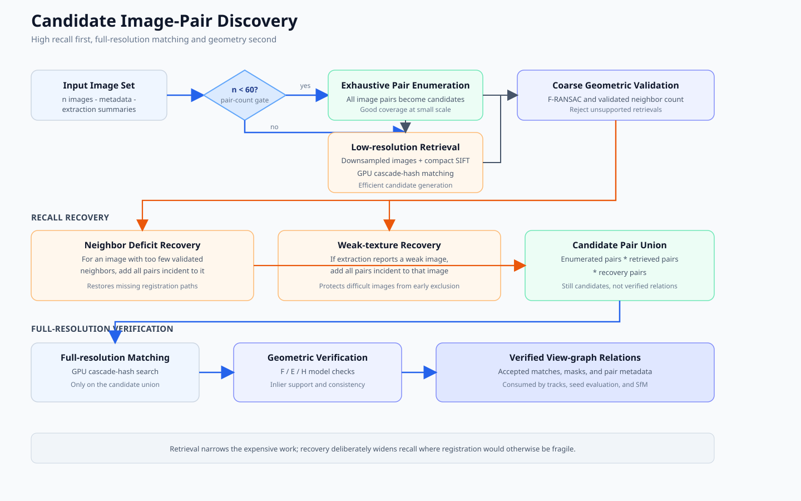
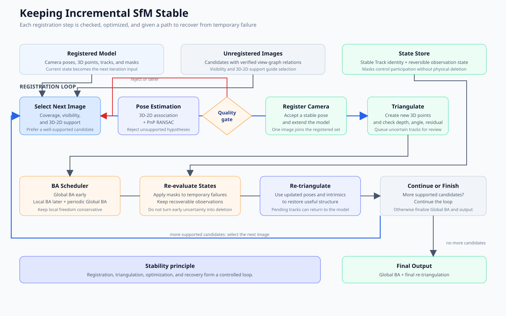
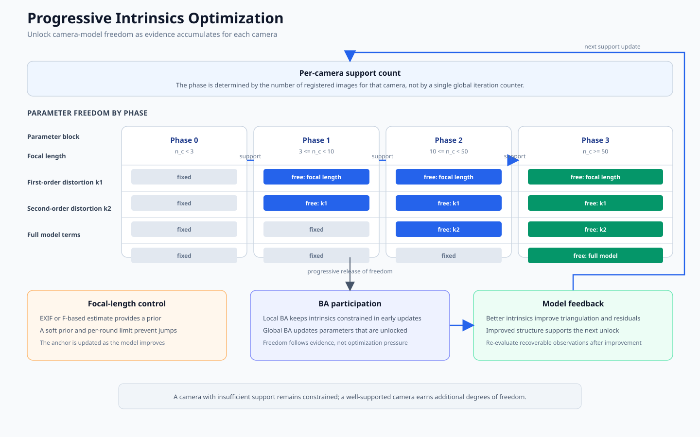
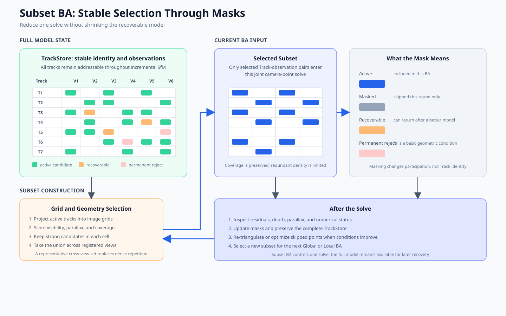

# InsightAT: Simple Automated SfM

## Abstract

InsightAT is designed for automated sparse reconstruction when the input metadata is incomplete, the image collection is growing, and the available compute resources are heterogeneous. Decisions about retrieval, feature thresholds, and intrinsic initialization are handled inside the pipeline. Users can run SfM with tasks that can be split, results that can be inspected, and failures that can be recovered. The system uses a task-description-driven staged architecture: independent CLIs and file artifacts connect the computation stages, while IDC, SoA, and asynchronous I/O organize large intermediate data. Electron UI provides the workflow entry point for users.

At the algorithmic level, InsightAT is built on SIFT. Global threshold lowering and a second per-image threshold reduction preserve candidate features in weak-texture images. Low-resolution pair retrieval, GPU cascade-hash matching, and F-matrix verification balance candidate recall with matching cost. The system also groups cameras automatically, searches for focal-length initialization from the F matrix, and improves reconstruction stability through multi-hypothesis initialization, incremental registration, reversible Track states, progressive intrinsic optimization, and Global/Local BA scheduling. The current version is a runnable single-machine incremental sparse reconstruction system. Automatic partitioning, cross-block merging, and multi-machine scheduling for very large scenes remain future extensions.

**Keywords**: automated SfM; sparse reconstruction; task-based architecture; GPU cascade hashing; focal-length estimation; incremental reconstruction; recoverable tracks; bundle adjustment

## 1. Motivation

InsightAT starts from the way an SfM system is organized and designs a computation pipeline for automated reconstruction.

Existing open-source implementations contain mature geometric algorithms. Many of them, however, are organized around single-machine execution, interactive use, or research experiments. Intermediate state often depends on a long-running process or a centralized data structure, which makes computation stages difficult to split, parallelize, and retry. Image retrieval, camera grouping, focal-length estimation, and threshold selection may also require repeated manual adjustment for each dataset. Such systems can produce reconstructions, while task isolation, failure recovery, and zero-configuration execution still leave room for improvement in production settings.

InsightAT aims to provide an automated, robust, and efficient SfM system for very large-scale 3D reconstruction in cloud environments. The word “Simple” refers primarily to the user experience: users should not need to understand internal algorithm choices or tune many parameters for each batch. The system makes those decisions internally and remains stable when the input is uncertain. The overall design follows four directions.

### 1.1 Task-based architecture for cloud execution

InsightAT organizes computation as a set of independently executable tasks. Each task is defined by input files, an execution command, parameters, and output files. Each algorithm module can run as a command-line program on a batch of data, with its work divided into task preparation, batch processing, and result merging when the algorithm requires it.

Modules exchange files. A task can run sequentially on one machine or in parallel across processes and machines. When a batch fails, only the affected part needs to be rerun. Scheduling, queue management, and machine allocation can be handled by an external system; the SfM algorithm only needs to expose clear, stable, and reusable task boundaries.

### 1.2 Automation and robustness for end users

SfM includes image association, feature extraction, two-view geometry, track construction, camera registration, triangulation, and bundle adjustment. Each stage has many parameters, and those parameters interact. A system that delegates all of these choices to the user is difficult to use as an automated production tool.

InsightAT keeps this complexity inside the system. It provides a default pipeline, adaptive strategy combinations, and fallback paths so that a complete run can start even when EXIF is missing, images have weak texture, cameras are mixed, associations are incomplete, or the initial pair is poor. Algorithm modules still expose detailed parameters for debugging, evaluation, and special cases. The default path does not require the user to make those decisions.

This approach consumes additional computation and may give up some peak performance on ideal data. InsightAT prioritizes a stable completion rate in production over theoretical throughput, and applies robustness throughout the pipeline: candidate retrieval, geometric verification, and incremental optimization all participate in that goal.

### 1.3 Efficient computation and data movement

3D reconstruction is constrained by both computation and data volume. Algorithmic kernels need parallel hardware, while the data path must prevent large file reads and writes from becoming the bottleneck. InsightAT therefore optimizes computation and I/O together.

- CUDA is preferred for compute, with GPU paths such as GLSL available for different hardware and runtime environments.
- Intermediate results use the self-describing IDC binary container. Data can be read by block, and processes do not depend on shared-memory state.
- I/O is organized asynchronously where possible, allowing data loading, computation, and result writing to overlap. Batch processing limits memory use and balances throughput against resource consumption.
- Internal data structures favor SoA (Structure of Arrays), which supports contiguous access, batch operations, and GPU transfers.

Together, these mechanisms form the system infrastructure: CUDA or GLSL handles compute efficiency, IDC, SoA, and asynchronous I/O handle data efficiency, and task boundaries carry these properties into a parallel execution environment.

### 1.4 An SfM path toward very large scenes

Global SfM is often effective at establishing wide-area relationships and has strong parallelization potential. Incremental SfM can inspect camera registration, triangulation, and optimization step by step, which makes it easier to control and recover when the input is uncertain. InsightAT follows a staged path: it first builds a reliable incremental SfM foundation and then extends toward hybrid and hierarchical reconstruction.

Version 1.0 first establishes a complete and stable incremental SfM core as the base for later system growth. For very large scenes, later versions can introduce hybrid or hierarchical strategies: local regions continue to use incremental reconstruction for robustness, while wider relationships and model merging use parallel processing, hierarchy, and global optimization. This preserves the inspectability of incremental reconstruction while leaving room for scale and efficiency.

The next chapters first describe the system infrastructure behind these goals: task splitting, batch parallelism, result merging, IDC, SoA, command-line interfaces, asynchronous I/O, and the relationship between UI and CLI. The later chapters then discuss the SfM algorithms and show how these system choices shape image association, initialization, track management, triangulation, and BA.

## 2. System Philosophy

The previous chapter described InsightAT's goals: cloud-oriented execution, automation, robustness, and efficiency. This chapter states the system-level decisions behind those goals: where computation begins and ends, how tasks are organized, how algorithms are separated from the runtime, and what robustness means when no operator is expected to intervene.

These decisions determine the later CLI, IDC, SoA, asynchronous I/O, and UI designs. They also define the conditions that the SfM algorithms must satisfy. The central objective is to give one SfM computation a boundary that can be executed, saved, parallelized, and recovered.

### 2.1 File is the boundary

In InsightAT, files are the most stable handoff boundary between stages. A stage reads explicit input files, runs with a specified command and parameter set, and writes explicit result files. Once a stage completes, its result files become inputs to the next stage. Downstream programs do not need to inherit objects, pointers, or global memory from the upstream process.

File boundaries make intermediate state persistent. If a program exits, the results already produced remain available, and a later run can continue from those artifacts. They also make stage results inspectable: developers can examine the inputs, outputs, and logs of one stage to locate a problem in association, feature extraction, matching, tracks, or incremental reconstruction.

The file boundary also determines the granularity of failure handling. A failed run can be localized to a stage; a failed batch can be rerun without restarting the whole stage; a failed merge can be retried while preserving the local results that already exist. In a future cloud runtime, an external scheduler can arrange work from files, commands, and parameters without understanding the camera, track, and 3D-point relationships inside SfM.

These files have explicit structure and semantics. IDC describes the type, shape, offset, length, and meaning of each data block, while binary payloads store the actual data. A file therefore serves as a communication boundary, a task-state record, a debugging artifact, and a recovery point.

### 2.2 Task is the unit of computation

InsightAT treats a task as the basic unit of computation and scheduling. A task contains, at minimum, input data, an execution command, parameters, and expected outputs. The input may be the complete dataset or a batch created during task preparation.

Depending on algorithm scale and data characteristics, a module can be organized into three logical parts:

```text
task preparation and splitting (optional) -> batch processing (required) -> result merging (optional)
```

Task preparation creates manifests, partitions data, and prepares parameters. Batch processing performs the algorithmic work. Result merging organizes multiple local outputs into artifacts that downstream stages can read. Whether a module should be split or merged depends on its data and algorithm: a small dataset can run as one task, a parallel-friendly module can be split, and merging is needed only when multiple local results exist.

Task-based organization turns an indivisible long-running process into units that can be observed, saved, run in parallel, and retried. Small datasets can run sequentially on one machine; a single machine can use multiple processes or threads; an external task system can later distribute batches across machines or resource types. A failed batch does not force the entire stage to restart.

Task boundaries also leave an interface for the InsightAT 2.0 large-scene path. Local reconstruction, cross-block matching, model alignment, and model merging can continue to use input files, batch tasks, and result files. Cross-machine scheduling and large-scene merging are not implemented in the current system, but those future capabilities do not require a change to the basic calling form of the algorithm modules.

### 2.3 Algorithm-Scheduler Decoupling

An algorithm module should not need to know which scheduler started it, which interface called it, or which machine it runs on. It only needs to understand its input files, parameters, and output files, and complete one task or batch within the available resources.

InsightAT therefore divides the SfM pipeline into independent CLIs. `isat_sfm` organizes stage order, starts subprocesses, forwards parameters and progress, and records timing. It does not hold global algorithm state for the entire reconstruction and does not implement feature extraction, matching, geometric estimation, or BA. Those algorithms live in their respective command-line modules and exchange artifacts through files.

This separates algorithms from the scheduler. The caller may be a single-machine command-line program, a desktop UI, a server endpoint, an RPC service, or an external task platform. The calling mechanism can change while commands, input/output files, and task boundaries remain stable. The UI creates tasks, starts processing, tracks progress, reads logs, and displays results; the algorithms remain in independent CLIs.

The current InsightAT system provides scheduler-friendly algorithm programs and task boundaries. Queues, resource management, cross-machine scheduling, object storage, and server-side retries belong to the surrounding runtime. This division keeps the algorithm core independent of a particular scheduler, cloud platform, or UI framework.

### 2.4 Automation changes the definition of robustness

An interactive tool can stop between stages and let a user inspect matches, change focal length, specify camera groups, replace the initial pair, or rerun a stage. An automated system cannot assume that intervention. Users usually provide images and start the run; the program must make the main decisions itself. Automation therefore increases the system's responsibility for uncertain input.

In InsightAT, robustness covers result quality, intermediate decisions, and failure handling:

- The system evaluates whether the current result is trustworthy instead of accepting the first result unconditionally.
- When a hypothesis fails, the system can try another candidate or follow a fallback path.
- Temporarily unreliable observations and states can be marked and retained for later reevaluation.
- A failed local batch or intermediate stage does not invalidate results that have already been produced elsewhere.
- The default pipeline can continue as far as possible without manual parameter adjustment.

This is also why InsightAT uses incremental SfM as its 1.0 foundation. Incremental processing can inspect camera registration, PnP, triangulation, and BA step by step, reject unreliable states, and reevaluate them after conditions improve. Recall recovery in image association, F-based reasoning with unknown focal length, multi-hypothesis initialization, reversible track and observation states, and conservative BA scheduling all express the same system philosophy.

Automation usually adds computation, candidates, and state-management complexity. InsightAT keeps that complexity inside the system and prioritizes stable completion on uncertain input. “Simple” describes the way users operate the system, not the complexity of the algorithms inside it.

## 3. Architecture

This chapter turns the system philosophy into a concrete architecture. InsightAT forms a processing chain from CLIs, files, tasks, and data structures. Each stage has a defined responsibility; stages exchange files; each stage selects sequential, batched, or parallel execution according to its data and computation.

As shown in Figure 1, the architecture has five connected layers from top to bottom: user entry and input, task orchestration, algorithm execution, data exchange and compute runtime, and stage artifacts and final results.

Figure 1 shows the relationship between user entry points, task orchestration, independent algorithm stages, data exchange, and compute backends.



*Figure 1. InsightAT system architecture. The current execution form is a single-machine staged pipeline; task, CLI, and file boundaries leave an interface for external orchestration.*

Together, these five layers form the path from task start to result viewing. Electron UI, CLI, and the image directory provide entry points and task inputs. The orchestration layer creates tasks, orders stages, passes parameters, and records execution state. The algorithm layer consists of independent CLI stages for features, matching, geometry, tracks, and SfM. The data and runtime layer uses IDC, JSON, SoA, asynchronous I/O, and CUDA, GLSL/EGL, and CPU backends to organize stage data, memory access, data movement, and computation. The bottom layer stores stage artifacts, logs, progress, and reconstruction results.

Solid arrows in the figure show the main data and control flow. Data exchange and the compute runtime span the algorithm stages, providing common data formats, memory layouts, I/O mechanisms, and compute backends. The parts cooperate through explicit input, output, and state boundaries; stages do not need a shared memory state that persists across the entire pipeline.

The five layers are connected by tasks, commands, files, and state events. The core algorithms do not depend on a particular interface or scheduling method. Any caller that follows these boundaries can invoke the same algorithms, whether it is a command line, Electron UI, or another upper-level system. The complexity remains inside the system while the user sees a continuous reconstruction workflow.

### 3.1 CLI pipeline

#### 3.1.1 Pipeline stages

InsightAT's SfM workflow consists of independent command-line programs. The default pipeline is:

```text
create
  -> extract
  -> match
  -> tracks
  -> seed_eval
  -> incremental_sfm
  -> undistort (optional)
```

The default execution form is a single machine. One `isat_sfm` run starts each stage in order, while individual stages use threads, OpenMP, or a GPU according to their computation. Tasks and files connect the stages, so the same boundaries can later be split into batches for scheduling.

The stages follow the usual SfM data order, with explicit inputs, outputs, and task boundaries:

- `create` reads the image directory and creates the base information required by the project and task;
- `extract` extracts features and writes the data needed by matching;
- `match` establishes candidate image relations and performs descriptor matching and geometric verification;
- `tracks` builds tracks from valid correspondences;
- `seed_eval` evaluates candidate initial pairs and selects a starting point for incremental reconstruction;
- `incremental_sfm` performs camera registration, triangulation, track updates, and BA;
- `undistort` optionally creates undistorted images and corresponding results.

#### 3.1.2 Task snapshots and resume

`create` performs project creation, image-group import, camera-intrinsic estimation, task-snapshot creation, and input-manifest export in sequence. `create-at-task` freezes the current project as an `ATTask`. Later, `extract -t <task-id>` and `intrinsics -t <task-id>` read only that snapshot and generate `images_all.json` and per-image camera intrinsics for the reconstruction. Changes to the project after task creation therefore do not silently change a run that has already started.

The GUI resume workflow follows the same task contract: create a task snapshot, export inputs from that snapshot, and then run `isat_sfm --existing-task`. `--existing-task` skips project preparation and reuses the existing input manifest. This keeps the input set, image indices, and camera information stable and allows stages to be rerun independently.

`isat_sfm` orchestrates the complete pipeline. It starts subprocesses, passes input paths and parameters, forwards structured progress, and records stage timing. The concrete algorithms remain in their CLI modules. `isat_sfm` does not retain global algorithm state for the whole reconstruction and does not implement feature extraction, matching, geometric estimation, or BA.

#### 3.1.3 CLI interfaces

From an interface perspective, CLIs cooperate through several stable interfaces:

- **Control interface**: command names, command-line arguments, input paths, and output paths describe one execution;
- **Data interface**: IDC and related file formats exchange features, matches, tracks, and reconstruction results;
- **State interface**: exit codes, logs, and structured progress report success, errors, and stage progress.

Together these interfaces form the communication protocol of the CLI pipeline. They are serializable, persistent, and inspectable external state. A UI, shell script, or external task system can start the same algorithms in its own way without changing the algorithm modules.

Each stage can process the complete input or a batch created during task preparation. Small datasets can run sequentially on one machine; parallel-friendly stages can start multiple CLIs concurrently. Stages do not depend on a shared address space: the output file of one stage is the input file of the next. Every edge in the pipeline is therefore also a data dependency that can be saved, inspected, and retried.

#### 3.1.4 Working directory and stage artifacts

A typical run uses a directory similar to:

```text
<work>/
├── project.iat
├── images_all.json
├── camera_estimate_meta.json
├── feat/                       # full-resolution features
├── feat_retrieval/             # low-resolution retrieval features
├── match/                      # candidate pairs, matches, and .isat_match
├── geo/                        # geometric verification and .isat_geo
├── tracks/tracks.isat_tracks
├── seed_eval_all/              # initial-pair evaluation
├── incremental_sfm/            # poses, tracks, and sparse model
├── sfm_interval/               # optional incremental snapshots
├── logs/run_<timestamp>/
└── sfm_timing.json
```

These directories are the artifacts of the pipeline. `images_all.json` fixes image identity. `*.isat_feat`, `*.isat_match`, `*.isat_geo`, and `*.isat_tracks` store binary intermediate data. `poses.json`, Bundler, and COLMAP sparse directories store final or intermediate reconstruction results. Logs and timing files record the execution process.

### 3.2 IDC

#### 3.2.1 Data-exchange goal

Stage data is organized with IDC (InsightAT Data Container). IDC follows the general design of formats such as glTF/glb, where a description is kept separate from a binary data payload.

The description records the name, count, type, shape, offset, length, and semantic information of each data block. The binary section stores large feature, match, geometry, and track arrays. A reader parses the description first and then locates only the blocks it needs. It does not inherit memory objects or global state from the previous process.

#### 3.2.2 Physical file layout

The physical layout of an IDC file can be summarized as:

```text
┌────────┬─────────┬───────────┬────────────────┬──────────┬─────────┐
│ "ISAT" │ version │ json_size │ JSON descriptor│ padding  │ payload │
│  4 B   │  u32    │    u64    │    UTF-8       │ align 8 B│ binary  │
└────────┴─────────┴───────────┴────────────────┴──────────┴─────────┘
```

Each data block in the descriptor declares `name`, `dtype`, `shape`, `offset`, and `size`. An 8-byte alignment separates the header and the payload, which supports SIMD access, GPU uploads, and cross-platform reading. Common IDC artifacts in the working directory include `.isat_feat`, `.isat_match`, `.isat_geo`, and `.isat_tracks`. Each artifact declares its own array structure, and stages do not depend on C++ object layouts.

#### 3.2.3 Typical data artifacts

Feature files can store keypoints and descriptors. Match files can store feature indices, pixel coordinates, and distances. Geometry files can store correspondences that pass F/E/H verification. Track files store tracks, observations, and view-graph relations. Pixel coordinates remain in pixel space during matching and geometry; they are normalized later when intrinsics are required. Each stage can therefore read the same data according to its own computation.

#### 3.2.4 IDC in the system

IDC provides a stable data boundary between stages:

- Data files are self-describing, so downstream programs can understand their structure without hidden memory-layout assumptions.
- Large arrays use binary storage, avoiding the overhead of text parsing and object construction.
- Data blocks can be read on demand instead of loading every block into memory.
- Stage results can be saved, inspected, reused, and rerun independently.
- Future local reconstruction, cross-block association, and model merging can continue to use the same exchange mechanism.

IDC and the task system are complementary. The task description determines how a CLI runs, while the IDC file determines what data that task produces. One defines the work; the other defines the data handoff. Together they form a computation boundary that can be split and recovered.

### 3.3 SoA

#### 3.3.1 Why SoA

SfM has several access patterns. Feature extraction and matching access images, track construction accesses correspondences, incremental reconstruction accesses tracks and cameras, and BA organizes data by variable blocks and observation relations. If all attributes are wrapped in many interconnected objects, contiguous access, batch processing, state updates, and GPU transfers become difficult.

InsightAT therefore favors SoA (Structure of Arrays) for internal data. Coordinates, indices, image IDs, feature IDs, observation attributes, and state information are stored in separate contiguous arrays. Algorithms can read or update only the fields they need. For example, track data can keep 3D coordinates, track state, and observation ranges in separate arrays; observation data can keep image ID, feature index, pixel coordinates, and observation state in separate arrays.

#### 3.3.2 TrackStore and stable indices

The current `TrackStore` is a typical SoA design. Track coordinates are stored in contiguous arrays. Tracks and observations have separate state flags. Observations are linked to tracks through a flat array and `obs_track_id`, and a reverse index maps each image to its observation indices. Removing an outlier observation from one image therefore does not require scanning every track or rebuilding the entire object graph.

Image identity also uses a stable dense index. The array index in `images[]` from `images_all.json` is the image identity for the task, and later stages use the same `image_index`. Camera indices are linked through `image_to_camera_index[]`. The system does not repeatedly rebuild mappings from external IDs to internal IDs between stages, reducing identity conversion between task snapshots, IDC data, and the solver.

#### 3.3.3 Contiguous access and batch computation

SoA is useful in three main ways:

1. Contiguous arrays support sequential access and batch computation, reducing the cost of object indirection.
2. Each algorithm can read only its relevant arrays instead of loading unrelated fields.
3. Arrays can be transferred to a GPU directly and connected more easily to batch I/O.

#### 3.3.4 State flags and reversible updates

InsightAT combines SoA with state flags or masks. The validity of 3D points and observations is controlled by state. Removing an observation, temporarily disabling a 3D point, or restoring it after conditions improve usually requires a state-array update, not a move of the whole track or a reconstruction of the object graph.

Current track states include “valid,” “needs retriangulation,” “already triangulated,” and “skip BA.” Observation state can mark an observation as “valid” or “recoverable.” A temporary rejection caused by reprojection error can be reevaluated after a significant intrinsic change. A rejection caused by negative depth, triangulation geometry, or a PnP outlier is not automatically restored. These categories give reversibility a precise algorithmic meaning and distinguish temporary failure from permanent invalidity.

The design adds state information and storage, but provides the reversibility required by incremental reconstruction. Track structure stays relatively stable while algorithms change the effective state at each stage. The same foundation supports triangulation, retriangulation, observation rejection, and Subset BA.

### 3.4 Async I/O

#### 3.4.1 Loading, computation, and writing

End-to-end reconstruction speed depends on both computation and data movement. Image, feature, match, and track files can be large. If computation waits for every read and write, both CPU and GPU resources become idle. I/O is therefore part of the computation path.

InsightAT stages are generally organized as:

```text
load the next batch -> compute the current batch -> write the previous result
```

The loading step prepares the next batch, computation processes the current batch, and writing stores the previous result. Bounded queues connect the three steps. When a queue is full, loading is throttled instead of allowing memory use to grow without limit. I/O and computation can overlap within a controlled resource budget.

#### 3.4.2 Batches and backpressure

I/O-thread parameters control the data path within a stage. Feature, matching, geometry, and track stages process data in batches according to their scale. BA uses separate thread parameters, while the incremental loop, track-state management, and Ceres solve run mainly on the CPU. Asynchronous I/O and GPU acceleration address data movement and computation respectively, and together determine the end-to-end path.

Batch size must balance throughput, memory, and device transfer. A batch that is too small increases scheduling and I/O overhead; a batch that is too large increases memory pressure and retry cost. Geometry verification, cascade-hash matching, track construction, and other stages therefore choose batch policies according to their own data.

#### 3.4.3 Compute backends and I/O

The current backend path generally falls back from CUDA to GLSL/EGL and CPU. Feature extraction, cascade-hash matching, and F/E/H geometry use the GPU when CUDA is available. Without CUDA, or when explicitly selected, GLSL/EGL or CPU paths can be used. The incremental SfM loop remains CPU-based, and BA mainly uses CPU Ceres. When available, sparse linear solving can use `CUDA_SPARSE`; otherwise it falls back to another sparse or iterative solver.

Asynchronous I/O works together with SoA, IDC, and GPU backends. IDC describes and stores batch data, SoA makes batch data contiguous for access and transfer, GPU or CPU performs the computation, and bounded queues provide backpressure between components with different processing rates. A faster kernel alone cannot improve the end-to-end path if the data pipeline still waits.

### 3.5 UI as the Workflow Layer

#### 3.5.1 UI as the workflow entry point

InsightAT already provides an Electron UI. It is the desktop workflow entry point for the CLI pipeline. It creates or opens a work directory, adds image directories, starts SfM, tracks progress, reads logs, and opens reconstruction results. Users operate on projects and tasks through the UI, while the actual SfM computation is performed by independent `isat_*` CLIs.

Electron UI communicates with the algorithm core by calling CLIs. The algorithm implementation remains in independent CLI processes. The current GUI workflow creates a project, adds image groups, estimates camera intrinsics, creates an `ATTask` snapshot, exports inputs from the snapshot, and invokes `isat_sfm --existing-task` for execution or resume. CLI input files, parameters, and output files form the interface between UI and algorithms. Task state and reconstruction results are stored in stage artifacts in the working directory. The same core workflow remains available from the command line.

#### 3.5.2 Progress, logs, and errors

The GUI starts CLIs as subprocesses and reads machine-readable events. CLI stdout contains only NDJSON events prefixed with `ISAT_EVENT `. Logs, warnings, errors, and textual progress go to stderr; the exit code reports stage success or failure. This convention prevents ordinary output from third-party libraries from polluting the machine-readable channel and lets the GUI display progress and errors reliably.

#### 3.5.3 Separating result viewing from the core

Result viewing follows the same division. Electron UI can start the independent `sfm-viewer`, which uses Electron, Three.js, and WebGL to read a COLMAP sparse directory and display sparse points, camera frustums, and tracks. The viewer parses and visualizes results; it does not recompute SfM. UI, CLI, and viewer can evolve independently while sharing task files and result files.

This separation makes the UI a caller and observer of the algorithms. If the interface closes, generated stage files remain available. The command line can rerun or inspect a task, and a future caller can reuse the existing CLI, file, and task boundaries.

### 3.6 Architectural evolution boundary

InsightAT currently prioritizes a single-machine, single-GPU staged pipeline and keeps larger-scale capabilities as independent extension paths. Task queues and cross-machine scheduling belong to the execution layer. Large-scene clustering, Sim3 merging, pose-graph optimization, and cross-block Global BA belong to the scene layer. These capabilities can all reuse the existing CLI, task-snapshot, and stage-artifact boundaries.

The current backend path is layered. Feature, matching, and geometry stages provide CUDA acceleration with GLSL/EGL and CPU alternatives; the incremental SfM loop and BA are mainly CPU implementations. Distributed scheduling, cross-block model merging, and a fully CUDA-based incremental SfM can be added along the existing CLI, task-snapshot, IDC, SoA, and artifact boundaries.

## 4. Building a Robust Automated SfM

The difficulty of automated SfM is maintaining reliable relationships and making progress when input information is incomplete. Images may lack a reliable focal length, candidate image retrieval may be incomplete, cameras may be mixed, and the initial pair may be poorly conditioned. InsightAT handles these uncertainties inside the pipeline so that the user does not need to intervene in every decision.

This chapter follows the processing order and introduces five entry strategies: feature extraction, automatic camera grouping, candidate image retrieval, stable focal-length estimation, and multi-hypothesis selection of the starting point for incremental reconstruction. Together, these strategies determine the quality of the input to incremental SfM.

### 4.1 Feature Extraction: Global Threshold Lowering and Per-Image Retry

InsightAT uses SIFT as its base local feature to cover weak texture, low contrast, and varied imaging conditions. Descriptors use RootSIFT normalization by default, and the extraction backend prefers the GPU. GLSL/EGL or CPU paths are available when CUDA is not. Feature extraction uses a two-level policy: global threshold lowering followed by a second per-image threshold reduction. This gives the normal input a useful recall while providing a targeted recovery path for weak images.

The first level is global threshold lowering. The default path passes a peak-response threshold of `0.0067` to feature extraction. Regions with weak gradients can then still produce candidate features when they contain stable structure, instead of losing useful texture at the first stage because one common threshold is too high.

The second level is per-image threshold reduction. The system checks the number of features extracted from each image under the global threshold. If the count remains below `10000`, the peak-response threshold is divided by `10` for that image only and extraction is repeated. The retried image receives a metadata flag, which is consumed by candidate image retrieval.

Compared with applying a lower threshold to every image, this policy confines extra computation and possible noise to the images that need it. Global lowering provides baseline recall; the per-image retry addresses weak input. The flag also triggers candidate-relation recovery later in the pipeline.

Feature extraction therefore has two responsibilities: it produces local descriptors for matching and identifies weak-texture images that need a special recall policy. The threshold decision travels through metadata into candidate retrieval, creating a continuous path from feature-count inspection to candidate-pair recovery.

### 4.2 Automatic Camera Grouping

#### 4.2.1 Why grouping matters

Incremental SfM usually needs images from one camera to share a reasonable intrinsic model. If images from different cameras, resolutions, or imaging conditions are placed in one model, optimization may explain camera differences as focal length or distortion. The resulting structure and poses are then affected.

Camera grouping directly affects reconstruction stability and is a prerequisite for focal-length estimation. Each group needs its own statistics and intrinsic optimization.

#### 4.2.2 No user-maintained camera table

By default, InsightAT first organizes images by directory, then splits groups using manufacturer, model, and actual resolution information. Focal length is not a primary grouping key: EXIF focal length can vary slightly within one camera, and using it directly could split images that should share parameters.

The user only needs to provide the images. The system prepares camera groups and initial intrinsics. Evaluation and special cases can still specify manual groups through the CLI, but the default path does not require a prebuilt camera table.

### 4.3 Candidate Image Retrieval: Preserve Potential Relations

#### 4.3.1 The goal of candidate image-pair retrieval

Candidate retrieval should find as many image pairs with real overlap as possible. If retrieval discards a candidate too early because of one model or similarity score, later descriptor matching and geometric verification cannot recover it. In automated SfM, a missed relation can break the view graph, reduce the 3D support available for camera registration, destabilize incremental processing, and leave some images unregistered. Extra candidate pairs mainly add matching and geometric-verification cost; they do not usually damage the reconstruction directly.

InsightAT therefore prioritizes recall during candidate retrieval and uses feature matching and geometry to control false relations later. The candidate set retains enough margin that a potential real relation is not permanently lost at the first stage. Only relations that survive full-resolution matching and geometric verification enter the view graph and subsequent SfM.

InsightAT currently uses retrieval by matching for candidate discovery: it finds candidates with low-resolution features, then performs full-resolution matching and geometric verification on those relations. This section discusses candidate image-pair retrieval, while keeping it distinct from final feature matching and the verified image-relation graph.

#### 4.3.2 Why global descriptors or learned retrieval are not the default

VLAD, NetVLAD, bag-of-words and vocabulary trees, and learned image-retrieval models are established candidate-retrieval techniques. They usually compress each image into a global descriptor and use an index to find similar images, which can greatly reduce search cost at large scale. InsightAT's default path puts cross-scene stability and recall first, so candidate discovery is based on local-feature matching.

Global descriptors and learned retrieval depend to some degree on data distribution, training data, imaging conditions, and the number of candidates retained. Input images may come from different cameras and scales, under different illumination, and from different scenes. They may contain weak texture, repetitive texture, seasonal changes, or large viewpoint changes. A model that ranks candidates well for one data family can produce a different ranking for another. If only the top few candidates are retained, a ranking error becomes a missed image relation.

A vocabulary tree also depends on feature distribution and vocabulary construction. It can organize large-scale retrieval efficiently, while vocabulary, tree depth, branching factor, and candidate count all affect recall. For a default path in which users should not choose a model, prepare training data, or tune retrieval parameters, these dependencies add uncertainty.

SIFT is scale- and rotation-invariant and does not depend on a scene-specific training set. Direct pair matching on downsampled images can infer potential overlap from local feature support, while later F-based geometry removes visually similar pairs without a valid geometric relation. This gives the default path useful generalization and recall across varied scene types.

Small-image matching can approach exhaustive pair search, so its cost grows with the number of images. InsightAT uses a layered strategy: smaller collections use exhaustive matching; larger collections first discover candidates at low resolution and then match those pairs at full resolution. Cascade hashing reduces descriptor comparisons inside each pair. The system spends more work at the front of the pipeline to obtain a more stable default path.

GNSS and other spatial priors can provide an additional candidate condition. Reliable GNSS can narrow the spatial search or reorder candidates. GNSS availability, accuracy, coordinate systems, and time synchronization are not guaranteed, so it is not a required foundation for SfM. GNSS retrieval is therefore an optional prior and acceleration path; low-resolution image matching remains the independent default base.

#### 4.3.3 Low-resolution retrieval and full-resolution matching

For a small image collection, the system generates all image pairs. For a larger collection, it first extracts low-resolution features, matches pairs at low resolution, and uses F-RANSAC to validate candidate relations. Relations that pass are then sent to full-resolution matching.

The exhaustive operation occurs at the image-pair level. Cascade hashing limits descriptor-level search and controls the cost while the candidate relation set is widened. The next section describes the role and implementation cost of cascade hashing.

#### 4.3.4 GPU cascade-hash matching: making small-image enumeration practical

Low-resolution retrieval must preserve pair-level recall while limiting descriptor search inside each pair. If each image retains \(m\) SIFT descriptors, naive matching for one pair costs approximately \(O(m^2)\). When the number of pairs approaches the full combination, this quickly becomes a major bottleneck. Reducing image resolution lowers part of the cost, but descriptor candidates must also be narrowed.

InsightAT implements GPU cascade-hash matching for this purpose. It first compresses each 128-dimensional descriptor into a 128-bit binary code using random projections. Multiple independent projection groups then assign descriptors to hash buckets. The current implementation uses six hash groups, each with \(2^8=256\) buckets. A query first searches the same bucket and, when needed, nearby buckets, while limiting the number of candidates compared in each group. Candidates pass bidirectional nearest-neighbor and ratio checks before becoming pair matches; pairs with too few matches are filtered.

This changes the operation from comparing every descriptor with every other descriptor to narrowing candidates through hash buckets and computing true distances only for those candidates. The GPU path batches projection, bucket search, bidirectional best matching, cross-checking, and result compaction, and combines multiple pairs into one or a small number of kernel calls. Descriptors, hash indices, and match results use contiguous layouts that fit SoA and batched asynchronous I/O.

CPU and CUDA implementations share the same cascade-hash parameters and bucket-index logic. GPU acceleration changes execution speed while preserving the matching criterion. Without CUDA, the same stage can run on CPU or another backend. With CUDA, pairs are grouped according to available memory so that the next batch can load, the current batch can compute on the GPU, and the previous result can be written at the same time.

GPU cascade hashing lets InsightAT keep two properties that usually conflict: near-exhaustive candidate discovery on small images for high recall, and limited descriptor comparisons inside each pair for controlled matching time. Without this efficient matching layer, pair-level enumeration would remain simple in principle but would be difficult to use as the default retrieval base for larger image collections.

#### 4.3.5 Automatic candidate-relation recovery

Low-resolution retrieval can still miss relations involving weak texture, large viewpoint changes, or insufficient feature counts. InsightAT therefore expands the candidate set:

- If an image has too few neighbors after geometric verification, all pairs incident to that image are added.
- If an image required a lower feature-response threshold to obtain enough features, its full set of incident pairs is also added.
- Added pairs still go through matching and geometric verification; they do not become valid observations automatically.

These additions increase full-resolution matching cost, while removing the need for the end user to decide whether to rerun all matching. The automated path spends more time early to give later reconstruction more recovery routes.



*Figure 2. Candidate image-pair discovery. Image scale determines exhaustive enumeration or low-resolution retrieval; neighbor deficit and weak texture trigger two recall-recovery paths, after which the candidate union enters full-resolution matching and geometric verification.*

### 4.4 Stable focal-length estimation under incomplete intrinsics

#### 4.4.1 Why focal length needs separate treatment

Focal length is a key intrinsic in two-view geometry and incremental reconstruction. A focal length that is too small or too large changes normalized coordinates, two-view motion, and triangulation depth. Input images may lack reliable EXIF, or their EXIF focal length may be a default value. Requiring the user to provide an accurate focal length breaks the automated entry point; trusting an unreliable value can instead contaminate inlier decisions.

Focal-length estimation therefore needs to be layered, delayed, and correctable:

1. Do not let an unreliable focal length carry too much responsibility for early decisions.
2. Do not determine an entire camera model from one image pair.
3. Aggregate information from multiple view relations.
4. Gradually release intrinsic freedom in later BA and allow structure and observations to be reevaluated.

#### 4.4.2 Use F as the primary correspondence test

At the two-view stage, InsightAT estimates the fundamental matrix `F`, essential matrix `E`, and homography `H`, and checks for degeneracy. They have different roles:

- `F` describes epipolar geometry in pixel coordinates without known intrinsics;
- `E` depends on intrinsics and is used to recover relative motion when the intrinsics are reliable;
- `H` helps identify near-planar motion and pure-rotation degeneracy.

The decision to keep a matching relation is therefore based mainly on its agreement with `F`. `E` is used for motion recovery and two-view reconstruction when intrinsics are available, while `H` supports degeneracy checks. This separates correspondence reliability from focal-length accuracy and prevents an incorrect focal length from deciding which matches survive.

#### 4.4.3 Search focal length from the F matrix

The initial focal length is critical to a stable start for incremental SfM. Once inserted into the intrinsic matrix, it affects pixel normalization, construction of `E`, relative-pose decomposition, and triangulation depth. A poor initial value can propagate from two-view initialization into camera registration, 3D-point creation, and later BA. Focal-length estimation therefore deserves attention at initialization and continued correction during reconstruction.

The system first tries to use an equivalent focal length from EXIF, converting it to a pixel focal length with sensor information as an intrinsic prior. If EXIF is missing or incomplete, sensor information cannot be matched, or the EXIF value is only a default, the prior becomes unreliable. InsightAT then searches focal length from the estimated `F` matrix. When an EXIF prior is available, the search can also check and correct it.

The F matrix is suitable because it describes pixel-domain epipolar geometry without requiring known intrinsics. For two images that share a camera model, given a candidate focal length `f`, the system constructs `K(f)` and computes:

```text
E(f) = K(f)^T F K(f)
```

An ideal essential matrix has two equal nonzero singular values and one value close to zero. Within a reasonable range determined by the EXIF prior, camera model, and image size, the system performs a one-dimensional search that makes the first two singular values of `E(f)` as close as possible:

```text
loss(f) = |sigma_1(E(f)) - sigma_2(E(f))|
          --------------------------------
          sigma_1(E(f)) + sigma_2(E(f))
```

This turns intrinsic initialization from a user-provided value into a constrained one-dimensional search. The search is based on `F`, which does not require intrinsics, so an unverified focal length does not decide whether a correspondence is valid. Each pair contributes one candidate estimate; failure of one pair does not stop the pipeline. The final focal length is aggregated from multiple pairs in the camera group.

#### 4.4.4 Multi-pair aggregation and outlier suppression

A focal-length estimate from one pair can be affected by match count, parallax, degeneracy, and incorrect correspondences. The system therefore does not write the first estimate directly into the camera model. It collects multiple geometrically verified pairs for each camera group, filters degenerate or weakly supported estimates, and aggregates the remaining candidates.

Aggregation lets independent view relations constrain the focal length together and reduces the effect of an abnormal pair. If support is insufficient, the system keeps the existing prior or uses a default strategy rather than allowing one unstable estimate to control the group.

The estimate also records its source and support, including the number of contributing pairs, the effective view range, and candidate consistency. This information supports later intrinsic optimization and diagnosis, making focal length traceable rather than opaque.

#### 4.4.5 Progressive optimization and structure recovery

The focal length obtained from geometric relations is only an initial point. At the beginning of incremental SfM, the system fixes or limits intrinsic changes. As more images and reliable 3D points are registered, it gradually releases focal length and distortion parameters. This prevents an optimizer from using too many intrinsic degrees of freedom to absorb pose errors or incorrect observations while the structure is still unstable.

When focal length improves, observations that were temporarily suppressed for reprojection error can be reevaluated, and the new focal length can support retriangulation. Focal-length estimation, structure optimization, and observation recovery form a loop:

```text
more reliable focal length
    -> more stable triangulated structure
    -> more accurate poses and BA
    -> more reliable focal length
```

Stable focal-length estimation concerns gradual convergence throughout the incremental process and prevents early error from becoming permanent structure.

### 4.5 Multi-hypothesis initialization

#### 4.5.1 The initial pair determines the starting point

The initial pair determines which part of the motion path starts the incremental process. A very small baseline produces unstable triangulation depth; a very large viewpoint difference can make matching and two-view geometry unreliable. A single fixed threshold cannot cover different motion paths, overlap levels, and camera poses.

Initial-pair selection is also affected by focal-length quality, track support, and camera grouping. Pair scores therefore generate candidates, while the final choice is checked through a short-window reconstruction.

#### 4.5.2 Short-window reconstruction and candidate comparison

InsightAT generates multiple candidates from the view graph, supporting tracks, parallax angle, and motion conditions. Each candidate runs a short-window reconstruction that checks:

- the number of images that can be registered;
- whether relative motion satisfies the geometric conditions;
- the number and parallax of triangulated points;
- reprojection error and the geometric-outlier ratio;
- whether initial BA converges stably.

The starting pair is selected from the combined short-window results. A pair with the largest match count is accepted only after it passes the short-window check; failed candidates are discarded.

#### 4.5.3 Using extra computation for a verifiable start

Multi-hypothesis initialization adds a short computation phase, while turning initialization into a comparison and verification step. For a default pipeline without human inspection, this extra work reduces the effect of an incorrect starting pair on the entire incremental process.

## 5. Keeping Incremental SfM Stable

Incremental SfM is a state-evolution process that receives new images, updates cameras, creates 3D points, and reevaluates existing observations. Each result becomes input to the next step. Early errors can propagate into camera-registration failures, deformed structure, or BA divergence.

The stability strategy gives uncertain decisions opportunities for continued inspection and correction. InsightAT uses stateful Tracks, controlled track construction, reversible observation removal, repeated triangulation, progressive intrinsic optimization, and conservative Local BA to make the incremental process recoverable.



*Figure 3. Incremental SfM stability loop. Each camera registration passes through candidate selection, pose estimation, quality checks, triangulation, and BA scheduling; the optimized model then drives state recovery and the next candidate selection.*

### 5.1 Track as a State

#### 5.1.1 Track lifecycle

A Track is usually understood as a set of corresponding features across several images. In incremental SfM it also carries a changing state. After an image is registered, a Track may be triangulated. When a camera pose or focal length changes, its 3D point may need to be recomputed. An observation classified as an outlier may become usable after the model improves.

An incremental Track must therefore support:

- fast construction from matches;
- stable identity as images are added;
- independent validity flags for 3D points and observations;
- triangulation and retriangulation of new observations;
- reevaluation of temporarily excluded observations after conditions improve.

Rebuilding every Track after each observation change would make incremental updates a dominant cost. Keeping only a small set of apparently clean observations would risk permanently losing useful information while intrinsics and structure are still uncertain.

#### 5.1.2 Separating geometric identity from effective state

InsightAT stores Track identity separately from current effective state. Tracks and observations remain in a stable data structure, while state flags decide whether they participate in current triangulation, PnP, or BA. The algorithm can therefore change the active set without changing Track identity.

This lets a Track serve both as a container for matching results and as a state carrier for incremental estimation. Union-Find, SoA, masks, observation recovery, and retriangulation all build on this separation.

### 5.2 Why Union-Find

#### 5.2.1 Building Tracks directly from the match graph

After matching and geometric verification, each feature can be treated as a node and each verified correspondence as an edge. Track construction then becomes a connected-component problem. InsightAT uses Union-Find to merge these relations and build the initial Tracks in one pass.

Union-Find fits this stage because it is simple, fast to merge, and able to convert many pairwise relations into contiguous track data. It does not require incremental reconstruction to have started and does not depend on current camera poses to discover tracks dynamically.

#### 5.2.2 Conflict handling and deferred judgment

An incorrect match can connect observations that belong to different 3D points. Union-Find therefore does not claim that every initial Track is already a correct 3D point. InsightAT defers this uncertainty to later geometry: triangulation, reprojection error, PnP, BA, and observation state determine which observations remain effective.

Two observations from one image cannot belong to the same Track. Before merging two connected components, the system checks their image sets. If they conflict, it rejects that match edge and retains the two existing components. The conflict is therefore localized to the current edge rather than damaging an established Track.

#### 5.2.3 Compared with dynamic Track merging during incremental SfM

The cost of Union-Find is that an incorrect match edge can connect observations from different real points. Such a Track may contain multiple structures, and later processing must use triangulation, reprojection error, PnP, BA, and observation state to decide which observations remain effective. Union-Find only establishes connectivity; it does not certify a connected component as an accurate 3D point.

An alternative is to discover and merge Tracks gradually during incremental SfM. With current poses, 3D points, and reprojection relations, this approach can reduce incorrect connections after the model becomes stable. It depends on the model already being accurate enough to decide whether two Tracks should merge.

That assumption is weakest during early incremental processing. Poses, focal length, and structure are all changing. Observations of one real point may temporarily be split into several Tracks. If later dynamic merging is the main way to recover them, model error may keep those Tracks apart, producing duplicate 3D points and fragmented support. Repeatedly changing Track identity also adds graph maintenance, index updates, data movement, and state synchronization, which complicates SoA layout and stage-file exchange.

Union-Find can quickly and consistently establish initial connected components after geometric verification, fixing Track data identity early. After that, point and observation activation, deactivation, retriangulation, and recovery mainly use masks or state flags. The system does not need to rebuild object relationships or reallocate large data structures after every model change. This fits batch processing, contiguous arrays, and recoverable state management.

InsightAT chooses Union-Find as a combined trade-off among speed, data layout, recoverability, and geometric purity. It first builds a broad and stable set of candidate Tracks, then handles incorrect connections through later geometry, BA, observation rejection, and retriangulation. For the default pipeline, establishing relations first and judging their effective validity later gives a more stable base data structure.

### 5.3 Why deletion should be reversible

#### 5.3.1 Early decisions and delayed deletion

The early incremental stages often have uncertain focal length, initial pose, 3D structure, and distortion. A high reprojection error can come from a bad observation or from an inaccurate camera model. Physically deleting an observation after one BA result turns a temporary judgment into an irreversible fact.

Intrinsics and structure depend on each other. A better focal length can produce better triangulated structure, while better structure helps estimate focal length and pose. If an early observation has already been deleted, a later model improvement cannot reuse it.

#### 5.3.2 Recoverable and permanent states

InsightAT uses masks or state flags to control whether Tracks and observations participate in current computation. An observation rejected because of reprojection error, temporary lack of parallax, or early model bias can be marked recoverable. When focal length or camera pose improves substantially, the system checks it again.

Recovery conditions must be distinguished. Negative depth, an explicit geometric-direction error, a non-inlier in the initial pair, and a PnP geometric outlier usually mean that the observation fails a basic model constraint and should not enter automatic recovery. Separating recoverable state from permanent invalidity gives reversible deletion a clear geometric meaning.

#### 5.3.3 State history is also part of the result

Because deletion is a state change, Track files can preserve an observation's path from active to suppressed and then reevaluated. The final result contains the final points and observations as well as evidence of how the model formed. This helps diagnose failures and continue from an intermediate state.

### 5.4 Triangulation and re-triangulation

#### 5.4.1 Triangulation is continuous

Triangulation continues throughout the incremental process after Tracks are built. A newly registered image creates new 3D points. BA changes poses and focal length, which may require existing points to be recomputed. Removing or restoring observations changes the effective view set of a Track.

Triangulation must therefore run repeatedly after camera registration, Local BA, Global BA, and state recovery.

#### 5.4.2 Geometric conditions and quality checks

New 3D points go through several checks:

- triangulated depth must be positive;
- observations need sufficient parallax;
- reprojection error must remain within an acceptable range;
- extreme depth or abnormal scale must not damage the current model.

An observation that fails a check does not need to be removed from its Track immediately. Depending on the reason, it can enter a temporary or permanent invalid state. Tracks related to the newly registered camera are first retriangulated locally; after several optimization rounds, pending Tracks or all Tracks can be scanned more broadly.

#### 5.4.3 Preserving spatial support for registration

Incremental registration depends mainly on existing 3D points for PnP. If only a small set of apparently clean points is retained early, later images may lack spatial coverage and stable 3D support. InsightAT keeps enough structural information when Tracks are built, then reduces errors through Subset BA, retriangulation, and recoverable state.

The data used in one BA is therefore separate from the information kept in the model. One optimization can process a subset of points while points outside that subset remain available for later processing when conditions improve.

### 5.5 Progressive intrinsics optimization

#### 5.5.1 Interdependence of intrinsics and structure

Focal length, distortion, camera pose, and 3D structure affect one another. With few registered images, releasing focal length, principal point, and all distortion parameters at once can let the optimizer absorb incorrect matches, bad structure, or pose error into the intrinsic model. Those changes then affect later registration and triangulation.

InsightAT increases intrinsic freedom according to the number of images already registered for each camera. Each camera determines its own unlock phase, so cameras with different support levels can use different optimization times.

#### 5.5.2 Staged parameter release

The strategy can be summarized as:

```text
few registered images  -> keep intrinsics fixed
initial support        -> release focal length and low-order distortion
more observations      -> add higher-order distortion parameters
stable structure       -> release the full intrinsic model
```

In the current implementation, the phases use the per-camera registered-image count: fewer than 3 images keeps intrinsics fixed; at 3 images, focal length and first-order radial distortion are released; at 10 images, second-order radial distortion is added; at 50 images, the full model is released. A fixed-intrinsic option is available when intrinsics should remain unchanged.



*Figure 4. Progressive intrinsic optimization. Each camera releases focal length and distortion parameters according to its own registered-image support; Local BA keeps intrinsics constrained, while Global BA updates parameters that have been released.*

Progressive optimization can also use a focal-length prior and a per-round change limit so that focal length does not jump too far in one BA. After intrinsics improve, observations that were temporarily excluded can be reevaluated through the recoverable-observation policy.

### 5.6 Conservative Local BA

#### 5.6.1 Stability risks of Local BA

Local BA can quickly adjust cameras and 3D points near a newly registered image. It also introduces a risk: when the model is small and intrinsics and distortion are not stable, local degrees of freedom can absorb errors into camera parameters and pass a biased result to the larger model.

The value of Local BA depends on scheduling. Local freedom becomes useful after the current model has enough structure and parameter support to constrain it.

#### 5.6.2 Scheduling as the model grows

When few images are registered, the system favors Global BA so that all registered cameras and major structure can adjust together. As the model grows, it introduces Local BA and runs Global BA periodically to correct the overall model. Local BA mainly handles the new image and nearby 3D points, while intrinsic freedom remains conservative in early local updates.

The schedule can be summarized as:

```text
small model   -> frequent Global BA
medium model  -> less frequent Global BA
large model   -> Local BA with periodic Global BA
```

When local optimization stops improving the model, the system can return to Global BA, retriangulation, or state recovery. A measured amount of global computation constrains local optimization and provides the main balance between stability and efficiency in incremental SfM.

## 6. Controlling BA Problem Size and Numerical Conditioning

BA jointly optimizes camera parameters and 3D points to minimize reprojection error. As registered images and Tracks grow, observations often grow faster, and so do the Jacobian, Schur complement, and linear solve. Two questions must be controlled: how much data enters one BA, and whether that data provides enough geometric constraint.

This chapter separates the strategies into two levels. Global BA and Local BA determine the range of camera poses that may change, which is an incremental scheduling decision. Subset BA selects the Tracks and observations used within that range, which controls the size of one solve. The two strategies can be combined, but neither replaces the other. Coordinate scale, parameter constraints, and the data path also affect numerical stability and wall-clock time.

### 6.1 Observation Redundancy and Effective Information

#### 6.1.1 Observation redundancy and problem size

More observations usually increase redundancy and make the model more tolerant of some incorrect matches. Once the same camera, local region, and similar viewpoints provide sufficient constraint, however, additional similar observations contribute less new geometric information while the Jacobian, Schur complement, and linear system continue to grow.

Putting every valid observation into every joint solve makes BA do two things at once: use new information to improve the model and repeatedly process large amounts of redundancy that is already sufficient. The first task brings estimation value; the second mainly adds computation and memory cost.

#### 6.1.2 BA should retain effective constraints

InsightAT prioritizes constraints that can change the camera and structure state. Observation count is only one part of scale control. Useful constraints generally have these properties:

- they are spatially distributed across the image;
- they are observed by several registered images;
- they have enough parallax to constrain depth or camera motion;
- they cover a weak region or viewpoint in the current model.

Triangulated points that do not enter the current joint BA remain in the model state. They can be updated with fixed poses or reintroduced into joint optimization when conditions improve. BA controls the size of one solve; the model keeps its information.

### 6.2 Subset BA: Control Data Volume

#### 6.2.1 Subset BA and BA scheduling

Two selection dimensions must be distinguished. Global BA usually allows all registered camera poses to participate. Local BA allows only selected camera poses to vary while fixing the others. Subset BA selects Tracks and observations within the chosen BA range, reducing the residual, Jacobian, and linear-system construction for one solve.

In the current implementation, the camera range of Global BA is still the registered image set. With subset selection enabled, the main reduction is in the 3D points and observations entering the joint solve. For Local BA, subset selection can be combined with the variable-camera set to prioritize constraints on new or variable cameras.

#### 6.2.2 Track selection by grid and geometric quality

The current Global BA subset strategy uses image grids. For every registered image, valid triangulated Tracks are projected into an adaptive grid. Each cell keeps strong candidates, and the candidates from all images are then united. Selection uses:

1. the number of registered images observing the Track;
2. triangulation parallax quality for Tracks seen in only two images;
3. the spatial position of the Track in the image.

The first two terms contribute to the Track score; the spatial position determines competition within a grid cell.



*Figure 5. Subset BA and recoverable state. The complete TrackStore remains stable while grid coverage and geometric quality select the current BA subset; a mask changes participation in the current solve without changing Track identity or observation recoverability.*

A single BA therefore receives a representative set of Tracks spanning the registered model rather than a dense set concentrated in one continuous region. When a Track has too many observations, an observation limit can be applied, favoring lower reprojection error, complementary viewing directions, and observations that constrain variable cameras.

#### 6.2.3 Data outside the subset

Tracks that do not enter the current joint BA remain in TrackStore and receive a state indicating that they are temporarily excluded from BA. The state affects only the current BA input. It does not affect Track identity, observations, retriangulation, or outlier checks. A later subset selection can bring the Track back according to updated poses, parallax, and coverage.

When camera poses are fixed, skipped 3D points can also be optimized independently using their existing observations. This separates joint camera-structure optimization from fixed-camera point updates and avoids enlarging every camera-point solve merely to update all points.

#### 6.2.4 Stability benefits of Subset BA

A smaller BA problem makes residuals, outliers, and numerical state easier to inspect and makes rollback to the previous state easier after failure. Reducing the Tracks and observations in one solve keeps the Jacobian, Schur complement, and linear system manageable. Grid coverage, track visibility, and parallax screening also prevent the compute budget from concentrating in one dense patch.

These benefits come from controlling both problem size and data quality. Local BA answers which camera poses may change; Subset BA answers which data are used among those cameras and related structure. They can be combined or used separately. Periodic Global BA corrects the overall model and belongs to incremental scheduling.

### 6.3 Observation Coverage

#### 6.3.1 Count does not represent observation quality

If Tracks or matches are selected by count alone, BA can take all dense features from one local region. The subset may contain many observations while providing poor constraints over the image, so the optimized result may be valid only for that region.

Spatial coverage is the first constraint in subset selection. Image grids distribute candidates across different positions, and the union across images makes the final Track set cover multiple views and regions. Regions do not need equal sampling; the limited budget should first avoid obvious spatial bias.

#### 6.3.2 Coverage, visibility, and parallax

Coverage distributes observations across the image. Track visibility records how many registered images observe the same Track. Parallax determines the strength of the 3D-point and camera-motion constraint. A well-supported BA subset generally needs:

- observations covering the main image regions;
- Tracks connecting multiple registered images;
- sufficiently different viewing directions;
- no large dominance by low-degree or low-parallax Tracks.

This gives limited BA budget to observations that are spatially distributed, view-complementary, and geometrically supported.

#### 6.3.3 Coverage and incremental registration

Incremental registration relies mainly on existing 3D points for PnP. If BA repeatedly processes only a dense local region, points and camera constraints elsewhere can weaken, leaving later images with insufficient registration support. Subset selection therefore serves the next registration step as well as the current BA: it must preserve spatial coverage and multi-view connections.

### 6.4 Numerical Conditioning

#### 6.4.1 The effect of coordinate scale on BA

BA stability depends on numerical scale as well as variable count. If camera centers and 3D-point coordinates have widely different magnitudes, the normal equations and Schur complement can become poorly conditioned, making the linear solve more sensitive to round-off error.

InsightAT provides scene-scale normalization during incremental processing. It computes a center from coordinate-wise medians of the current valid 3D points, then uses a typical radial distance from that center as the scale. Valid points and registered camera centers are transformed into a range better suited to numerical computation. Rotation and projection relations are unchanged; translation and scale do not alter the similarity-geometry objective of SfM.

The normalization applies to the scene state and keeps the coordinate transform consistent with the complete model. It can run periodically under incremental scheduling conditions and can be combined with fixed anchors and scale priors.

#### 6.4.2 Gauge freedom and solver selection

SfM has coordinate-frame and scale freedom. BA must therefore fix an anchor camera so that the whole solution does not undergo meaningless rigid drift. When additional scale or camera-distance control is needed, weak priors can be added; these are not the same as external geolocation.

The solver should also follow problem size. With few camera variables, a dense Schur solve has low management overhead. As the number of variables grows, sparse Schur controls memory more effectively. The available CUDA sparse backend or SuiteSparse is preferred, followed by Eigen sparse or an iterative solver. Focal-length priors, Tikhonov regularization, and progressive intrinsic release limit the ability of weakly constrained intrinsics to absorb structure and pose error.

Numerical normalization, gauge constraints, and intrinsic priors solve different problems: normalization improves coordinate scale, gauge constraints remove meaningless freedom, and priors limit drift in weakly constrained parameters. Together they determine whether BA can converge stably under the current data conditions.

### 6.5 CPU, GPU, and I/O as One BA Pipeline

#### 6.5.1 BA is part of the complete data path

BA wall-clock time depends on more than the linear solver. Track reading, observation selection, Jacobian construction, memory allocation, and result writing also contribute. Accelerating one solver kernel gives limited end-to-end benefit if data preparation and transfer remain serial.

InsightAT therefore treats BA as a complete data path:

```text
read tracks and observations
    -> select BA subset
    -> build residuals and Jacobian
    -> solve and update
    -> check outliers, retriangulate, and write state
```

#### 6.5.2 Backend division

Feature extraction, cascade-hash matching, and two-view geometry can use CUDA, with GLSL/EGL and CPU alternatives. The incremental SfM loop and BA are mainly implemented with CPU Ceres. Sparse linear solving can use a CUDA backend when the environment supports it.

The backends share the same task and data boundaries. SoA provides contiguous access and batch transfer for observations and variables; IDC allows stage results to be saved and read again; batched asynchronous I/O organizes data preparation, computation, and result writing into a bounded pipeline.

This chapter therefore concerns the complete BA data path: the amount of data, numerical scale, memory use, solver choice, and data transfer must all remain controlled in each solve.

## 7. Design Choices and Trade-offs

With incomplete input, changing scene size, and different hardware conditions, InsightAT prioritizes reconstruction results that can be inspected and recovered. The system keeps redundancy, fallback paths, and compatibility boundaries in several places. The cost is additional computation, storage, and implementation complexity.

### 7.1 Robustness vs. Computation

The clearest trade-off in automated SfM is robustness against computation. To reduce the effect of missed relations on later registration, InsightAT favors high candidate recall and then filters candidates through SIFT matching, F-matrix verification, and track-quality checks. This creates more candidate pairs and geometric-verification work, while keeping as many errors as possible outside incremental registration.

Incremental SfM follows a similar pattern. Candidate images are screened by visibility and 3D-2D support, checked with PnP RANSAC and reprojection error, and then processed through triangulation, BA, outlier rejection, and retriangulation. Global BA is preferred early; Local BA is introduced as the model grows, with periodic Global BA. This avoids the highest cost at every iteration, while adding total runtime and scheduling logic.

InsightAT spends computation where it can reduce error propagation: candidate retrieval, geometric verification, camera registration, and key BA points. The cost is more intermediate data and more recovery paths to maintain.

### 7.2 Generality vs. Scene-specific Priors

Another trade-off is generality versus scene-specific priors. InsightAT uses SIFT and low-resolution image matching as the base candidate-retrieval strategy, without requiring GNSS, strict time ordering, reliable EXIF, or a particular flight pattern. It can therefore handle image collections without complete EXIF or GNSS, and collections that do not follow a typical aerial sequence. GNSS and other information can still be added as retrieval or constraint inputs.

The general base gives up some of the efficiency available from strong priors. Reliable GNSS can usually limit candidate pairs faster through spatial proximity, and complete camera metadata can simplify focal-length initialization. InsightAT uses such priors in layers: an equivalent EXIF focal length can initialize the estimate, while missing EXIF can be handled through two-view geometry and F-matrix search. GNSS can narrow the search without becoming a dependency of the geometric pipeline.

This reduces dependence on input conditions, while requiring more candidate search and geometric verification and a wider initialization search when external priors are absent.

### 7.3 Reversibility vs. Storage

In automated reconstruction, an abnormal result cannot always be identified correctly at the moment it appears. Physical deletion of a Track, observation, or intermediate file makes recovery difficult even after focal length, camera pose, or triangulation improves. InsightAT therefore treats recoverability as part of state management.

Task snapshots preserve the input boundary of one reconstruction. IDC files preserve stage artifacts. Track and observation flags express valid, pending-retriangulation, temporarily excluded from BA, and recoverable states. A Track excluded by a BA subset is not removed from the model; an observation temporarily suppressed for reprojection error can be reevaluated after intrinsics improve. Existing data can then be reused when better geometric conditions become available.

Recoverability increases state and storage cost. More intermediate artifacts must be saved, “not used now” must be distinguished from “permanently invalid,” and state must remain consistent during recovery, retriangulation, and snapshot rollback. InsightAT accepts this storage and state-management cost in exchange for room to backtrack when a decision was made under uncertainty.

### 7.4 Performance vs. Implementation Complexity

InsightAT assigns backends according to algorithm characteristics. Feature extraction, cascade-hash matching, and two-view geometry can use CUDA, with GLSL/EGL and CPU paths. The incremental SfM loop and BA mainly use CPU Ceres, while sparse linear solving can use a CUDA backend when available. SoA layout, batched asynchronous I/O, and IDC artifacts reduce waiting between data preparation, computation, and write-back.

This heterogeneous design can improve end-to-end behavior across hardware configurations and avoids moving a dynamically stateful incremental BA to an unsuitable execution model too early. It also increases implementation and validation cost. Backends must share data contracts; CPU and GPU paths require transfer and synchronization; GLSL/EGL has context and thread-safety boundaries. More backends make performance diagnosis, reproducibility, and failure localization more difficult.

The system therefore keeps the CPU path as a stable baseline, places GPU acceleration in batch-friendly and highly parallel stages, and isolates backend differences through explicit stage inputs and outputs. Performance optimization becomes an optimization of data layout, task boundaries, asynchronous I/O, and solver selection rather than a kernel migration alone.

## 8. Current System

The preceding chapters described InsightAT's goals, system boundaries, and core algorithms. This chapter brings them together in the current runnable system and separates implemented capabilities from roadmap items.

### 8.1 Task startup and stage execution

The current system starts a reconstruction from an input snapshot. Images, camera groups, and related parameters in the project are frozen as task inputs. Each stage reads those inputs and writes its own artifacts. The same task therefore retains a clear input boundary when rerun and does not change with later project edits.

Users can create projects, prepare tasks, start reconstruction, and view progress through the Electron workflow interface. They can also call the command-line programs directly. Electron UI handles interaction, task management, and result display; the actual algorithms run in independent headless stages. Closing the interface does not change written artifacts, and a task can continue from existing results.

The main path is:

```text
task input snapshot
    -> image and intrinsic manifests
    -> candidate image-pair retrieval
    -> feature matching and two-view geometric verification
    -> Track construction
    -> focal-length and camera-parameter initialization
    -> initial-pair selection
    -> incremental camera registration, triangulation, and BA
    -> sparse model and diagnostic snapshots
```

Every stage exchanges data through artifacts. An artifact is both the next stage's input and the basis for failure localization, checkpointed reruns, and result inspection.

### 8.2 Current SfM core

The current version forms a complete single-machine incremental SfM loop. It starts with a candidate initial pair to establish the coordinate frame, selects images for registration one at a time, registers them through 3D-2D association and PnP, and triangulates after each new camera. Global BA or Local BA is scheduled according to model size.

The incremental process also uses robust kernels and MAD-based outlier removal, retriangulates pending Tracks, reevaluates recoverable observations, and progressively unlocks intrinsics. More intrinsic freedom is held fixed early and released after the same camera has sufficient image support. Focal length can come from an equivalent EXIF prior or from two-view geometry.

Tracks, observations, cameras, and poses use layouts suited to batch access, with logical state maintained through flags. IDC stores stage artifacts and large data, task snapshots store input boundaries, and debug directories store periodic incremental snapshots. These mechanisms support inspectability and recovery.

### 8.3 Current compute backends

Current workloads are assigned by algorithm:

- feature extraction, cascade-hash matching, and two-view geometry can use CUDA;
- GLSL/EGL and CPU paths are available for some stages without CUDA or when headless computation is required;
- the incremental SfM loop and BA mainly use CPU Ceres;
- BA sparse linear solving can use a CUDA sparse backend when supported, with SuiteSparse, Eigen sparse, and iterative fallbacks;
- SoA layout and batched asynchronous I/O reduce waiting between preparation, transfer, and computation.

The system already has heterogeneous stage boundaries. The complete incremental SfM loop has not been moved to the GPU; camera registration, state management, and BA remain primarily CPU-based.

### 8.4 Current boundary

The current operating range is single-machine, single-task or limited-batch sparse reconstruction. It includes task snapshots, stage artifacts, GPU geometry, incremental SfM, Electron workflow UI, and a sparse-model viewer. The following capabilities are not part of the default reconstruction chain:

- automatic cluster partitioning and multi-cluster local reconstruction;
- Sim3 alignment and merging between local models;
- cross-cluster pose-graph optimization;
- cross-machine task scheduling, queues, and object-storage artifact services;
- GNSS, IMU, or GCP as default solver constraints;
- fully CUDA-based incremental SfM and persistent GPU BA state.

These boundaries do not reduce the completeness of the current single-machine SfM base. They define the extensions still required for the very-large-scene 2.0 direction.

## 9. Toward Cloud-scale SfM 2.0

The goal of InsightAT 2.0 is to extend the current single-machine incremental core into a hierarchical reconstruction system for very large tasks. This is a design direction, not a statement that the current code already provides these capabilities. The main idea is to keep incremental SfM inspectable within local regions and use partitioning, alignment, and global optimization across the wider scene.

### 9.1 Partition

The first step is to divide a large image collection into blocks with strong internal connections. Partitioning can use the candidate-image view graph, image-space distribution, flight structure, and optional GNSS priors. Each block should have enough internal overlap and geometric support while keeping the number of images, Tracks, and BA variables under control.

The partition result must carry the block input snapshot, boundary images, candidate cross-block connections, and task parameters. Block reconstruction, cross-block matching, and later merging can then run as independent tasks and be retried separately after failure.

### 9.2 Local Reconstruction

Each block continues to use the current incremental SfM core for local reconstruction: candidate retrieval, initial-pair selection, camera registration, triangulation, progressive intrinsic optimization, and BA. A local task should output more than cameras and 3D points:

- identity mappings for block Tracks and observations;
- boundary images and their local poses;
- representative features and image manifests for cross-block matching;
- local coordinate frame, scale, and quality statistics;
- a task snapshot and replayable parameters.

Local reconstruction first establishes reliable geometry at a controlled scale, then supplies stable input for cross-block connections and global merging.

### 9.3 Cross-block Matching

Relations between blocks should start with boundary images and candidate-overlap regions instead of all-image exhaustive matching. A first pass can use low-resolution SIFT and F-matrix verification to find possible cross-block connections. After the relation is sufficiently clear, candidate boundaries can receive full-resolution matching and stricter geometric verification.

Cross-block output should distinguish two kinds of information. One kind can directly connect local models through shared Tracks or camera observations. The other is used only to estimate the relative relation between blocks. This prevents unverified cross-block matches from contaminating local Tracks and allows connection quality to be checked again during merging.

### 9.4 Sim3 Alignment

Local SfM models usually have independent origins, orientations, and scales. Before merging, an inter-block Sim3 transform must be estimated from shared cameras, shared Tracks, or cross-block geometric constraints. Robust estimation and residual checks should reject abnormal transforms caused by incorrect cross-block matches.

Without reliable external geographic constraints, Sim3 is determined mainly by visual connections. When GNSS, IMU, or GCP is available, it can serve as a soft constraint or alignment aid without becoming a requirement for local SfM. After alignment, each block's original coordinates and transform parameters should be retained for rollback and diagnosis.

### 9.5 Global Optimization

After block alignment, a cross-block pose graph can first correct camera-to-camera relations globally. A hierarchical Global BA can then run according to the resource budget. The first global pass can prioritize boundary cameras, shared Tracks, and high-quality cross-block constraints. As the model relations stabilize, more cameras, points, and observations can enter the optimization.

Future Global BA should continue to use the subset-selection, spatial-coverage, numerical-normalization, and recoverable-state principles described in this report. For very large models, a complete BA may not fit into one solve. Hierarchical solving, periodic global correction, and local write-back can control memory and computation time.

The route is:

```text
image partitioning
    -> block-level incremental reconstruction
    -> cross-block candidate matching
    -> Sim3 alignment
    -> pose graph and hierarchical Global BA
    -> unified sparse model
```

The current version already provides block-level reconstruction and file-based task boundaries. Partition scheduling, cross-block merging, pose-graph optimization, and multi-machine execution remain later 2.0 work.

## 10. Conclusion

InsightAT's central contribution is a new computation boundary for automated reconstruction. The system freezes task inputs as snapshots, connects stages through file artifacts, executes algorithms through independent CLIs, and provides a user-facing workflow through Electron UI.

At the algorithmic level, SIFT and two-view geometry provide broadly applicable candidate relations. F-matrix focal-length search, robust initialization, incremental registration, progressive intrinsic optimization, recoverable Track states, and Global/Local BA scheduling reduce error propagation through reconstruction. Subset BA, spatial coverage, and numerical conditioning keep BA inspectable as the model grows.

The current implementation is a runnable single-machine sparse-reconstruction base. Its limitations are explicit: large-scene partitioning, local-model merging, Sim3 alignment, pose-graph optimization, and cross-machine scheduling are not yet implemented.

InsightAT 2.0 will use the current incremental core as a reliable local-reconstruction unit, then scale through task splitting, cross-block relationship building, and hierarchical global optimization. The current system addresses how to complete one reconstruction stably under uncertain input. The next system will organize many recoverable local reconstructions into an extensible global model.
