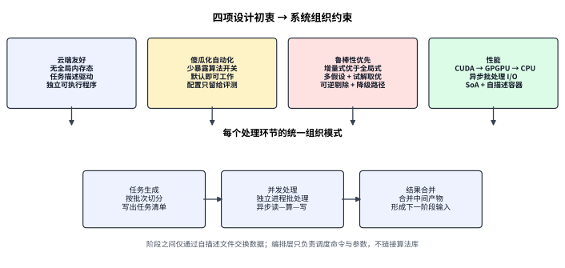
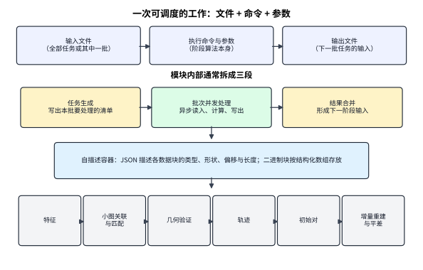
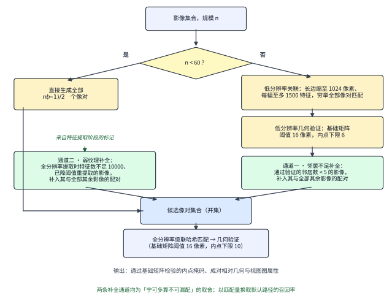
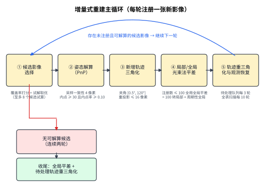
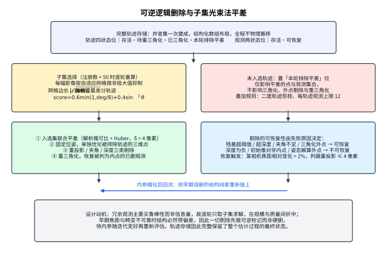
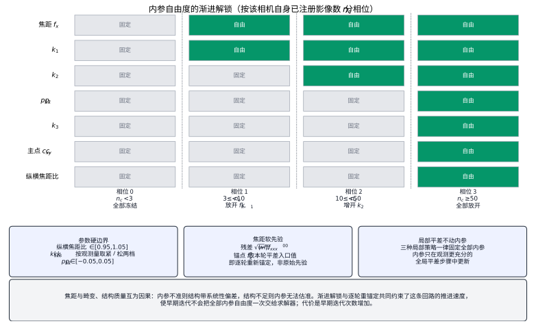
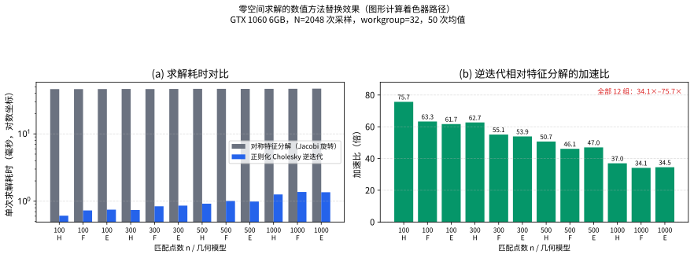
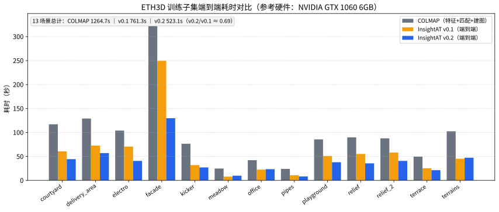

# 一种以任务描述驱动、以可逆轨迹状态为核心的自动化空中三角测量方法

## 摘要

本文讨论一套空中三角测量方法的设计取舍。方法从四项初衷出发。其一，系统形态要对云端调度友好，因此不以常驻内存的全局数据结构为算法载体，而把一次工作定义成输入文件、执行命令与参数的组合，每个处理环节是独立可执行程序，一次处理一批任务，环节内部再分为任务生成、批次并发处理与结果合并。其二，默认路径要傻瓜化，因此不把检索模型、特征后端与平差开关交给终端用户，由系统自行吸收缺焦距、多相机混杂、弱纹理、初始像对难选与观测冗余等情况，并在友好与极致速度冲突时选择友好。其三，鲁棒性优先于精度上限与速度，这是优先实现增量式重建而非全局式重建的直接原因，也是方法内部大量策略的共同目标；系统保留后续引入混合策略的能力。其四，计算要快，因此 GPU 算得的环节尽量交给 GPU，按 CUDA、GPGPU 计算着色器、CPU 三级降级，数据按 SoA 组织，大文件读写与计算以有界队列构成背压式流水线并按批进行。空三的处理顺序仍是特征、关联、几何验证、轨迹、增量注册与光束法平差（BA）。为让上述初衷在这条顺序上成立，方法在各环节确立了一批具体机制：低分辨率穷举关联配合两条独立的召回补全通道；以一维数值搜索从基础矩阵反算焦距初值，并始终以基础矩阵内点作为对应关系的判据，压低焦距不确定性的传播；按目录与 EXIF 键自动分组相机；以中位视差角松弛调度构造多组初始像对假设，并用短重建的注册规模择优；并查集一次建成轨迹并全程以状态位做可逆的逻辑删除；每轮 BA 按自适应网格 NMS 选取子集，并在固定位姿下单独更新被排除的三维点；内参按每相机自身的注册规模分四相位渐进解锁；每次全局 BA 前对参与求解的坐标做中位数中心化与尺度归一。方法描述中的机制与阈值均以实现为准，并明确区分已实现能力、设计意图与未实现部分。

## 关键词

空中三角测量；任务描述驱动；零配置重建；可逆逻辑删除；子集光束法平差；并查集轨迹

## 1 引言

空中三角测量从一组重叠影像恢复相机的内外方位元素与稀疏三维结构，为后续测图、正射与密集重建提供几何基准。它与运动恢复结构（SfM）共用同一套计算：建立影像间对应，估计相对与绝对位姿，三角化得到结构，再由 BA 联合优化相机与三维点。这条计算顺序本身已经比较清楚，公开实现也不少。真正决定一套系统能不能被用起来的，是另外几件事：它以什么形态被调度，用户要不要先理解算法才能让它跑起来，在输入质量不可控时会不会崩，以及影像文件很大时计算与读写如何一起成立。

云端调度适合的是一批能独立启动、用文件交接、失败后可单独重跑的工作，不适合一个必须始终握着全局内存状态的求解器。终端用户面对的是另一类困难：影像可能没有可用的焦距信息，相机可能混在不同目录与不同分辨率里，场景纹理强弱不一，初始像对选错会把后面的增量过程从第一步带偏。若把检索用哪种方法、特征响应阈值取多少、BA 多久做一次都做成必须填写的配置，系统实际上把诊断工作转移给了用户。鲁棒性上的要求更直接：生产数据里总有少量像对的对极几何是错的、总有相机的 EXIF 缺失、总有区域纹理不足，方法必须在这些条件下给出可用结果，而不是在某一步抛出失败。与此同时，三维重建的中间数据体积大，只优化算法复杂度而不管读写与内存峰值，墙钟时间仍然会被 I/O 拖住。

本文按这四项初衷说明一套自动化空三方法：先规定任务、文件与数据结构如何服务于调度与效率，再说明在一般空三顺序上每一处具体做法如何让系统在不配置算法的情况下仍然稳，并在必要处用效率换鲁棒、用近似换吞吐。后文的机制细节都从这四项初衷长出来，而不是对通用流程的复述。

## 2 主要问题

方法要回答的问题可以收成四类，它们共同决定了后面每一处取舍。

第一类是**调度形态**。一次空三若依赖进程内的全局数据结构，任务就难以按批次切开，失败后也难以只重跑一段。可调度的工作需要有明确边界：输入是哪些文件，执行哪条命令、带哪些参数，输出又写成哪些文件。输入可以是全部影像，也可以只是其中一批。模块因此自然分成三段：生成任务清单，并发处理这些任务，必要时把结果合并成下一阶段的输入。这一形态的另一层要求是断点续跑——只要中间产物还在，任意环节应当可以单独重新执行。

第二类是**零配置下的可运行性**。同一套默认流程要面对 EXIF 缺失、多相机混杂、重复纹理、低对比、初始运动选择不稳、观测中混有错误对应等情况。把"关联用哪种方法"这类选择暴露给用户，等于要求用户先判断场景再选算法。方法要求默认路径自己吸收这些差异。由此带来的直接冲突是：更稳的做法会多算——例如某幅影像关联不足时把它与其余全部影像的配对补进候选。方法在这种冲突上选择让用户跑得通，而不是把速度放在第一位。评测时仍可以替换算法，但那是旁路，不是默认。

第三类是**鲁棒性的来源**。空三的输入质量在生产中不可控，错误对应、退化像对、缺失内参与弱纹理区域必然存在，因此方法必须有"出错之后怎么办"的机制，而不只是"怎么算得更准"的机制。这一要求决定了几处架构级选择：优先实现增量式而非全局式重建；一切因残差统计而发生的剔除都做成可逆标记；候选影像不是只试一个而是试多个再择优；初始像对不靠单一规则而是多组假设比较。它也决定了失败处理的形态——每个关键步骤都要有降级路径，而不是直接终止。

第四类是**大文件上的吞吐**。特征、匹配与几何验证的数据量随影像数与特征数上升，内存里同时握着全部中间结果容易成为瓶颈。计算密集环节需要 GPU，GPU 不可用时需要还能算的后备路径。数据结构要便于按下标随机访问与整列搬运。读写与计算需要重叠，并且按批而不是按整库进行，用来在吞吐与内存占用之间取平衡。

这四类问题在重建过程内部还会落到几处具体的几何困难上。焦距不确定时，本质矩阵会把内参误差写进"哪些匹配可信"的判断里，使对应关系与内参误差纠缠。同一相机的影像若没有归到一组，内参求解会把不同成像几何搅在一起。初始像对没有足够基线或基线选择失当，增量过程会从第一步偏。轨迹若在早期就被硬删，等内参变好后结构线索已经不在了。观测若全部进入每一次 BA，信息增量有限而求解规模持续上升。后面的具体机制，就是在任务化的系统形态里处理这些困难。

## 3 解决思路

### 3.1 四项初衷

**云端友好。** 系统不以一个全局数据结构作为算法的驻留形态，而以任务描述作为工作单元。整体算法由文件、执行命令与参数组成，数据任务的输入也是文件。每个处理环节是独立的可执行程序，一次处理一批任务；一个环节大概率再拆成任务生成、任务的并发处理，以及结果合并一类的后处理。端到端驱动器本身不链接任何算法库，它只负责按顺序启动各环节的独立进程、合并其输出流并解析其中的结构化进度事件；跨阶段不存在共享地址空间、内存映射或常驻服务，全部状态经磁盘文件交接。因此把一批任务分到多台机器上调用同一命令，不需要先把求解器改写成分布式运行时。这一形态也直接支撑断点续跑：只要工作目录里的影像与相机清单还在，任意环节都可单独重新执行。

**傻瓜化。** 默认流程不要求用户选择和感知各种算法。配置项可以存在，供希望做评测的人使用；面向终端用户的路径是什么都不设置也能工作。这会牺牲一部分速度。傻瓜化在算法上的落点，是在一般空三流程里插入一批提高鲁棒性的机制，使用户不必先判断"这次该开哪一个开关"。

**鲁棒性优先。** 在鲁棒性、精度上限与速度三者冲突时，方法先保鲁棒性。这一优先级最重要的一次体现，是**优先实现增量式重建而不是全局式重建**。全局式方法先在视图图上做旋转平均与平移平均，再做一次大规模 BA，复杂度接近线性、速度优势明显；但它要求整个视图图的相对几何全局一致，少数错误的相对旋转或平移会污染全局解，而平均化阶段的外点剔除本身是个难题。增量式相反：每次只加入一幅影像，每一步都有独立的 PnP RANSAC 门限、独立的 BA 与外点剔除，错误被局部化并且可以被当场否决；代价是误差随链条累积，且 BA 要被调用与影像数同阶的次数。方法选择后者，因为在输入质量不可控时，"错了能发现、能拒绝、能回退"比"算得快"更值钱。

保留混合策略的能力是这一选择的配套安排，而不是事后补救。成对几何环节把每个像对的基础矩阵、本质矩阵、单应矩阵及其内点掩码，以及从本质矩阵分解出的旋转与平移、三角化点、视差角与深度基线比统计，全部作为独立产物落盘并建立紧凑索引；方法中也已经存在一次在视图图上做全局联合优化的先例——焦距估计的第三步就是在整张视图图上对每相机焦距做联合非线性精化。也就是说，全局式或混合式方法所需要的输入（视图图加成对相对位姿）在当前流程里已经是现成的文件产物。后续若要引入旋转平均与平移平均，或以全局解为增量过程提供初值，前段流程不需要改动。

鲁棒性在算法内部的落点是一组统一模式：关键判断都不走单点决策。候选影像不是只试一个而是试多个再择优；初始像对不靠单一规则而是构造多组假设逐一验证；对应关系的判据选不依赖焦距的基础矩阵，避免内参误差传入；一切因残差统计而发生的剔除都做成可逆标记，等内参变好再重新评估；关键步骤失败时有降级路径而不是直接终止。

**性能。** GPU 算得的环节尽量交给 GPU，按 **CUDA → GPGPU 计算着色器 → CPU** 三级降级。这三级不是应急关系而是并存关系：计算着色器路径无条件参与构建，是基线实现；CUDA 路径在工具链可用时构建，作为默认后端。构建期会据此注入默认后端：有 CUDA 时默认取 CUDA 的 SIFT 提取实现、CUDA 级联哈希匹配与 CUDA 几何验证，没有时整体切到计算着色器与 CPU 实现；运行期还会再做一次检查，例如请求 CUDA 几何验证但对应可执行程序不存在时，自动降级到计算着色器路径并告警。三维重建的数据文件通常较大，I/O 与计算同等重要，因此读入、处理与写出以有界队列串成流水线并按批进行，避免一次性把整库载入内存。

图 1 把这四项初衷收成同一种环节组织。

*图 1　四项初衷落到同一种环节组织。云端友好对应任务描述与独立可执行程序；傻瓜化对应默认路径自行处理多种情况；鲁棒性优先对应增量式优先、多假设与可逆剔除；性能对应 CUDA → GPGPU → CPU 三级降级、异步批处理与 SoA。阶段之间用文件交接。*

### 3.2 文件容器、数据结构与批处理

阶段间的中间数据统一放进一种自描述二进制容器，组织方式参考 GLB 一类"描述段 + 二进制载荷"的封装。容器以固定魔数与版本号开头，随后是一段无缩进的 JSON 描述段，再以零填充把载荷起点对齐到 8 字节。描述段登记每一个数据块的名称、元素类型、形状、相对载荷起点的偏移与字节长度，并按各阶段任务类型附加各自的语义字段——特征提取记录描述子维度、归一化方式与量化尺度，匹配记录像对索引与匹配数，成对几何记录块编号与像对计数，轨迹记录模式版本、影像索引集合、轨迹数与观测数。读取时先解析 JSON 段建立"名称到偏移"的 O(1) 索引，随后既可按名称单独定位某一数据块，也可一次性载入整个载荷并在其上取得零拷贝指针视图；后一条路径供热循环复用调用方缓冲，避免反复堆分配。容器不使用 mmap，随机访问以文件定位实现。

容器内的大数组按 SoA 排布。轨迹数据即为典型：三维坐标、轨迹状态位、指向观测区间的 CSR 偏移各成一列，观测侧的所属影像、特征序号、像素坐标、尺度与观测状态位同样各成一列。算法内存侧采用同一布局，并额外维护每幅影像到其观测下标的反向索引，以及每幅影像已三角化观测数的 O(1) 计数。删除与恢复只改状态位，不搬移数组，因此轨迹在整个增量过程中保持同一块存储。

成对几何的结果不逐对存成小文件，而是按块打包（默认每块 10 万对），块内以像对为命名空间分别存放 F、E、H 三个矩阵及其内点掩码、分解出的旋转与平移、三角化点。另有一个紧凑二进制索引，每条记录 49 字节，记录像对所在的块编号、一组标志位（是否通过 F 检验、是否退化、是否通过 E 检验、是否通过两视图重建、是否稳定）与一组统计量（三种模型的内点数、F 内点率、有效点数、像素位移中位数、视差角中位数、深度基线比中位数）。索引不记录块内字节偏移，块内定位靠命名约定加该块自身的 JSON 描述段完成。这一索引是后续视图图筛选与焦距估计的唯一输入，也让"先粗筛像对再取细节"成为 O(1) 操作。

流水线形态上，各环节内部普遍是"加载—计算—写出"三段，加载与写出各配多个工作线程，占用 GPU 上下文的计算段固定在主线程执行。段间以有界队列相连，生产者在队列满时阻塞，于是重叠深度由队列容量隐式决定，而不是显式的双缓冲——例如几何验证环节允许加载段领先计算段 2 个批次、允许 4 个已完成批次排队落盘。批内设屏障，保证计算段不会看到半加载的批次。批次规模的决定方式各环节不同：几何验证按固定像对数分组（默认 1 万对）并在 kernel 内部切到编译期上限 5 万对；级联哈希匹配按当前空闲显存自适应确定块内影像数（取空闲量的 72% 后解一个二次式），查询显存失败时退回用户上限的一半；轨迹构建以成对几何的块为单位，一次读入整块载荷、合并完即释放，这一项把内存峰值从 8.3 GB 降到约 1.5 GB。

处理顺序与一般 SfM 相同：特征、影像关联与匹配、两视图几何、轨迹、初始像对、增量注册与 BA。差别在于每个环节都是独立命令，命令吃一批任务清单，内部用背压式流水线把计算与 I/O 叠在一起。图 2 画出一次工作如何从文件与命令走到空三各阶段。

*图 2　一次可调度的工作由输入文件、命令与参数、输出文件组成。环节内部分为任务生成、批次处理与结果合并。中间数据放入自描述容器。容器之上仍是一般的空三阶段顺序。*

### 3.3 机制总览

一般的阶段顺序只说明数据先后，不说明默认路径在缺信息时如何往下走。下面先列出各环节的具体机制及其服务的初衷，后文逐项展开。

为傻瓜化与鲁棒性：影像关联在规模超过阈值时改用低分辨率穷举匹配加 F 验证，不引入需要码本或模型的 VLAD 类方法；并设两条独立的召回补全通道，分别针对"验证后邻居数不足"的影像与"提取时不得不降阈值"的弱纹理影像，把它与其余全部影像的配对补进候选。缺少可用焦距时，由 F 反算焦距初值并在视图图上做加权中位数聚合；两视图里虽然同时估计 F、E、H 三个模型并做退化检测，写入轨迹的内点仍以 F 为准。相机自动分组按目录划一级、按 EXIF 键划二级，用户不需要建立相机表。初始像对以中位视差角的松弛调度构造多组假设，并由短重建的注册规模在策略间择优。SIFT 提取在全局降低响应阈值的基础上，再对特征数仍然不足的影像自动二次降阈值并留下标记。

为效率：全分辨率对应搜索使用级联哈希，CPU 与 CUDA 两套实现共享同一组参数，并与批量异步 I/O 绑定。轨迹用并查集一次建成，后续增删三维点与观测只改状态位，不做动态轨迹合并。BA 每轮只取当前影像与三维点的一个子集，子集由每幅影像上的自适应网格 NMS 选出，并叠加二度轨迹剪枝与每轨迹观测上限。几何验证中求解齐次方程零空间的数值方法由对称特征分解换成正则化 Cholesky 分解加逆迭代，以压低片上临时存储。

为稳定：影像少于 100 幅时每轮都做全局 BA，超过后才转局部 BA 并按线性间隔插入周期性全局 BA；局部 BA 一律不动内参。内参按每相机自身的注册规模分四相位渐进解锁，并配硬边界与逐轮重锚定的焦距软先验。每次全局 BA 前对参与求解的坐标做中位数中心化与尺度归一。一切因残差统计而发生的剔除都是可逆标记，因几何不成立而发生的剔除不自动恢复；焦距出现显著变化时重新评估可恢复观测。

## 4 方法描述

### 4.1 特征提取：全局降阈值与逐影像的二次降阈值

为覆盖各种场景，局部特征采用 SIFT，描述子默认用 RootSIFT 归一化（L1 归一化后逐元素开方），128 维保存；提取后端优先 PopSift（CUDA），无 CUDA 时用 SiftGPU 的 GLSL 路径。响应阈值的设置分两层。第一层是全局降低：端到端流程向提取环节传入的峰值阈值为 0.0067，约为提取工具独立运行时默认值 0.02 的三分之一，使梯度不强的位置也能产生候选。第二层是逐影像自适应：若某幅影像在该阈值下提取到的特征数不足 10000，系统自动把峰值阈值再降一个数量级（除以 10）并重新提取该幅影像，同时在提取阶段的元数据中为这幅影像留下标记。这个标记在后续关联阶段被消费，构成第二条召回补全通道（见 4.2 节）。

这一设计与"在全部影像上统一取一个更低阈值"有实质差别：它把弱纹理影像的额外代价限制在确实需要的影像上，并把"这幅影像先天信息不足"这一判断显式传递到下游，而不是让它在关联阶段沉默地表现为漏配。

候选数量增多后，用网格 NMS 把规模收回。网格边长取抑制半径的 10 倍，默认 30 像素，每格至多保留 2 个特征。格内排序键是**特征尺度降序**，即同一网格优先保留尺度更大的特征。这一选择的依据是：尺度空间极值即使响应不明显，仍可能在尺度上稳定，因而仍可能匹配得上；而尺度较大的特征通常对应更稳的图像结构，对后续几何验证与增量过程更有利。NMS 还保留同一位置的多个主方向——当两个候选的像素距离小于 2 像素但主方向差超过 30 度时，二者都保留，因为它们在描述子空间中是不同的表项。低分辨率那一层另行限制特征数与图像尺寸，只服务于 4.2 节的关联判断。

### 4.2 候选像对发现与两条召回补全通道

影像规模较小时，全分辨率穷举全部像对是可接受的，系统在影像数少于 60 幅时直接生成全部 $n(n-1)/2$ 个组合，不再绕关联这一层。规模更大时才启用关联步骤。

关联不使用 VLAD 一类把整幅影像聚合成单一向量再做相似检索的方法。这类方法衡量的是"看起来像不像"，且需要准备码本或 PCA 白化模型，而终端用户不应被要求选择这类模型——仓库中虽然实现了 VLAD 编码、PCA 白化与基于 GNSS 的空间检索，但它们都不在默认路径上。默认做法是：把影像长边缩到 1024 像素，每幅提取至多 1500 个特征，在这组低分辨率特征上穷举全部像对做匹配，再用 F 的 RANSAC 做一次几何验证，以验证后仍保留的匹配数量表示两幅影像有无可靠关联。这一步的阈值比正式流程更宽松（F 阈值 16 像素、内点下限 6），因为它的职责是筛选而非定量。需要说明的是，这里的"穷举"指的是像对层面穷举，单个像对内部仍走级联哈希匹配，并非逐描述子的全量最近邻搜索。

低分辨率关联仍可能漏掉真实重叠，尤其在特征变稀或纹理重复时。方法为此设两条独立的补全通道，如图 3。

通道一针对关联结果本身：统计每幅影像通过几何验证的邻居数，凡邻居数少于 5 的影像，把它与其余全部影像的配对全部补入候选，且这些补入的配对不经低分辨率验证。通道二针对特征提取的结论：凡在 4.1 节被标记为"降阈值重提取"的影像，同样把它与其余全部影像的配对补入候选，与检索结果取并集。两条通道的判据不同——前者是"关联结果看起来不对"，后者是"这幅影像先天信息不足"——因此不能互相替代。

这两步都会明显增加后续全分辨率匹配量，效率下降，但关联更不容易漏。这是傻瓜化与鲁棒性上明确的取舍：默认路径宁可多算，也不把"关联失败了要不要改用穷举"留给用户判断。

*图 3　影像较少时直接穷举全分辨率配对。规模更大时先在低分辨率上穷举像对匹配并用 F 验证，再由两条独立通道补全召回：邻居数不足的影像与提取时降阈值的弱纹理影像，各自补入与全部其余影像的配对。并集进入全分辨率精匹配与几何验证。*

### 4.3 级联哈希匹配与背压式批处理

候选像对确定后，单对若仍做全量最近邻，复杂度是两侧特征数之积。级联哈希把 128 维描述子经随机投影压成 128 位二进制码，另用一组独立投影把描述子分入 6 组、每组 $2^8=256$ 个桶；搜索只在同一桶及必要时的邻近桶内进行，候选数按每组 6 到 10 个控制，随后保留互为最近邻的对应并施加比值检验（阈值 0.8），匹配数不足 16 的像对直接不输出。CPU 与 CUDA 两套实现共享同一组参数与同一套桶索引结构，投影矩阵与描述子均值由一批采样影像（默认 256 幅）统计得到，因此不同场景不必手调同一组桶参数。CUDA 实现以 uint8 描述子参与距离计算，并把双向最优的交叉校验与紧凑化也放在设备上完成，多个像对合并成单次 kernel 调用。

这一步与批量异步 I/O 绑定：下一批描述子在读入时，当前批可以在 GPU 上计算，上一批的匹配可以写出。块内影像数按当前空闲显存自适应，取空闲量乘 0.72 安全系数后解一个二次式，再与用户上限取较小者。级联哈希在整个方法中的角色是把 4.2 节那种更稳、但更重的关联，收成时间上可接受的全分辨率精匹配。

### 4.4 两视图几何：三模型估计、退化检测与以 F 为准的内点

两视图环节同时估计 F、E、H。E 只在影像清单提供了有效内参时才估计。最小解算法取决于后端，两条路径不能统一表述：CUDA 与计算着色器路径统一采用 $8\times 9$ 的 DLT，即 H 取 4 点、F 取 8 点（归一化八点法）、E 也取 8 点后强制本质约束（奇异值取前两者均值、第三置零），F 则强制秩 2；CPU 路径调用 PoseLib，分别为 7 点、5 点与 4 点法并带 LO-RANSAC。GPU 路径是朴素 RANSAC——固定迭代次数、一线程一次迭代、最后并行归约取内点最多者，没有局部优化、没有自适应终止；LO-RANSAC 只存在于 PoseLib 路径。

误差度量上，F 与 E 用平方 Sampson 距离

$$
e_S=\frac{\bigl(\mathbf{x}_2^{\top}F\mathbf{x}_1\bigr)^2}{(F\mathbf{x}_1)_1^2+(F\mathbf{x}_1)_2^2+(F^{\top}\mathbf{x}_2)_1^2+(F^{\top}\mathbf{x}_2)_2^2},
$$

H 用单向前向传递误差。所有坐标先在 CPU 上做双精度的 Hartley 各向同性归一化（零均值、均方距离为 $\sqrt2$），阈值随归一化因子同步缩放；E 的归一化阈值按四个焦距的几何均值折算，即 $\text{thresh}_E=\bigl(t_{px}/\sqrt{f_{\text{avg}}}\bigr)^2$，其中 $f_{\text{avg}}=\sqrt{f_{x1}f_{y1}f_{x2}f_{y2}}$。端到端流程实际采用的 F 阈值为 16 像素、内点下限 10、RANSAC 迭代 2000 次；单独运行几何验证工具时默认值是 2 像素与 20，两者不同。

退化检测只依据内点计数，不做几何量检验。匹配数或 F 内点数不足 8 时直接判退化；H 未估计时判为一般场景；否则计算

$$
\rho=\frac{N^{H}_{\text{inl}}}{N^{F}_{\text{inl}}},
$$

在 $N^H_{\text{inl}}\ge 10$ 且 $\rho\ge 1.15$ 时判退化并标记为平面主导。需要如实说明的是：方法**不区分平面主导与纯旋转**，二者合并为同一个退化标志；也没有实现基于 AIC 的模型选择，实际生效的只有上述比值启发式。焦距估计阶段另有一套更严的独立筛选（H 内点数不小于 F 内点数即拒，$\rho\ge 0.85$ 即拒）。

**最终用来评价匹配、并写入轨迹的内点以 F 为准**，取不到时才退用 E，H 内点从不用于轨迹。原因是焦距估计的不确定性很大：E 把内参卷进误差，焦距一偏，内点集合就跟着偏；F 不把焦距当成已知量，用它筛选对应，是在内参还不可靠时尽量减少焦距对"谁和谁是同一点"的影响。焦距留到后面的 BA 里逐步精化。两处实现细节值得记录：内点掩码不是 RANSAC 内部产生的，而是取最优矩阵后在 CPU 上对全部匹配重算一遍，PoseLib 路径中其局部优化给出的内点掩码被丢弃；退化像对仍然写出内点掩码，只要内点数不少于 4 就落盘，因此退化像对的过滤发生在下游的视图图筛选阶段，而不在轨迹构建阶段。

几何验证在 GPU 上要反复求解由匹配点构成的齐次方程，即对称矩阵最小特征值对应的方向。完整的对称特征分解（20 轮 sweep、每轮 36 个上三角对的 Jacobi 旋转）在着色器中需同时持有约 234 个可动态索引的浮点数，编译器无法全部放入寄存器，溢出到 local memory 成为真正瓶颈——这一判断由 GPU 计时查询证实：一次 dispatch 本身耗时约 44 ms，而内存屏障仅 0.013 ms，排除了同步开销。方法把该子问题改为三步：先取 $B_\mu=A^\top A+\mu I$，$\mu=10^{-3}\operatorname{tr}(A^\top A)$，即按迹成比例的相对正则化以保证严格正定；再做原地 Cholesky 分解 $B_\mu=LL^\top$；最后以均匀向量为初值做 6 轮逆迭代

$$
x^{(k+1)}=\frac{(LL^{\top})^{-1}x^{(k)}}{\bigl\lVert (LL^{\top})^{-1}x^{(k)}\bigr\rVert_2}.
$$

每轮主要是三角回代，临时存储降到 99 个浮点数。之所以不用幂迭代，是因为幂迭代的收敛率取决于次大与最大特征值之比，当随机子样本接近退化时可能数十步不收敛而输出零内点；Cholesky 逆迭代的收敛率由正则项与次小特征值之比决定，对任意特征值间隔都适用，6 轮即可。这是性能初衷在几何验证内部的一处数值取舍，不改变上面"内点看 F"的判定。

### 4.5 焦距初值：从 F 反算并在视图图上聚合

焦距对重建很关键，很多影像却没有可用的 EXIF，传感器库也给不出可信初值。若因此要求用户填写焦距，就违反傻瓜化。

单像对的估计不是闭式解，既不是 Bougnoux 公式也不是 Kruppa 方程，而是一维数值优化。目标函数取 Hartley 风格的本质矩阵奇异值残差

$$
r(f)=\bigl|\sigma_1(E)-\sigma_2(E)\bigr|,\qquad E=K^{\top}FK,\qquad
K=\begin{bmatrix} f&0&c_x\\ 0&f&c_y\\ 0&0&1\end{bmatrix},
$$

其含义是：真实焦距下 E 应有两个相等的非零奇异值。求解分两阶段——先在对数等间隔的 200 点粗网格上取最小值，若最小值落在网格边界附近则直接判失败（该情形对应近平面或纯旋转，焦距不可观测）；再以黄金分割在最优点上下 1.1 倍的区间内细化，至多 60 次迭代，收敛判据为区间宽度小于 0.01 像素。最后做后验合法性检查：残差大于 $10^3$、或结果贴住搜索区间端点即判失败。搜索区间由影像尺寸给出，约为长边的 0.35 倍到 1.4 倍。

视图图上的聚合分三步。第一步在同相机像对上并行采样（OpenMP），跳过退化像对与权重不足的像对，主点取两图平均；跨相机像对因含两个未知焦距不做此步。样本还要过一道软先验比值门：估计值与先验之比落在 0.5 到 2.0 之外的样本丢弃。第二步对每相机做**加权中位数**，权重取内点数乘以像对质量分，且要求该相机至少有 3 个同相机样本。像对质量分本身是一组硬拒条件与软加权的组合：未通过 F 检验、退化、F 内点少于 30、H 内点数不小于 F 内点数、$\rho\ge 0.85$、像素位移中位数小于 15 像素、视差角中位数不在 1 到 60 度之间者直接拒；通过者按内点数与内点率加权，并对通过 E 检验、通过两视图重建、被标为稳定的像对分别乘以 1.25、1.25、2.0 的放大系数，视差角以对数域高斯偏好 8 度附近。第三步是可选的联合 Ceres 精化（默认开启），残差仍取奇异值差、雅可比用中心差分、鲁棒核取 Cauchy，并对每相机焦距设上下界；若精化结果相对中位数偏离超过 20%，则丢弃精化结果回退到中位数。聚合方法因此是加权中位数而非投票或 RANSAC。

这一环节的触发条件值得注明：它并非总是执行。EXIF 估计有三层回退——先用 35 mm 等效焦距按 $f_{px}=f_{35}\sqrt{w^2+h^2}/43.267$ 折算，其次用物理焦距配合传感器宽度查表按 $f_{px}=f_{mm}w/s_w$ 折算，最后兜底假定等效焦距为 35 mm。只有当某相机落到兜底这一层时，系统才自动启用从 F 反算焦距，并把结果回写影像清单；是否已经执行过会记入决策元数据，供断点续跑判断。

### 4.6 相机自动分组与内参模型

同一相机的影像归到一组再估计内参，增量求解更稳；若把不同分辨率、不同相机的影像绑成同一组可优化参数，焦距与畸变会被错误共享。分组分两级且全自动。第一级按目录：递归遍历输入目录，凡含影像的目录各成一组，组名由相对路径转换而来。第二级按 EXIF 键自动拆分，键由四个字段构成——厂牌、型号、像素宽、像素高。其中宽高取自影像本身（经 GDAL 读取）而非 EXIF，因为对无人机影像更可靠；厂牌与型号取自 EXIF 并去除首尾空白。**焦距被刻意排除在分组键之外**，因为同型号相机的 EXIF 焦距常有微小漂移，若入键会把同一相机拆散。拆分时最大的一桶保留原组标识，其余各成新组并重置其相机参数。EXIF 无效的影像不进入任何桶。用户不需要建立相机表，也不需要声明哪几幅影像共用内参；手工分组的接口仍然保留，可完全绕过自动逻辑。

内参模型只有一种：针孔投影加 5 参数 Brown-Conrady 径向与切向畸变，允许 $f_x\neq f_y$。设归一化坐标 $(u,v)=K^{-1}[p_x,p_y,1]^\top$，$r^2=u^2+v^2$，正向畸变为

$$
u_d=\bigl(1+k_1r^2+k_2r^4+k_3r^6\bigr)u+2p_2uv+p_1\bigl(r^2+2u^2\bigr),
$$

$$
v_d=\bigl(1+k_1r^2+k_2r^4+k_3r^6\bigr)v+2p_1uv+p_2\bigl(r^2+2v^2\bigr).
$$

这是 Bentley ContextCapture 约定，两个切向系数 $p_1$、$p_2$ 的角色与 OpenCV 的 Brown-Conrady 互换，导出到 COLMAP 一类外部格式时需相应对调，且 $k_3\neq 0$ 时不能用只有两个径向系数的相机模型。去畸变在归一化空间做不动点迭代，容差 $10^{-6}$（对 $f\approx 4000$ 约合 0.004 像素）、至多 20 次，无畸变时短路返回。数据层的枚举里列有针孔、简化畸变、鱼眼等类型，但算法层不读该字段，一律按上述 5 参数模型处理，因此实际只有一个相机模型在起作用；类型字段目前是元数据而非行为开关。分组的意义就在于：后面渐进放开焦距与畸变时，同一组共享的是同一套这些参数。

### 4.7 并查集轨迹与可逆的逻辑删除

轨迹要能适应增量过程里不断加入影像、删除三维点、剔除与恢复观测。方法用并查集直接把通过 F 内点检验的对应合并成轨迹。节点键由影像序号左移 32 位与特征序号拼成 64 位整数，合并采用按大小合并并配迭代式路径压缩以避免深链栈溢出。约束"一条轨迹在同一幅影像上至多一个特征"的实现方式是：每个连通分量维护一个有序的已占用影像列表，合并前先检查两个列表是否相交，相交则**拒绝本次合并**。因此冲突处理的粒度是**边级丢弃**——丢掉这一条匹配边，既不删整条轨迹也不删已有观测，两个分量各自独立保留。构建阶段与成对几何的块读取交错并行，但并查集本身串行更新；合并完成后遍历节点生成观测，按轨迹、影像、特征序号排序后写入 SoA 存储，三维坐标此时全置零，三角化留给增量阶段。端到端流程对轨迹长度设下限 2。

这是一种平衡，并非断言并查集轨迹优于在增量过程中动态发现并合并轨迹。并查集可能把本属于不同三维点的观测连到一起，错误观测会变多。动态合并把错误连接的概率压得更低，但它依赖"重建已经足够准，才能发现两条轨迹是同一个点"这一前提；增量过程若已积累较大误差，该合并的轨迹合并不上，结构会继续分开，误差更容易被放大。并查集的思路相反：先把可能的连接建出来，再在后续 BA、外点剔除与重三角化里评估谁该留下。对一条实际上混有多个三维点的轨迹，可以认为其中一部分观测为真、其余是错误观测，这个解释是自洽的。换来的好处是：不需要一套合并轨迹的策略，轨迹可以很快建成并保持 SoA 布局；三维点的生成与删除、观测的剔除与重新接上，都只改状态位，开销与该影像实际碰到的观测数相关，且与后面的子集 BA、重三角化共用同一套存储。

状态位分两组。轨迹侧 4 位：存活、待重三角化、已三角化、本轮排除 BA。观测侧 2 位：存活、可恢复。可恢复性由失败原因决定，这是整个机制的关键：重投影残差超过自适应阈值、深度超过场景深度中位数的若干倍、视差角不足或过大、稳健三角化的 RANSAC 外点视图，这几类都标为**可恢复**；深度为负（成像方向不成立）、初始像对提交时的非内点、PnP 判定的外点，这几类**不自动恢复**，因为它们反映的是几何上不成立，内参变好通常改变不了这个结论。恢复的触发点在每次全局 BA 之后：对参与 BA 的相机取 BA 前快照，逐相机比较焦距的相对变化 $|\Delta f_x|/f_x$，超过 2% 即把该相机列入变化集合并重新评估其相关的已删观测，判据是在当前内参与位姿下重投影误差不超过 4 像素。此外，当某轨迹存活且落在已注册影像上的有效观测少于 2 个时，清除其三维坐标并自动入队待重三角化，但坐标数值本身保留待下次覆盖。轨迹存储用状态位保留最终状态，因此一次重建估计过哪些观测、哪些被抑制、哪些又回来了，都留在同一份结果里，便于回看算法实际做了什么。

### 4.8 初始像对：松弛调度构造的多组假设

初始像对决定增量重建从哪一段运动开始。基线太窄，三角化的深度很不确定；基线太宽或视角差太大，匹配又会变差。单靠一条固定规则很难事先知道哪一对最好。

"多假设"在方法中体现为两个层次。内层是**中位视差角的松弛调度**：以配置的中位角门限为起点构造一个递减序列，若起始值超过 20 度则追加其 0.67 倍、超过 15 度则追加 15 度、超过 10 度则追加 10 度并去重。默认起始值为 30 度，故调度为 30 度、约 20.1 度、15 度、10 度共 4 组假设。每一组假设内部再遍历候选：第一影像按"总对应数"降序取前 100 幅，第二影像按视图图打分取前 50 幅。视图图打分先做硬过滤（须同时通过 F、E 与两视图重建检验，被标为稳定，且非退化，视差角中位数不低于 2 度），再按

$$
s=1.0\ln(1+s_{\text{prelim}})+1.2\ln(1+N^F_{\text{inl}})+1.4\ln(1+N_{\text{pts}})+2.2\ln(1+\bar\theta)
$$

排序，其中 $\bar\theta$ 为视差角中位数。三层循环取第一个通过全部门限的像对，是首个成功而非全枚举取最优。

单个候选的验证链完整且全程不修改轨迹存储：先收集共视轨迹的像素对应，数量不足 50 即否；用 PoseLib 五点法做相对位姿 RANSAC（阈值 4 像素，迭代上限 2000、下限 100，局部 bundle 迭代 250，Cauchy 核）；内点数不足 100 即否；前向运动比例 $|t_z|/\lVert t\rVert\ge 0.95$ 即否（近似纯前向运动的基线不可用）；用内点三角化到本地缓冲，要求双视图正深度且夹角落在 2 到 120 度之间；成功点数不足 8 即否；随后做一次两视图解析 BA（固定第一影像位姿、不优化内参、迭代 500）；BA 后以 MAD 做自适应内点筛选，阈值为 $\mathrm{clamp}(\mathrm{median}+k\cdot 1.4826\,\mathrm{MAD},\,2,\,50)$ 像素，$k$ 依次取 3.0、3.5、4.0，够数即停，仍不够则退到 p99 分位；最后检查内点数不少于 50、RMSE 不超过 10 像素、以及三角化角中位数不低于本组假设的门限。只有全部通过才写入存储：写入内点轨迹的三维坐标，并用每影像反向索引删除这两幅影像上非内点轨迹的观测（不可恢复删除，这些轨迹在其他影像上的观测保留）。世界系以第一影像为基准，其旋转取单位阵、中心取原点。

外层是一个**策略选择器**：它对 4 组预设的门限组合分别启动一次短窗重建，比较结果择优。4 组策略在内点下限、前向运动上限、单点夹角下限与中位角门限上各有偏向，分别偏向更均衡（100 / 0.95 / 2.0 度 / 20 度）、更宽基线（110 / 0.80 / 3.0 度 / 30 度）、更多匹配支持（80 / 0.95 / 1.5 度 / 10 度）与更保守的运动（120 / 0.75 / 2.5 度 / 15 度）。每组只重建 6 幅影像并强制固定内参，打分为

$$
\text{score}=100\,N_{\text{registered}}+5\ln(1+N_{\text{points}}),
$$

即**注册影像数主导，三角化点数仅作决胜项**。这一打分形式直接对应"这段相对运动是否站得住"——能把更多影像接进来，才说明起点选对了。选出的策略把 5 个门限参数回填给正式的增量重建。需要如实说明的是，4 组策略是串行执行而非并发，合并阶段只是按分数排序取第一。

### 4.9 增量注册：覆盖率打分与试解取优

选定起点后，增量循环每轮挑一幅影像注册进来，如图 4。候选筛选要求该影像上已三角化的三维点数不少于 30；候选数上限被二次收紧为"给定上限 40 与已注册数的 30% 两者取小"，以避免早期遍历过多候选。排序依据是覆盖率优先、其次单一排名分

$$
\text{rank}=\text{coverage}+0.1\frac{\ln(1+N_{3\text{d}2\text{d}})}{\ln(1+1000)}.
$$

覆盖率由一个可见性金字塔给出（COLMAP 同类构造的移植）：共 6 层，第 $\ell$ 层（从 0 计）的网格维度为 $2^{\ell+1}$，即 2、4、8、16、32、64；某一层的某个格子计数由 0 变 1 时，分数增加该层的格子总数。这一构造使**越细层的新增占用贡献越大，而聚簇的点贡献很小**，因此覆盖率衡量的是观测在像面上铺得多匀，而不是观测有多少。分数按理论上限归一化到 $[0,1]$。为控制开销，观测数超过 16384 时直接取覆盖率为 1，以及在观测数变化不大时复用上一轮的分数，这两条快路径以精确性换时间。

PnP 调用 PoseLib 的绝对位姿 RANSAC（内部为 P3P 加局部优化，阈值 4 像素，迭代上限 10000、下限 1000），随后做 10 次高斯牛顿的纯位姿精化。稳定性门限要求内点数不少于 30、内点率不低于 0.10（大场景收紧到 0.15）、RMSE 不超过 6 像素。真正决定注册哪一幅的是**试解取优**：对前 8 个候选各做一次不写回存储的试算，按

$$
\text{score}=\text{ratio}\cdot\frac{\ln(1+N_{\text{inl}})}{1+\mathrm{RMSE}/4}
$$

打分，先在满足偏好门限（内点不少于 50 且内点率不低于 0.20）的试算里取最高分，没有则在全部通过硬门限的试算里取最高分，最后重跑一次提交。**每轮只新增一幅影像。** 若候选为空或全部失败，进入救援路径：做一次全局 BA、以放宽到 0.5 度的夹角门限做一次轨迹全表扫描重三角化、清空评分缓存、并以放宽的阈值重取候选；连续 2 次无进展才退出主循环。这条救援路径是鲁棒性初衷在主循环里的直接体现——注册失败不等于重建结束。

注册成功后，把新影像与已注册影像之间尚未三角化的观测三角化。稳健三角化对两视图情形只做 DLT 加正深度、夹角与重投影检查；三视图及以上则枚举视图对（上限随机抽 500 对，固定随机种子以保证可复现）逐对建模型并统计内点，取内点最多者后对内点子集做高斯牛顿精化并重新统计内点掩码。最少内点视图数被夹到"至少 2、至多总数减 1"，保证至少容忍一个坏视图。提交时非内点视图一律做可恢复删除，并要求至少提交 2 个视图。

*图 4　增量重建的每一轮：候选选择与试解取优、PnP、新增轨迹三角化、局部或全局 BA、周期性重三角化。连续两轮无可注册影像时进入收尾。图中标注的是默认流程的实际门限。*

以 PnP 为主的增量系统依赖足够多、足够可靠的三维点。因此轨迹不在建完时就裁成一个很小的子集，点的取舍放到每一次 BA 与重三角化里做，见下一节。

### 4.10 子集 BA 与固定位姿的补偿求解

BA 里三维点与观测都很多，观测尤其多，大规模稀疏矩阵的求解会变重。从信息角度看，多余的观测主要是在买鲁棒性：观测再增加，新的信息往往很少，求解难度却继续上升。所以每轮进入 BA 只取当前影像与三维点的一个子集。

子集选择在已注册影像数超过 50 后逐轮重算，分三遍。第一遍遍历已注册影像统计每条轨迹的已注册度数 $\deg$，并对 $\deg=2$ 的轨迹计算两观测射线夹角的 $\sin^2\theta$，$\deg\ge 3$ 者直接取 1。第二遍**逐幅影像**做自适应网格 NMS：网格边长取 $\lceil\sqrt{WH/N_{\text{target}}}\,\rceil$，默认目标密度为每幅 1000 点，故 4000×3000 的影像对应边长约 110 像素；格内按

$$
\text{score}=0.6\min\!\bigl(1,\deg/8\bigr)+0.4\sin^2\theta
$$

取最高分的一条轨迹，$\deg<2$ 者不参与，影像尺寸未知时该影像全选作为兜底。第三遍把未入选且存活、已三角化、$\deg\ge 2$ 的轨迹置"本轮排除 BA"位。这个状态位**只影响 BA 的点与观测集合**，不影响三角化、外点剔除与重三角化。子集选择同时兼顾了两件事：网格 NMS 保证观测在像面上铺得开，度数与夹角项保证入选轨迹本身的可见性与视差质量够用。

在网格 NMS 之上还叠加两条降规模规则。一是二度轨迹剪枝：若某轨迹在 BA 窗口内恰被 2 幅影像看到、两幅影像都被判为稳定、且其 $\sin^2\theta\ge 0.002$（约 2.6 度），则剪去；影像稳定性定义为有效三角化观测数不少于 50 且高分观测占比不低于 0.5，每轮 BA 前算一次并跨轮复用。二是每轨迹观测上限，全局 BA 取 12、局部 BA 取 8；选取时先按重投影误差升序，前 3 个保证相机模型多样性，之后按一个兼顾误差、相机模型覆盖、影像序号跨度与视线夹角跨度的贪心分数补齐。

求解器一侧，代价函数由**解析雅可比**给出而非自动求导，参数块为 9 维内参 $[f_x,\sigma,c_x,c_y,k_1,k_2,k_3,p_1,p_2]$、7 维位姿（四元数加相机中心）与 3 维点，位姿采用四元数流形与欧氏流形的乘积流形，由 Ceres 求解。线性求解器按变量相机数分支：少于 300 时用 DENSE_SCHUR（优先 CUDA 稠密后端，否则 Eigen），否则用 SPARSE_SCHUR，稀疏后端按运行时可用性依次尝试 cuDSS/cuSPARSE、SuiteSparse 的 CHOLMOD、最后是 Eigen 稀疏；稀疏路径失败时自动重试一次 ITERATIVE_SCHUR 配 Jacobi 预条件。鲁棒核为 Huber，阈值实际恒为 4 像素——代码中存在一套基于 MAD 的自适应阈值估计（裁剪到 0.5 至 3.0 像素），但随后与 4.0 取较大者，故自适应在默认参数下不生效，这一点应按实现而非注释理解。全局 BA 迭代上限 500，局部 BA 250。

外点剔除与 BA 构成迭代循环，至多 10 轮。每轮 BA 后并行统计含畸变的重投影误差，按 MAD 定阈值，随后做三类剔除：重投影超阈值（阈值取 $\max(\mathrm{median}+2.5\cdot 1.4826\,\mathrm{MAD},\,4.0)$ 像素）、视差角不足 0.5 度或超过 120 度、深度非正或超过场景深度中位数的 200 倍。剔除数低于设定下限即提前退出。BA 失败时走一条恢复链：先以 1.5 度、再以 2.0 度做角度剔除，然后改用交替固定点与固定位姿的交替 BA（外层 5 次、内层 100 次），最后加 Tikhonov 正则并把系数由 $10^{-4}$ 加大到 $10^{-2}$。

未进入本轮联合 BA 的轨迹并不被放弃：在相机位姿与内参全部固定的条件下，对这些轨迹单独做一次三维点优化（迭代上限 30），把子集没带走的结构更新补上。这一步在剔除循环收敛后执行一次，最终 BA 后再执行一次。随后的重投影与夹角剔除、以及重三角化，都只改轨迹上的状态位。关系如图 5。

*图 5　并查集轨迹整份保留。每轮按自适应网格 NMS 选取子集，未入选者置"本轮排除 BA"位并在固定位姿下单独更新。剔除的可恢复性由失败原因决定；焦距出现显著变化后重新评估可恢复观测。*

重三角化有三种作用域：只处理待处理队列、只处理与新注册影像相关的轨迹、以及清空队列后全表扫描。触发点分布在主循环多处：每次注册成功后做一次批量三角化（重投影门限 16 像素、夹角门限 0.5 度）；局部 BA 成功后按新影像作用域做一次；任一全局 BA 之后做一次全表扫描；未做全局 BA 时则每 3 轮做一次队列扫描、每 10 轮做一次全表扫描；救援路径另以放宽的夹角门限做一次。最终 BA 之后不再做全表扫描，因为最终 BA 用的是约 4 像素的严格阈值，再以 16 像素的宽松阈值重三角化会形成拉锯。

建完轨迹就选定一个子集、其余永久丢掉，在内参与结构都还不准的早期风险很大。方法每轮 BA 时再选子集，然后三角化与重三角化，使空间中的结构信息尽量还在。对主要靠 PnP 向前扩展的增量系统，更多可靠三维点直接决定下一幅影像能不能注册上。

### 4.11 对局部 BA、焦距与畸变的克制

影像还少、内参与畸变都不稳定时，局部 BA 容易在邻域里把自由度用过头。方法的调度判据实际只有一条：已注册影像数不超过 100 时，每轮都做全局 BA 并带完整的外点剔除循环；超过 100 后才转入局部 BA，并按线性间隔 $\lceil 22+0.06n\rceil$ 插入周期性全局 BA（100 幅时约 28 幅一次，500 幅时约 52 幅一次）。代码中另有一套按早中晚三相位的更复杂调度，但整块被注释停用，实际不参与决策；报告按实现描述。局部 BA 的生效策略是批邻域：可变相机为本轮新注册的那一幅，常量相机取与之共享已三角化轨迹最多的前 8 幅的并集，可变三维点为本轮新三角化的轨迹，常量三维点为同时被批相机与常量相机看到的旧轨迹。**三种局部 BA 策略一律不优化内参**，内参只在观测更充分的全局步骤中更新。局部 BA 后的剔除对新影像用紧阈值（$\max(2\cdot 1.4826\,\mathrm{MAD},\,2.0)$）、对历史可变相机用宽阈值、对常量相机默认不删，且历史相机有效观测不足 50 时受保护；局部 BA 失败则回退到全局 BA。

焦距与畸变同样克制，按**每相机自身**的已注册影像数 $n_c$ 分四相位渐进解锁，如图 6。$n_c<3$ 时全部内参冻结；$3\le n_c<10$ 放开 $f_x$ 与 $k_1$；$10\le n_c<50$ 增开 $k_2$；$n_c\ge 50$ 放开全部，包括 $k_3$、$p_1$、$p_2$、主点与纵横焦距比 $\sigma=f_y/f_x$。注意这是按相机计数而非全局注册数，因此影像少的相机会长时间停在低相位。参数另有硬边界：$\sigma\in[0.95,1.05]$，径向系数按该相机观测量分紧松两档（紧档 $k_1\in[-0.3,0.3]$、$k_2\in[-0.25,0.25]$、$k_3\in[-0.2,0.2]$），切向系数 $p_1,p_2\in[-0.05,0.05]$；焦距与主点不设硬边界。焦距另有软先验残差 $\sqrt{w}(f_x-f_x^{0})/f_x^{0}$，其中锚点 $f_x^{0}$ 取**本轮 BA 入口的取值**而非原始先验，因此实质是逐轮重新锚定，起到抑制单轮漂移的作用。需要明确的是：代码中**不存在**一个显式的"单次 BA 内参变化幅度上限"机制，约束由硬边界、逐轮重锚定的软先验与相位解锁三者共同构成；2% 那个数值是观测恢复的触发阈值，不是变化幅度限制。

*图 6　内参自由度按该相机自身已注册影像数分四相位解锁，并配硬边界、逐轮重锚定的焦距软先验，以及"局部 BA 不动内参"的约定。*

这种渐进对应的是早期不要把全部内参自由度一次交给求解器。它与 4.7 节的可逆删除构成一组：内参、畸变与结构互为因果——有了更好的内参与畸变，结构会更稳；有了更多更稳的结构，才估计得出内参与畸变。早期内参不可靠时结构会带系统性偏差并影响后面整个重建；随着迭代结构预期变好，此时把先前按残差删掉的观测恢复回来，才能把早期误删的线索用上。一旦在起点就把轨迹硬删，这条回路就不存在了。

### 4.12 求解前的坐标中心化

每次全局 BA 之前，对参与求解的三维点与相机做一次相似变换归一化。中心取**逐轴中位数**而非质心，尺度取点到中心的**径向距离中位数**，变换为 $X'=(X-\mu)/s$，目标是把中位半径归一到 1；旋转不变，因为相似变换保持投影关系。有效点不足 3 个或尺度小于 $10^{-12}$ 时跳过。触发条件默认为每轮迭代且每新增一幅影像各满足一次，实际效果是每次全局 BA 前都归一化一次。

中心化改善数值稳定性：在原始坐标下，相机中心与点坐标的量级可能相差很多，法方程条件数偏大；归一化后各参数块的量级接近，有利于稠密或稀疏 Schur 补的数值行为。同一套局部坐标也是以后把 GNSS 观测融进 BA 时需要的参照。两点需要如实交代：归一化**没有逆变换**，整条流水线之后一直停留在归一化单位下，因此输出的位姿、点云与轨迹都不是米制，绝对尺度与地理定位仍需后续配准；当前增量求解中**没有任何 GNSS 约束**，BA 里唯一的位置类先验是初始像对的基线软先验（权重 $10^4$），其目标值取进入 BA 时的当前基线，纯粹用于抑制尺度漂移，不携带任何外部地理信息。中心化只是把坐标系准备好。

## 5 结果

本节是对方法完成了什么、在什么条件下成立的知识性归纳，并对仓库中可核实的两组实测数据作有限度的说明。

在**调度形态**上，空三被拆成 17 个独立可执行程序，阶段之间以文件交接，一次运行处理一批任务，环节内部是任务生成、批次处理与合并。端到端驱动器不链接算法库，只做子进程编排与进度事件转发；跨阶段不存在共享地址空间、内存映射或常驻服务。中间数据放在自描述容器里，大数组按 SoA 存放，计算密集环节可以走 GPU，I/O 按批异步进行并以有界队列形成背压。这种形态本身可以被外部按命令与文件调度，任意环节可单独续跑。需要明确区分的是：**跨机器的调度器、任务分簇、结果合并与位姿图对齐都不是当前实现的一部分**，当前实际运行的是单簇、无合并的退化形态，并行只体现在环节内的线程与多进程上。

在**默认可运行**上，默认路径依次吸收了这些情况：影像规模小则直接穷举、规模大则低分辨率关联并由两条通道补全召回；缺少可用 EXIF 焦距时由 F 反算初值并在视图图上加权中位数聚合；对应关系的判据始终取 F 内点；相机按目录与 EXIF 键自动分组；初始像对以中位角松弛调度产生多组假设并由短重建注册规模择优；SIFT 提取对弱纹理影像自动二次降阈值并把该结论传给下游；轨迹一次建成并以状态位做可逆删除；BA 逐轮取子集并对被排除的点做固定位姿补偿；内参按每相机规模分四相位解锁。用户不必为这些情况逐项选择算法。

在**鲁棒性**上，方法形成了一组可归纳的模式：关键判断不走单点决策（多候选试解取优、多组初始像对假设、三种几何模型并行估计）；判据尽量不依赖尚不可靠的量（对应关系看 F 而不看 E）；剔除默认可逆并按失败原因分类，只有几何上不成立的才永久生效；关键步骤失败时有降级路径（注册失败走救援重三角化、BA 失败走四步恢复链、CUDA 不可用降级到计算着色器、稀疏后端三级降级）。选择增量式而非全局式重建是这一优先级在架构层的体现，同时成对相对几何已作为独立文件产物落盘、且视图图上已有一次全局联合优化的先例，因此后续引入混合策略不需要改动前段流程。需要说明的是，上述归纳是对机制的结构性描述，仓库中**没有**针对鲁棒性的定量评测（例如注入外点比例后的成功率曲线），因此本文不给出鲁棒性的数值结论。

在**效率事实**上，仓库中存在两组带完整测试条件、可核对的实测数据，以及若干不满足引用条件的数值。

第一组是零空间求解的数值方法替换。在同一数据集、同一 RANSAC 框架下仅替换零空间求解算法，12 组配置（F、E、H 三种模型各在 4 种匹配点规模下）的单次求解耗时从约 46 ms 降到 0.61 至 1.37 ms，加速比区间为 34.1× 到 75.7×，如图 7。诊断结论同样是实测的：一次 dispatch 耗时约 44 ms 而内存屏障仅 0.013 ms，说明瓶颈在片上临时存储而非同步，因此换数值算法比单纯加大并行度更直接。**这一对照的适用范围必须交代清楚：它只存在于 GPGPU 计算着色器路径，而默认后端是 CUDA，CUDA 路径自始只实现了逆迭代版本，从来没有特征分解版本。** 因此默认配置下不存在这个量级的落差；该数据是计算着色器回退路径的算法改进证据。仓库中没有 CUDA 几何后端的实测耗时。

*图 7　零空间求解由对称特征分解换成正则化 Cholesky 逆迭代后的单次耗时与加速比，12 组配置完整列出。测试硬件 GTX 1060 6GB，RANSAC 采样 2048 次，workgroup 32，50 次均值。该对照仅存在于 GPGPU 计算着色器路径。*

第二组是端到端耗时。在 ETH3D 的 13 个训练场景上，两个相邻次版本的端到端墙钟时间合计由 761.3 s 降到 523.1 s，比值约 0.69，即降幅约 31.3%，同期 COLMAP 的对应合计为 1264.7 s，如图 8。**三点口径限制必须同时给出。** 其一，这不是单变量对照：两个版本之间同时更换了 SIFT 提取实现、匹配实现与稀疏线性求解后端，因此只能读作"版本间整体提升"，不能归因到任何单一机制。其二，COLMAP 一列的统计口径是特征、匹配与建图三段，本方法一侧是端到端墙钟，两者口径不同；COLMAP 的版本号亦未记录。其三，原始批跑产物没有入库，数据是文档化的人工抄录快照，可追溯到仓库中两份互相一致的记录，但无法在仓库内独立复算；各场景的影像数量也没有记录。此外基准数据停留在两个较早的次版本上，其后各次版本的端到端耗时没有实测。

*图 8　ETH3D 13 个场景上两个相邻次版本的端到端墙钟耗时，以及 COLMAP 的对照。测试硬件 GTX 1060 6GB。COLMAP 列的统计口径与本方法一侧不同。*

仓库中另有三类数值**不满足引用条件**，本文不作为效率事实使用：变更记录里"某剔除步骤此前耗时 4141 ms、优化后约 8 倍"一类的说法只给了优化前的单点耗时，缺基准硬件、缺优化后数值、缺场景标识；特征分布策略对比表中的毫秒量级数字带有约等号且无硬件与样本量说明，属设计权衡而非测量；一份全 CUDA 流程的阶段耗时表已由文档本身声明为设计预估而非实测。与真值对齐的精度指标只有图片存在，对应的 JSON 产物不在仓库中，因此本文不给出精度数字。

## 6 讨论

**取舍。** 低分辨率关联加两条补全通道，会把一部分本可省掉的像对重新算进来，这是用时间换默认路径的召回率。并查集轨迹会混入错误观测，后面的 BA 与重三角化必须把它们滤掉；若滤不干净，错误连接会留在结构里。子集 BA 丢掉的是单轮求解中的冗余观测，若网格覆盖或度数与夹角打分偏了，本轮的几何约束会变弱，固定位姿的点优化与重三角化是用来把结构补回来的。局部 BA 与内参放开得慢，早期迭代次数会多一些，换的是内参还不稳时少走偏。以 F 而非 E 定内点，牺牲了已知内参时本可获得的更紧约束，换的是内参不确定性不向对应关系传播。选增量式而非全局式，牺牲的是接近线性的速度与全局一致性，换的是每一步都能独立否决错误。

**误差从哪里进入。** 特征与匹配的定位噪声与残留误匹配，经过几何验证后仍会留在轨迹里。退化检测只看内点数比值、不区分平面主导与纯旋转，因此某些纯旋转像对可能被当作平面处理，或反之。增量顺序会把早期运动误差带到后面的 PnP 中，所以起点要用短重建比较，而不是只看某一对的内点数；但策略选择器的短重建只有 6 幅影像，它对更长程漂移的预测能力有限。某一相机的影像若一直很少，它的焦距与畸变会长时间停在低相位、停在初值附近，与它相关的残差会系统性偏大。并查集把"可能是同一点"先连起来，错误连接要靠后续状态位消化，不能指望建轨迹那一步已经是最终结构。此外单幅影像的特征序号在匹配文件中以 uint16 存储，隐含了每幅影像 65535 个特征的上限。

**实现与设计的差距。** 有几处需要按实现而非按注释理解，它们直接影响对方法行为的判断：Huber 阈值的 MAD 自适应估计被随后的 $\max(\cdot,4.0)$ 抵消，实际恒为 4 像素；BA 调度的三相位逻辑整块被注释停用，实际只有"注册数是否超过 100"一条判据；观测的尺度相关权重被硬置为 1.0，按尺度分档的加权代价函数实际不参与构建；一处基于全局位姿代次的门控因其递增函数从未被调用而恒不满足，使全表扫描中已三角化轨迹的恢复分支被跳过；两视图情形三角化的高斯牛顿精化段被注释掉，只有 DLT 加检查。另有若干参数声明并被赋值但全代码库无使用点。这些差距多为演进过程的残留，但在解读方法行为时不能忽略。

**边界。** 增量主循环仍是一条串行优化链，大规模的分块并行与块间合并没有实现。GNSS、IMU 与地面控制点（GCP）都不进入默认的 BA 约束，中心化只是为将来融合准备坐标系；坐标参考系（CRS）虽存在于工程元数据中，但不参与重建的坐标变换与高程基准转换。归一化没有逆变换，因此输出不是米制，绝对尺度与地理定位仍需后续配准。词汇树检索没有实现；E 的五点法与内点重精化在 GPU 路径上没有实现。全 CUDA 的增量 SfM 没有实现，BA 的残差与雅可比构建及 LM 迭代仍在 CPU 上（Ceres），只有大问题的稀疏 Schur 补线性求解在 cuDSS 可用时下放到 GPU，且属运行时探测加三级降级的可选路径，因此不宜表述为"GPU BA"或"BA 在 GPU 上完成"。**Vulkan 只是设计设想，代码、构建配置与技术状态文档中均无任何实现**；当前无 CUDA 时的后备路径是 OpenGL 4.3 计算着色器加 EGL 无窗口上下文，且该路径持有全局上下文与静态缓冲，同一进程内不支持高并发，并发只能落在多进程或多批次上。

**随后可以做的。** 把 GNSS 写成 BA 里的软约束，中心化后的坐标系可以直接承接，这也是中心化最初的动机之一。混合策略是另一条自然延伸：视图图与成对相对位姿已经是落盘产物，接入旋转平均与平移平均给出全局初值、再由增量过程做局部精化与外点消化，可以在保留"错了能拒绝"的同时拿回一部分速度。影像规模再上去时，按航带或空间把任务切成多批，各批仍用现在的命令与文件跑，再用相似变换与位姿图把结果合到一起——这与"任务生成、并发处理、结果合并"是同一形态。BA 进一步放到 GPU 上时，轨迹的 SoA 与状态位更新仍然适用。上一节列出的实现与设计差距，多数可以低成本收敛。

## 7 结论

这套空三方法从四项初衷写起。云端友好把一次工作定义成文件、命令与参数，环节拆成任务生成、批次处理与结果合并，求解过程不必维持全局内存态，任意环节可单独续跑。傻瓜化要求默认什么都不设置也能处理缺焦距、相机混杂、弱纹理、起点难选与观测冗余，因此在一般空三顺序里用低分辨率关联与双通道补全、F 内点判据、自动分组、松弛调度的多假设起点、可逆轨迹状态与子集 BA 把这些情况接住；由此多出来的计算，优先于把算法开关交给用户。鲁棒性优先解释了为什么先实现增量式而不是全局式——在输入质量不可控时，"错了能发现、能拒绝、能回退"比"算得快"更值钱——也解释了方法内部为什么大量采用多假设、试解取优与降级路径；成对几何已作为独立产物落盘，为后续混合策略留出了接口。性能落在 CUDA → GPGPU → CPU 三级降级、SoA、背压式批量 I/O，以及级联哈希、子集 BA 与 Cholesky 逆迭代这类减少无效计算的做法上。

方法中最具区分度的一点，是把"删除"统一实现为按失败原因分类的可逆状态位，并让焦距的显著变化成为恢复的触发条件。这使内参与结构互为因果的回路有了可推进的形式：早期结构带偏差是不可避免的，但偏差导致的剔除不是终局判决。轨迹存储因此完整记录了整个估计过程的最终状态，使上述取舍在结果里仍然可核对。与此同时，本文如实标注了未实现的部分——分布式、GNSS/IMU/GCP 约束、绝对定向、全 GPU BA 与 Vulkan——以及基准数据的口径限制，以免把设计意图读成现有能力。

## 参考文献

[1] Snavely, N., Seitz, S. M., & Szeliski, R. (2006). Photo tourism: exploring photo collections in 3D. *ACM Transactions on Graphics*, 25(3), 835–846.

[2] Schönberger, J. L., & Frahm, J.-M. (2016). Structure-from-motion revisited. In *Proceedings of the IEEE Conference on Computer Vision and Pattern Recognition (CVPR)*. （COLMAP，增量式 SfM 与可见性金字塔）

[3] Wu, C. (2013). Towards linear-time incremental structure from motion. In *Proceedings of the International Conference on 3D Vision (3DV)*.

[4] Chatterjee, A., & Govindu, V. M. (2013). Efficient and robust large-scale rotation averaging. In *Proceedings of the IEEE International Conference on Computer Vision (ICCV)*. （全局式 SfM 的旋转平均，本方法未实现，作为混合策略的候选）

[5] Cheng, J., Leng, C., Wu, J., Cui, H., & Lu, H. (2014). Fast and accurate image matching with cascade hashing for 3D reconstruction. In *Proceedings of the IEEE Conference on Computer Vision and Pattern Recognition (CVPR)*.

[6] Hartley, R., & Zisserman, A. (2004). *Multiple View Geometry in Computer Vision* (2nd ed.). Cambridge University Press.

[7] Fischler, M. A., & Bolles, R. C. (1981). Random sample consensus: a paradigm for model fitting with applications to image analysis and automated cartography. *Communications of the ACM*, 24(6), 381–395.

[8] Chum, O., Matas, J., & Kittler, J. (2003). Locally optimized RANSAC. In *Pattern Recognition, DAGM 2003*, Lecture Notes in Computer Science, vol. 2781. Springer.

[9] Triggs, B., McLauchlan, P. F., Hartley, R. I., & Fitzgibbon, A. W. (2000). Bundle adjustment — a modern synthesis. In *Vision Algorithms: Theory and Practice*, Lecture Notes in Computer Science, vol. 1883. Springer.

[10] Lowe, D. G. (2004). Distinctive image features from scale-invariant keypoints. *International Journal of Computer Vision*, 60(2), 91–110.

[11] Arandjelović, R., & Zisserman, A. (2012). Three things everyone should know to improve object retrieval. In *Proceedings of the IEEE Conference on Computer Vision and Pattern Recognition (CVPR)*. （RootSIFT）

[12] Jégou, H., Douze, M., Schmid, C., & Pérez, P. (2010). Aggregating local descriptors into a compact image representation. In *Proceedings of the IEEE Conference on Computer Vision and Pattern Recognition (CVPR)*. （VLAD，本方法未采用为默认关联手段）

[13] Hartley, R. I. (1992). Estimation of relative camera positions for uncalibrated cameras. In *Proceedings of the European Conference on Computer Vision (ECCV)*. （由 F 求焦距的奇异值判据）

[14] Golub, G. H., & Van Loan, C. F. (2013). *Matrix Computations* (4th ed.). Johns Hopkins University Press. （逆迭代与 Cholesky 分解）

[15] Persson, M., & Nordberg, K. (2018). Lambda Twist: an accurate fast robust perspective three point (P3P) solver. In *Proceedings of the European Conference on Computer Vision (ECCV)*.

[16] Umeyama, S. (1991). Least-squares estimation of transformation parameters between two point patterns. *IEEE Transactions on Pattern Analysis and Machine Intelligence*, 13(4), 376–380. （相似变换对齐，用于与真值比较）

[17] Schöps, T., Schönberger, J. L., Galliani, S., Sattler, T., Schindler, K., Pollefeys, M., & Geiger, A. (2017). A multi-view stereo benchmark with high-resolution images and multi-camera videos. In *Proceedings of the IEEE Conference on Computer Vision and Pattern Recognition (CVPR)*. （ETH3D 基准数据集）
